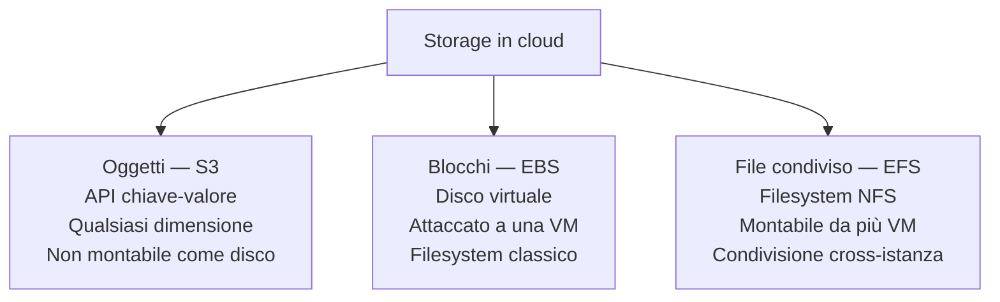

# Le risorse fondamentali

  Stabile
  Lezione 0.3
  ~10 min di lettura

Qualsiasi sistema cloud, da un sito statico a un cluster ML, è fatto degli stessi mattoni. Conoscerli per nome è il prerequisito per tutto il resto.

La lezione 0.2 ha mostrato che il livello di astrazione scelto (IaaS, PaaS, SaaS) cambia quanto gestisci tu. Adesso andiamo un livello più in basso: quali **risorse** esistono davvero sul cloud, come si chiamano, e a cosa servono? Ogni sistema che costruirai combina queste stesse categorie — compute, storage, networking, database. Cambiano i nomi tra provider, ma le categorie restano.

L'**idea in una frase**: il cloud mette a disposizione quattro famiglie di risorse — **compute** per elaborare, **storage** per conservare, **networking** per collegare, **database** per strutturare i dati — e qualsiasi architettura è un modo di assemblarle.

## Compute: dove gira il codice

Il **compute** è la capacità di elaborazione: CPU, RAM, e (sempre più spesso) GPU. Sul cloud la ottieni in tre forme principali, che abbiamo già incontrato nella 0.2:

- **Macchine virtuali**: un sistema operativo intero su hardware condiviso. Su AWS si chiama **Amazon EC2** (*Elastic Compute Cloud*). Hai pieno controllo, scegli la taglia (t3.micro per test e dev, m7g.8xlarge per carichi seri), paghi a ore.
- **Container gestiti**: il tuo codice containerizzato, senza gestire il sistema operativo sottostante. Su AWS è **AWS Fargate** (serverless per container) o **Amazon ECS** (*Elastic Container Service*) con cluster EC2.
- **Serverless**: funzioni che si attivano su eventi. Su AWS è **AWS Lambda**. Paghi a invocazione, scala a zero.

Per l'AI c'è una quarta forma che conta: le **istanze GPU**. I modelli di linguaggio e i workload di ML richiedono GPU enormi (NVIDIA A100, H100) che costano da $3 a oltre $30 all'ora su AWS (famiglia P4, P5, Trn2). Non è hardware che compri — lo accendi quando ti serve, lo spegni quando hai finito. Per chi costruisce sistemi AI questa è spesso la voce di costo più pesante.

## Storage: come si conservano i dati

Lo storage in cloud viene in tre sapori radicalmente diversi, e confonderli è uno degli errori più comuni:

**Storage a oggetti** (*object storage*): un sistema dove carichi "oggetti" — file di qualsiasi tipo e dimensione — tramite API, e li recuperi tramite una chiave (un percorso). Non è un filesystem: non puoi "aprire" un file e modificare solo un byte; devi scaricare, modificare, e ricaricare l'intero oggetto. Su AWS è **Amazon S3** (*Simple Storage Service*). È il tipo di storage più usato nel cloud: costa pochissimo (frazioni di centesimo per GB), scala a praticamente qualsiasi dimensione, è altamente durabile (11 nove di durability: 99,999999999%). Perfetto per log, immagini, backup, dataset, artefatti di build, contenuto statico.

**Storage a blocchi** (*block storage*): funziona come un hard disk: è collegato a una specifica VM, ha un filesystem, puoi fare I/O a blocchi. Su AWS è **Amazon EBS** (*Elastic Block Store*). È quello che attacchi a una EC2 come disco principale o disco dati. Performance predicibili, utile per database o applicazioni che richiedono accesso a bassa latenza. Svantaggio: è legato a una singola istanza (o zona di disponibilità) — non è distribuito per design.

**Storage condiviso** (*file storage* o *shared file system*): un filesystem che più istanze possono montare contemporaneamente tramite protocollo di rete (NFS o SMB). Su AWS è **Amazon EFS** (*Elastic File System*) per Linux, **Amazon FSx** per Windows. Utile quando più server devono condividere gli stessi file, o per workload HPC.

## Networking: come si collegano le risorse

Il networking in cloud è una rete virtuale che tu definisci via software — non cavi fisici, ma configurazione. Il concetto cardine è il **VPC** — *Virtual Private Cloud*: una rete privata isolata dentro l'infrastruttura del provider, con il tuo spazio di indirizzi IP, le tue regole di routing, il tuo controllo sul traffico in ingresso e in uscita.

Dentro un VPC dividi la rete in **subnet** — segmenti di rete con caratteristiche diverse. Una subnet pubblica è raggiungibile da internet; una privata non lo è. I tuoi server applicativi stanno in subnet private; solo il load balancer o l'API gateway stanno in subnet pubbliche. Questo isolamento è la base della sicurezza.

Il networking lo tratteremo in profondità nella Parte 1 — qui l'importante è capire che **ogni risorsa cloud vive in una rete** e che la configurazione di quella rete è responsabilità tua.

## Database gestiti: persistenza senza mal di testa operativi

I **database gestiti** (*managed databases*) sono database dove il provider si occupa di provisioning, patching, backup automatici, high availability, scaling del storage. Tu ti connetti con il normale driver del database e scrivi query — il resto sparisce.

Su AWS i principali:
- **Amazon RDS** (*Relational Database Service*): PostgreSQL, MySQL, MariaDB, Oracle, SQL Server — tutti gestiti. Backup automatici, failover in caso di guasto, scaling del storage automatico.
- **Amazon Aurora**: database relazionale AWS-native, compatibile con MySQL e PostgreSQL, con performance superiori (5× MySQL, 3× PostgreSQL) e architettura distribuita pensata per il cloud. È il managed database di default per chi vuole prestazioni relazionali serie su AWS.
- **Amazon DynamoDB**: database NoSQL fully managed, key-value e document, con latenza single-digit millisecond a qualsiasi scala. Scala automaticamente, non ha server da gestire. La scelta di default per workload serverless ad alta scala.

La scelta tra questi dipende dalla struttura dei dati e dai pattern di accesso — e ne parleremo in dettaglio nella lezione 0.5.

## Come si collegano: un'architettura minimale

Un sistema web tipico assembla tutte e quattro le famiglie:

Architettura di un'API web minimale su AWS: client → API Gateway → Lambda → DynamoDB, con asset statici su S3 e tutto dentro un VPC.

```mermaid
architecture-beta
  group vpc(cloud)[VPC]

  service apigw(logos:aws-api-gateway)[API Gateway] in vpc
  service lambda(logos:aws-lambda)[Lambda] in vpc
  service ddb(logos:aws-dynamodb)[DynamoDB] in vpc
  service s3(logos:aws-s3)[S3]

  apigw:R --> L:lambda
  lambda:R --> L:ddb
  s3:B --> T:apigw
```

*Lambda è il compute. DynamoDB è il database. S3 è lo storage a oggetti (per gli asset statici). API Gateway è il networking di ingresso. Tutto dentro un VPC.*

## Cosa non è

| Il pensiero sbagliato | Come stanno le cose |
|---|---|
| "S3 è un filesystem" | S3 è storage a **oggetti**: accesso tramite API con chiave, non montabile come disco, niente directory native (i "percorsi" sono solo prefissi delle chiavi). |
| "Tutte le risorse cloud scalano automaticamente" | Solo alcune (Lambda, DynamoDB on-demand, EFS). EC2, EBS, RDS richiedono configurazione esplicita per scalare. |
| "Il networking lo gestisce il provider" | Il provider gestisce la rete fisica. La **rete virtuale** (VPC, subnet, regole di accesso) la configuri tu — è tua responsabilità. |
| "I database managed non richiedono competenza" | Richiedono meno ops, ma richiedono ancora: scelta del tipo giusto, configurazione degli accessi (IAM + security group), tuning delle query, pianificazione dello schema. |

## Verifica di comprensione

> Rispondi a memoria. Le risposte incerte rivedile domani.

1. Qual è la differenza tra storage a oggetti e storage a blocchi?
2. Quando useresti EBS invece di S3?
3. Cos'è un VPC e perché esiste?
4. Cosa si intende per "database gestito"? Cosa gestisce ancora tu?
5. Nomina due scenari in cui useresti Lambda e uno in cui useresti EC2.
6. *(anticipazione)* Se devi distribuire il tuo sistema su più zone geografiche per ridondanza, quale risorsa deve essere replicata per prima?

---

## Glossario della pagina

- **Amazon Aurora**: database relazionale AWS-native, compatibile MySQL/PostgreSQL, architettura distribuita per il cloud.
- **Amazon DynamoDB**: database NoSQL fully managed, key-value e document, latenza millisecondo.
- **Amazon EBS** (*Elastic Block Store*): storage a blocchi, funziona come disco virtuale attaccato a una VM.
- **Amazon EFS** (*Elastic File System*): filesystem condiviso montabile da più istanze via NFS.
- **Amazon EC2** (*Elastic Compute Cloud*): macchine virtuali in cloud, il mattone base di IaaS su AWS.
- **Amazon RDS** (*Relational Database Service*): database relazionale gestito (PostgreSQL, MySQL, ecc.).
- **Amazon S3** (*Simple Storage Service*): storage a oggetti, il tipo di storage più usato nel cloud.
- **AWS Lambda**: piattaforma serverless FaaS per funzioni attivate da eventi.
- **VPC** (*Virtual Private Cloud*): rete privata virtuale isolata dentro l'infrastruttura del provider.

## Per approfondire

- "AWS Storage Services" su `aws.amazon.com/products/storage` — panoramica ufficiale con casi d'uso per tipo.
- "Amazon S3 FAQs" su `aws.amazon.com/s3/faqs` — chiarisce le limitazioni e il modello di accesso.
- "Amazon RDS vs DynamoDB" — cerca questo titolo nella documentazione AWS o nei blog AWS per il decision framework ufficiale.

## Prossima lezione

Le risorse cloud non vivono in un posto solo: sono distribuite geograficamente in regioni e zone di disponibilità. La lezione 0.4 spiega come funziona quella geografia, perché conta per la latenza e la ridondanza, e cosa devi sapere su **data residency** — dove risiedono fisicamente i tuoi dati.
