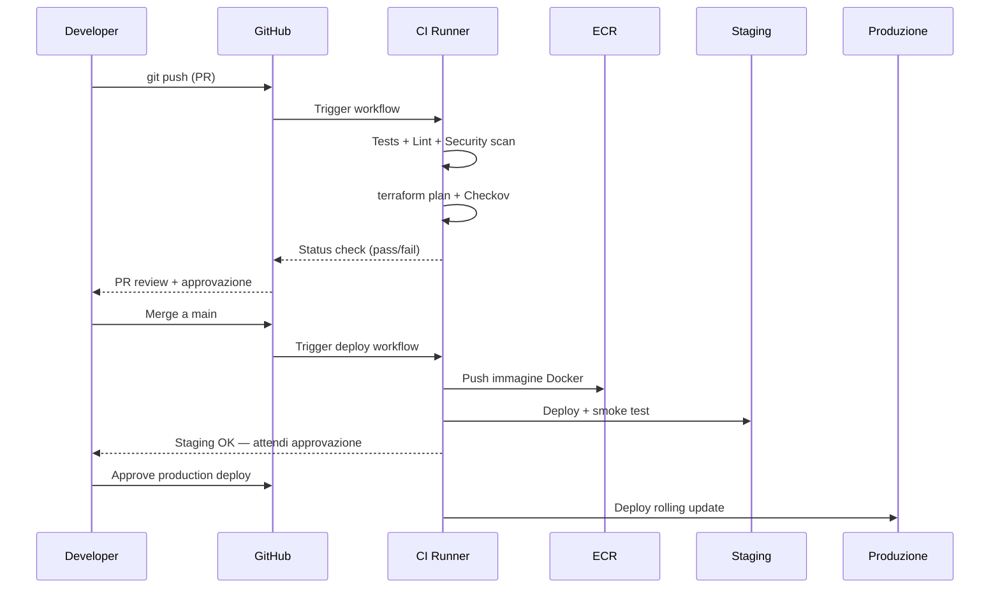

# CI/CD nel cloud

<div class="lesson-meta">
  <span class="badge-stato evoluzione">In evoluzione</span>
  <span>Lezione 4.3</span>
  <span>~12 min di lettura</span>
</div>

<p class="lesson-lead">Una pipeline CI/CD ben fatta è il sistema immunitario del software: intercetta i problemi prima che raggiungano gli utenti. Una mal fatta è un rituale burocratico che rallenta tutto senza dare sicurezza.</p>

Ogni volta che un develop fa un commit, qualcuno (o qualcosa) deve: eseguire i test, costruire l'artefatto, validare l'IaC, deployare in staging, aspettare che i test di integrazione passino, deployare in produzione. A mano, questo richiede ore e dipende dal fatto che il dev ricordi ogni passo. Automatizzato, richiede minuti e succede ogni volta, nello stesso modo.

L'**idea in una frase**: CI/CD trasforma ogni commit in un deploy candidato validato automaticamente — la velocità di rilascio non dipende dalla disciplina manuale ma dalla bontà della pipeline.

## CI: l'integrazione continua

**CI** (*Continuous Integration*) è la pratica di integrare le modifiche di codice frequentemente — idealmente ogni commit — in un branch condiviso, con validazione automatica. I passi tipici di una pipeline CI:

1. **Checkout del codice**
2. **Dipendenze**: `npm install`, `pip install`, `go mod download`
3. **Lint e type check**: verifica stilistica e tipologica del codice
4. **Unit test**: test veloci, isolati, senza dipendenze esterne
5. **Build**: compila il codice o costruisce l'immagine Docker
6. **Test di integrazione**: test che coinvolgono database, API esterne (spesso in ambiente sandbox)
7. **Scan di sicurezza**: SAST (*Static Application Security Testing* — analisi statica del codice), scan delle dipendenze per CVE, Checkov per l'IaC
8. **Push artefatto**: immagine Docker in ECR, package in S3

La regola fondamentale della CI: il branch principale deve **sempre** essere in uno stato deployabile. Se i test falliscono, la PR non va in merge. Il dev sistema prima di andare avanti.

## CD: deploy continuo vs delivery continua

**CD** sta per due cose leggermente diverse:

**Continuous Delivery**: ogni commit che supera la CI viene automaticamente deployato in staging/pre-prod. Il deploy in *produzione* richiede un'approvazione manuale (click su "approve" o merge su un branch protetto). È il punto di equilibrio per la maggior parte delle organizzazioni.

**Continuous Deployment**: ogni commit che supera la CI viene automaticamente deployato *anche in produzione*, senza intervento umano. Richiede una fiducia totale nella test suite e nel sistema di monitoring con rollback automatico. Netflix, Etsy, Amazon operano così — ma richiedono anni di maturità nella cultura e nell'automazione.

La distinzione pratica: la maggior parte dei team arriva alla Continuous Delivery e si ferma lì. Il Continuous Deployment richiede test coverage altissima e feature flags per spegnere funzionalità broken senza rollback.

## I tool: GitHub Actions e il paesaggio CI/CD

**GitHub Actions** è diventato lo standard de facto per i team che usano GitHub. Un workflow è un file YAML in `.github/workflows/` che definisce trigger (push, pull request, schedule) e job con step sequenziali. Ogni step può usare un'**action** predefinita dalla marketplace (es. `actions/checkout`, `aws-actions/configure-aws-credentials`).

```yaml
# .github/workflows/deploy.yml
name: CI/CD
on:
  push:
    branches: [main]

jobs:
  build-and-deploy:
    runs-on: ubuntu-latest
    steps:
      - uses: actions/checkout@v4
      
      - name: Run tests
        run: pytest tests/

      - name: Configure AWS credentials
        uses: aws-actions/configure-aws-credentials@v4
        with:
          role-to-assume: arn:aws:iam::123456789:role/GitHubActionsRole
          aws-region: eu-west-1

      - name: Build and push Docker image
        run: |
          docker build -t my-app .
          docker push 123456789.dkr.ecr.eu-west-1.amazonaws.com/my-app:${{ github.sha }}
```

Nota l'uso di `role-to-assume` invece di `AWS_ACCESS_KEY_ID` hardcoded: **OIDC** (*OpenID Connect*) permette a GitHub Actions di assumere un IAM Role senza credenziali statiche — il pattern corretto dal punto di vista della sicurezza. Le credenziali statiche in CI/CD sono una delle fonti di leak più comuni.

**Alternative**: GitLab CI, CircleCI, Jenkins (self-hosted, comune in enterprise), AWS CodePipeline (completamente managed su AWS). La scelta dipende dall'ecosistema: se sei su GitLab, GitLab CI è integrato. Se sei on-premise con requisiti di compliance, Jenkins. Per i nuovi progetti nel 2026, GitHub Actions è il default ragionevole.

## Pipeline completa: da commit a produzione



## Deploy strategies: zero downtime in pratica

Come si deploya in produzione senza abbattere il servizio? Tre pattern:

**Rolling update**: sostituisce le istanze vecchie con le nuove una alla volta. Semplice, nessun costo aggiuntivo, ma durante il rollout convivono la versione vecchia e quella nuova — incompatibilità di schema database possono essere un problema.

**Blue/Green**: mantieni due ambienti identici (blue = corrente, green = nuovo). Il deploy avviene su green, poi il traffico viene spostato in una volta sola dall'ALB. Il rollback è istantaneo (switcha il traffico su blue). Costo: doppia infrastruttura durante il deploy.

**Canary**: un sottoinsieme del traffico (es. 5%) viene instradato alla nuova versione. Se le metriche restano ok (errori, latenza), si aumenta gradualmente fino al 100%. Permette di rilevare problemi su traffico reale prima di impattare tutti gli utenti. Richiede un sistema di routing intelligente (es. AWS CodeDeploy con traffic shifting, Istio, o pesi ALB).

<details>
<summary>Feature flags: deploy disaccoppiato dal release</summary>

Un **feature flag** è un interruttore nel codice che abilita o disabilita una funzionalità senza deploy. Il codice va in produzione, ma la funzionalità è nascosta. Si abilita gradualmente (10% utenti → 50% → 100%) senza toccare il sistema.

Il vantaggio principale: separa il **deploy** (mettere il codice in produzione) dal **release** (rendere la funzionalità disponibile agli utenti). Il team può deployare decine di volte al giorno, abilitare funzionalità quando sono pronte, spegnerle istantaneamente se c'è un problema.

Tool: LaunchDarkly, Flagsmith (open source), AWS AppConfig. Il rischio: i flag si accumulano nel codice e diventano debito tecnico se non vengono rimossi dopo il rollout completo.
</details>

## Cosa non è

| Il pensiero sbagliato | Come stanno le cose |
|---|---|
| "CI/CD significa deployare spesso senza fare test" | CI/CD significa deployare spesso *perché* ogni deploy è stato validato automaticamente. Deployare spesso senza test è peggio che deployare raramente. |
| "GitHub Actions è solo per progetti piccoli" | Aziende come Shopify, Stripe, Microsoft usano GitHub Actions su pipeline di migliaia di job al giorno. La scalabilità non è il limite; lo è la complessità dei workflow YAML. |
| "Il Continuous Deployment è pericoloso" | È il contrario: con Continuous Deployment ogni bug viene scoperto e fixato velocemente, invece di accumularsi per settimane. Il rischio è nella *mancanza* di automazione, non nella sua presenza. |
| "Il deploy in produzione richiede sempre approvazione manuale" | Solo per la Continuous Delivery. Il Continuous Deployment è un obiettivo di maturità legittimo con test coverage sufficiente e monitoring con rollback automatico. |

## Verifica di comprensione

> Rispondi a memoria. Le risposte incerte rivedile domani.

1. Qual è la differenza tra Continuous Delivery e Continuous Deployment?
2. Perché usare OIDC per le credenziali AWS in GitHub Actions invece di `AWS_ACCESS_KEY_ID`?
3. Descrivi il vantaggio principale del deploy Blue/Green rispetto al rolling update.
4. Cos'è un canary deployment e quando è preferibile al Blue/Green?
5. Cosa sono i feature flags e come disaccoppiano deploy e release?
6. Qual è la regola fondamentale della CI riguardo allo stato del branch principale?
7. *(anticipazione)* Hai deployato una nuova versione in produzione con rolling update. I log mostrano un aumento di errori 5xx. Come fai rollback con K8s? E con ECS?

## Glossario della lezione

- **CI** (*Continuous Integration*): integrazione frequente del codice con validazione automatica.
- **CD** (*Continuous Delivery/Deployment*): deploy automatico in staging (Delivery) o produzione (Deployment).
- **Pipeline**: sequenza automatizzata di step da commit a deploy.
- **GitHub Actions**: sistema CI/CD integrato in GitHub, basato su file YAML e actions riusabili.
- **OIDC** (*OpenID Connect*): standard per assumere ruoli IAM temporanei da CI senza credenziali statiche.
- **Rolling update**: sostituzione graduale delle istanze durante il deploy.
- **Blue/Green**: due ambienti identici, switch del traffico in una volta sola.
- **Canary**: invio di una quota piccola di traffico alla nuova versione prima del rollout completo.
- **Feature flag**: interruttore nel codice per abilitare/disabilitare funzionalità senza deploy.
- **SAST** (*Static Application Security Testing*): analisi statica del codice per vulnerabilità.

## Per approfondire

- **GitHub Actions docs** su `docs.github.com/en/actions` — tutorial ufficiali con esempi per AWS.
- **AWS CodeDeploy docs** su `docs.aws.amazon.com/codedeploy` — per traffic shifting canary su EC2, ECS, Lambda.
- **"Accelerate"** (Forsgren, Humble, Kim): il libro che quantifica l'impatto di CI/CD sulle performance dei team (DORA metrics: deployment frequency, lead time, MTTR, change failure rate).

## Prossima lezione

Hai IaC, policy automatiche e pipeline CI/CD. La prossima lezione è il decision drill della Parte 4: scenari reali su cosa automatizzare, come strutturare la pipeline e dove mettere i guard rail.
