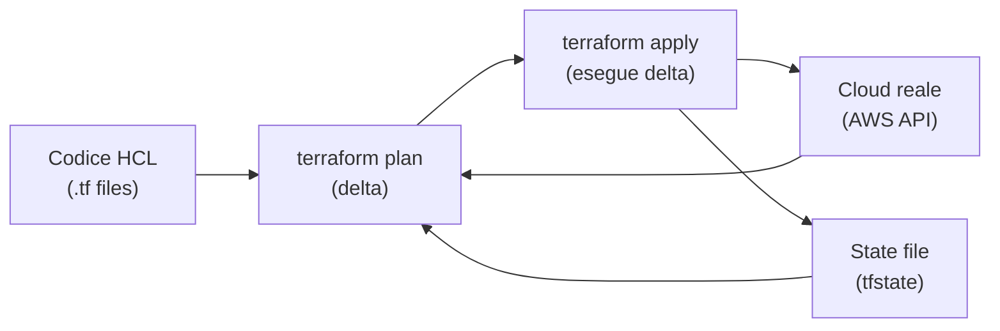

# Infrastructure as Code

<div class="lesson-meta">
  <span class="badge-stato evoluzione">In evoluzione</span>
  <span>Lezione 4.1</span>
  <span>~13 min di lettura</span>
</div>

<p class="lesson-lead">Cliccare nella console funziona una volta. La seconda volta stai cercando di replicare qualcosa che non ricordi esattamente come hai fatto. L'Infrastructure as Code risolve il problema alla radice: l'infrastruttura è codice, vive in Git, si rivede, si testa, si ripete.</p>

Immagina di aver costruito a mano un ambiente AWS ben funzionante: VPC configurata, subnet pubbliche e private, security group con le regole giuste, RDS con backup abilitati, Lambda deployate. Funziona. Poi ti chiedono di replicarlo per il cliente B. O per lo staging. O da zero dopo un disastro. Senza documentazione (che è già obsoleta), senza un collega che ricordi i dettagli — clicchi di nuovo, fai errori diversi, ottieni qualcosa di diverso.

L'**idea in una frase**: l'IaC trasforma la descrizione dell'infrastruttura in un file di testo versionabile — la fonte di verità diventa il codice, non la console.

## Il principio: stato desiderato, non istruzioni imperative

Il modello di IaC più diffuso è **dichiarativo**: dici *cosa* vuole che esista, non *come* crearlo passo per passo. Scrivi "voglio un bucket S3 con questo nome, questa configurazione, questo lifecycle policy" — il tool confronta quello che hai descritto con quello che esiste davvero, e calcola il delta.

Questo è radicalmente diverso dallo scripting imperativo (bash che chiama `aws s3 create-bucket`): uno script crea risorse, ma non sa cosa fare se la risorsa esiste già. L'IaC dichiarativa è **idempotente** — puoi eseguirla 10 volte, il risultato è sempre lo stesso.

## Terraform: lo standard multi-cloud

**Terraform** (di HashiCorp, ora con licenza BSL — Business Source License, cambiata nel 2023) è il tool di IaC più usato nel 2026. Il modello concettuale:

**Provider**: il plugin che sa come parlare con un cloud specifico (AWS, GCP, Azure, Cloudflare, GitHub...). Terraform parla con le API di AWS tramite il provider AWS, con le API di GitHub tramite il provider GitHub, ecc. Lo stesso linguaggio HCL (HashiCorp Configuration Language) funziona su tutti i provider.

**Resource**: una risorsa infrastrutturale gestita da Terraform — un bucket S3, un'istanza EC2, un record DNS. Ogni resource ha un tipo (`aws_s3_bucket`) e un set di attributi configurabili.

**State**: Terraform mantiene un file di stato (`terraform.tfstate`) che mappa le risorse nel codice con le risorse reali nel cloud. Il piano (`terraform plan`) confronta stato corrente vs stato desiderato e mostra cosa cambierà. `terraform apply` esegue le modifiche.

```hcl
# Esempio minimo: un bucket S3 privato
resource "aws_s3_bucket" "documenti" {
  bucket = "acme-corp-documenti-prod"
}

resource "aws_s3_bucket_public_access_block" "documenti" {
  bucket = aws_s3_bucket.documenti.id

  block_public_acls       = true
  block_public_policy     = true
  ignore_public_acls      = true
  restrict_public_buckets = true
}
```

*`terraform plan` mostra: "+ aws_s3_bucket.documenti will be created". `terraform apply` lo crea. La prossima volta che esegui `apply` senza modifiche: "No changes."*



## Il ciclo di lavoro

**`terraform init`**: scarica i provider necessari, inizializza il backend per lo stato remoto.

**`terraform plan`**: confronta codice vs stato vs cloud reale. Mostra cosa verrà creato (`+`), modificato (`~`), distrutto (`-`). **Non fa niente** — è puro read-only. È il momento di rivedere prima di agire.

**`terraform apply`**: esegue il piano. Crea, modifica, distrugge le risorse necessarie.

**`terraform destroy`**: distrugge tutto quello che Terraform gestisce. Utile per ambienti temporanei (dev/test), pericoloso in produzione se eseguito per sbaglio.

Il state file va salvato **da qualche parte condivisa e sicura** — non sul laptop di un singolo sviluppatore. La soluzione standard su AWS è un backend S3 + DynamoDB per il locking (evita che due persone eseguano `apply` contemporaneamente).

## Le alternative consapevoli del 2026

Il cambio di licenza di Terraform nel 2023 (da MPL-2 a BSL, che limita l'uso commerciale per i competitor di HashiCorp) ha creato un fork e accelerato alternative già esistenti:

**OpenTofu**: il fork open source di Terraform mantenuto dalla Linux Foundation, compatibile al 100% con HCL di Terraform. Se vuoi evitare la BSL, OpenTofu è il sostituto diretto. Il mercato nel 2026 lo sta adottando in modo crescente, specialmente in Europa per ragioni di compliance.

**Pulumi**: IaC in linguaggi general-purpose (Python, TypeScript, Go). Invece di HCL, scrivi codice reale — con loop, funzioni, test unitari. Vantaggio: un team Python può riusare skills esistenti. Svantaggio: la complessità del linguaggio si porta nell'infra (è facile introdurre side effect e logica implicita che HCL non permetterebbe). Buono quando hai esigenze molto custom.

**AWS CDK** (*Cloud Development Kit*): TypeScript o Python che compila a CloudFormation (il tool IaC nativo di AWS). Il vantaggio rispetto a Terraform è l'integrazione con l'ecosistema AWS (costrutti di alto livello per pattern comuni, es. un ALB + ECS service con 5 righe invece di 50). Il limite: lock-in totale su AWS, non funziona con altri provider.

**CloudFormation**: il tool IaC nativo di AWS, in JSON o YAML. Più verbose, meno ergonomico di Terraform/CDK, ma senza dipendenze esterne e con supporto diretto AWS. Usato in molte aziende enterprise per la familiarità con lo stack AWS.

La scelta pratica nel 2026: **Terraform o OpenTofu** per portabilità e adozione di mercato. CDK se sei full-AWS e il tuo team è più comodo con TypeScript/Python. Pulumi per use case molto custom.

<details>
<summary>Moduli, variabili e DRY nell'IaC</summary>

Ripetere la stessa configurazione per dev, staging, e prod copia-incollando tre volte lo stesso codice è lo stesso anti-pattern del codice applicativo. Terraform usa due meccanismi per evitarlo:

**Variabili**: `variable "environment" { default = "prod" }` — i valori cambiano tra ambienti, il codice no. I valori delle variabili vengono passati tramite file `.tfvars` (uno per ambiente) o variabili d'ambiente.

**Moduli**: una cartella Terraform riusabile che incapsula un pattern infrastrutturale (es. "modulo VPC", "modulo Lambda+API Gateway"). I moduli si chiamano dal codice principale passando variabili. Il Terraform Registry ospita moduli pubblici verificati dalla community per i pattern più comuni (es. il modulo `terraform-aws-modules/vpc/aws`).

**Workspaces**: ambienti separati (dev/staging/prod) usando lo stesso codice ma state file distinti. Più semplice che mantenere tre cartelle separate per ambienti simili.
</details>

## Cosa non è

| Il pensiero sbagliato | Come stanno le cose |
|---|---|
| "Terraform rimpiazza il deployment del codice applicativo" | Terraform gestisce l'infrastruttura (VPC, database, Lambda come risorsa cloud). Il codice dell'applicazione si deploya con strumenti separati — Docker push in ECR, `aws lambda update-function-code`, pipeline CI/CD. |
| "Il file tfstate si può committare in Git" | Il tfstate contiene valori sensibili (password, chiavi) in chiaro. Va nel backend remoto (S3 + cifratura), mai in Git. |
| "terraform destroy è sempre reversibile" | Dipende dalla risorsa. Un bucket S3 vuoto si ricrea. Un RDS senza snapshot finale perde tutti i dati. `prevent_destroy = true` nelle lifecycle rules è obbligatorio per le risorse critiche. |
| "OpenTofu è un fork incompatibile" | OpenTofu è compatibile al 100% con HCL di Terraform — i file `.tf` esistenti funzionano senza modifiche. La fork è sulla licenza, non sulla sintassi. |

## Verifica di comprensione

> Rispondi a memoria. Le risposte incerte rivedile domani.

1. Cos'è il modello dichiarativo nell'IaC e come differisce da uno script bash imperativo?
2. A cosa serve il file `terraform.tfstate`? Dove va salvato e perché non in Git?
3. Qual è la differenza tra `terraform plan` e `terraform apply`?
4. Perché HashiCorp ha cambiato la licenza di Terraform nel 2023 e qual è la risposta della community?
5. In quale scenario useresti AWS CDK invece di Terraform?
6. Cos'è un modulo Terraform e quale problema risolve?
7. *(anticipazione)* Hai deployato infrastruttura con Terraform, ma un collega ha modificato una security group rule manualmente nella console. Cosa succede al prossimo `terraform plan`?

## Glossario della lezione

- **IaC** (*Infrastructure as Code*): gestione dell'infrastruttura tramite file di configurazione versionabili.
- **HCL** (*HashiCorp Configuration Language*): linguaggio dichiarativo usato da Terraform/OpenTofu.
- **Provider**: plugin Terraform che implementa le chiamate API verso un cloud specifico.
- **Resource**: risorsa infrastrutturale dichiarata e gestita da Terraform.
- **State** (*tfstate*): file che mappa le risorse nel codice con quelle reali nel cloud.
- **terraform plan**: calcola il delta tra stato desiderato e realtà, senza applicare modifiche.
- **terraform apply**: esegue il piano — crea, modifica, distrugge le risorse necessarie.
- **OpenTofu**: fork open source di Terraform, compatibile HCL, mantenuto dalla Linux Foundation.
- **Pulumi**: IaC in linguaggi general-purpose (Python, TypeScript, Go).
- **AWS CDK** (*Cloud Development Kit*): IaC in TypeScript/Python che compila a CloudFormation.
- **Backend remoto**: configurazione per salvare il tfstate su storage condiviso (es. S3 + DynamoDB lock).

## Per approfondire

- **Terraform docs** su `developer.hashicorp.com/terraform/docs` — la documentazione ufficiale con tutorial pratici.
- **OpenTofu docs** su `opentofu.org/docs` — identica a Terraform per la sintassi, con note sulle differenze di licenza.
- **Terraform AWS modules** su `registry.terraform.io/modules/terraform-aws-modules` — moduli verificati per i pattern AWS più comuni.
- **"Terraform: Up and Running"** (Brikman) — il libro di riferimento, include pattern per ambienti multipli, moduli, e CI/CD.

## Prossima lezione

Hai l'infrastruttura in codice e versionata in Git. Ottimo. Ma chi garantisce che il codice rispetti le policy aziendali? Che nessuno abbia committato un bucket pubblico, un security group aperto al mondo, o un database senza backup? La prossima lezione introduce il policy-as-code e il drift detection — il "giorno 2" dell'IaC.
