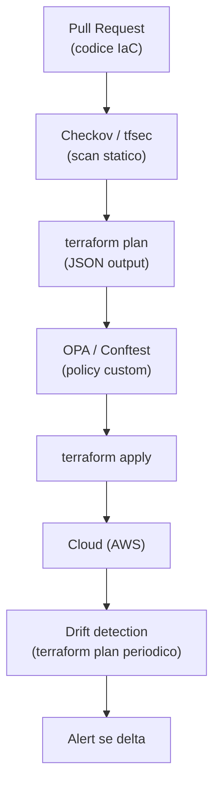

# Policy-as-code e governance dell'infra

<div class="lesson-meta">
  <span class="badge-stato evoluzione">In evoluzione</span>
  <span>Lezione 3.2</span>
  <span>~11 min di lettura</span>
</div>

<p class="lesson-lead">L'IaC risolve la riproducibilità. Non risolve la conformità. Senza policy-as-code, le regole di sicurezza vivono in un PDF che nessuno legge prima del deploy — e il bucket S3 pubblico arriva in produzione lo stesso.</p>

Hai Terraform. L'infrastruttura è in codice, versionata in Git, riproducibile. Ma chi garantisce che il codice rispetti le regole dell'organizzazione? Che nessuno abbia dichiarato un security group con `0.0.0.0/0` su porta 22? Che tutti i volumi EBS siano cifrati? Che il bucket S3 non sia pubblico?

L'**idea in una frase**: il policy-as-code trasforma le regole di governance da documenti statici a gate automatici nella pipeline — la violazione blocca il deploy prima che arrivi in cloud.

## Il problema del giorno 2

Il "giorno 1" dell'IaC è creare l'infrastruttura. Il "giorno 2" è governarla nel tempo: team diversi contribuiscono codice IaC, alcuni per errore, alcuni per fretta, alcuni per ignoranza violano le policy. Senza automazione:

- Il security team fa review manuali che rallentano i deploy
- Le violazioni vengono scoperte post-deploy, quando la remediation è costosa
- Le policy esistono come checklist PDF mai lette

Il policy-as-code sposta il controllo **a sinistra** (*shift left*): le regole vengono verificate prima del `terraform apply`, nella pull request, prima che la risorsa esista nel cloud.

## OPA e Conftest: il motore universale

**OPA** (*Open Policy Agent*) è il motore di policy open source più diffuso, sviluppato da Styra e ora sotto la CNCF (*Cloud Native Computing Foundation*). OPA valuta policy scritte in **Rego** — un linguaggio dichiarativo per esprimere regole su strutture dati JSON.

Il modello è semplice: OPA riceve un input (JSON), valuta le policy Rego, e restituisce una decisione (allow/deny + motivo). L'input può essere qualsiasi cosa — un piano Terraform in formato JSON, un manifesto Kubernetes, una richiesta API.

**Conftest** è il tool CLI che usa OPA per validare file di configurazione: Terraform plan, Kubernetes YAML, Dockerfile. Esempio di policy:

```rego
# policy/s3_no_public.rego
package terraform.aws.s3

deny[msg] {
  resource := input.resource_changes[_]
  resource.type == "aws_s3_bucket_public_access_block"
  resource.change.after.block_public_acls == false
  msg := sprintf("Bucket %s: block_public_acls deve essere true", [resource.address])
}
```

Questa policy nega il piano Terraform se un bucket S3 non ha `block_public_acls = true`. L'output di `conftest test plan.json` è un errore human-readable con il motivo.

## Checkov, tfsec, Terrascan: scanner statici per IaC

Gli scanner statici analizzano i file `.tf` *prima* del `terraform plan` — nessuna chiamata API al cloud, nessuno stato da confrontare. Velocissimi, integrabili come pre-commit hook o primo step CI.

**Checkov**: sviluppato da Bridgecrew (ora parte di Prisma Cloud). Copre Terraform, CloudFormation, Kubernetes YAML, Dockerfile, ARM template. Usa un set di policy predefinite (CIS Benchmark, best practice AWS) e permette policy custom in Python. Restituisce un report con check passati/falliti e remediation suggestions.

**tfsec**: più leggero, focalizzato su Terraform. Eseguibile come binary singolo, output in terminal-friendly format. Buono come check rapido pre-commit.

**Terrascan**: open source di Tenable, simile a Checkov ma con focus su compliance framework (SOC 2, HIPAA, PCI-DSS, GDPR). Utile quando hai requisiti di audit formali.

La differenza rispetto a OPA/Conftest: gli scanner statici hanno policy predefinite *out of the box* — parti in 5 minuti. OPA è più potente ma richiede scrivere le policy in Rego. In pratica: Checkov/tfsec per i check standard, OPA per le policy custom dell'organizzazione.



## Drift detection: accorgersi quando la console cambia

L'IaC descrive lo stato desiderato. Il drift è quando lo stato reale nel cloud diverge da quello desiderato — qualcuno ha modificato una security group rule dalla console, aggiunto un tag a mano, cambiato una configurazione senza passare per Git.

Il drift può sembrare innocuo ("ho solo aggiunto una regola temporanea"). Il problema è:

1. Non è versionato — non sai chi l'ha fatto, quando, perché
2. Il prossimo `terraform apply` **sovrascriverà la modifica** per riportare allo stato desiderato
3. Se la modifica era necessaria, va codificata in Terraform; se era sbagliata, il drift ha mascherato un problema

**Come rilevare il drift**: `terraform plan` eseguito periodicamente (es. ogni ora in CI) su infrastruttura esistente mostra il delta. Se non hai fatto modifiche al codice ma il plan mostra diff, hai drift. AWS Config può rilevare cambiamenti in tempo reale e triggerare alert.

## GitOps: il repository come fonte di verità

**GitOps** è il pattern in cui il repository Git è la *singola fonte di verità* per lo stato dell'infrastruttura. Nessuna modifica manuale alla console è permessa — tutto passa dalla pull request. Il sistema di CD monitora continuamente il repository e riconcilia lo stato del cloud con quello in Git.

I tool principali per GitOps sono pensati per Kubernetes (ArgoCD, Flux), ma il principio vale anche per IaC Terraform: Atlantis (self-hosted) o Terraform Cloud eseguono `plan` e `apply` automaticamente sui PR e applicano le modifiche quando il PR è approvato.

I benefici pratici:
- **Audit log gratis**: ogni modifica all'infrastruttura è una commit firmata in Git
- **Review obbligatoria**: nessun `terraform apply` in produzione senza approvazione PR
- **Rollback semplice**: `git revert` seguito da apply automatico riporta allo stato precedente

<details>
<summary>HashiCorp Sentinel: policy-as-code integrata in Terraform Cloud</summary>

**Sentinel** è il framework di policy-as-code di HashiCorp, disponibile in Terraform Cloud/Enterprise. Si posiziona tra `terraform plan` e `terraform apply` — il plan viene valutato da Sentinel, e se viola una policy, l'apply è bloccato o richiede approvazione manuale.

A differenza di OPA (esterno alla pipeline), Sentinel è integrato nativamente nel flusso Terraform Cloud. Il linguaggio Sentinel è più semplice di Rego per chi già usa Terraform.

Se usi Terraform Cloud/Enterprise, Sentinel è la scelta naturale. Se usi GitHub Actions con OpenTofu, OPA/Conftest è più portabile.
</details>

## Cosa non è

| Il pensiero sbagliato | Come stanno le cose |
|---|---|
| "Il policy-as-code sostituisce il security team" | Automatizza i check ripetibili (CIS benchmark, best practice note). Non sostituisce la threat modeling, il design review, il giudizio su nuove architetture. È un moltiplicatore di forza, non un sostituto. |
| "Checkov a zero finding significa infrastruttura sicura" | Checkov copre best practice note e configurate. Non può rilevare vulnerabilità logiche, policy IAM troppo permissive in modo sottile, o minacce di business logic. |
| "Il drift è sempre un errore da correggere" | A volte il drift è intenzionale: una hotfix critica in produzione applicata manualmente per rapidità. Il punto è che deve essere poi codificata in IaC — il drift è un promemoria, non necessariamente un errore immediato. |
| "GitOps significa usare ArgoCD" | GitOps è un principio — Git come fonte di verità, riconciliazione automatica. ArgoCD è un'implementazione per K8s. Atlantis è un'implementazione per Terraform. Il principio è indipendente dal tool. |

## Verifica di comprensione

> Rispondi a memoria. Le risposte incerte rivedile domani.

1. Cosa significa "shift left" nel contesto del policy-as-code?
2. Qual è la differenza tra uno scanner statico (Checkov) e OPA/Conftest in termini di quando agiscono?
3. Cos'è il drift nell'IaC e perché è un problema anche se la modifica sembrava innocua?
4. Descrivi il flusso GitOps per una modifica di infrastruttura: dal codice al cloud.
5. In quale situazione useresti Sentinel invece di OPA?
6. Cosa succede se un `terraform apply` viene eseguito dopo che qualcuno ha modificato manualmente una security group in console?
7. *(anticipazione)* Hai 3 ambienti (dev/staging/prod) con Terraform. Come gestiresti policy più permissive in dev e più restrittive in prod usando lo stesso codebase?

## Glossario della lezione

- **Policy-as-code**: regole di governance espresse come codice eseguibile e verificabile automaticamente.
- **OPA** (*Open Policy Agent*): motore di policy open source che valuta regole in linguaggio Rego.
- **Rego**: linguaggio dichiarativo usato da OPA per esprimere policy su strutture JSON.
- **Conftest**: CLI che usa OPA per validare file di configurazione (Terraform plan, YAML, ecc.).
- **Checkov**: scanner statico IaC con policy predefinite CIS/AWS best practice.
- **tfsec**: scanner statico leggero focalizzato su file Terraform.
- **Drift**: divergenza tra lo stato desiderato nel codice IaC e lo stato reale nel cloud.
- **GitOps**: pattern in cui Git è la fonte di verità per l'infrastruttura; ogni modifica passa da PR.
- **Atlantis**: tool GitOps per Terraform — esegue plan/apply automaticamente sui PR.
- **Sentinel**: framework policy-as-code di HashiCorp integrato in Terraform Cloud/Enterprise.
- **Shift left**: spostare i controlli di qualità/sicurezza prima nel ciclo di sviluppo.

## Per approfondire

- **Checkov docs** su `checkov.io` — lista completa dei check e guida all'integrazione CI.
- **OPA docs** su `openpolicyagent.org` — tutorial su Rego e integrazione con Terraform.
- **Atlantis docs** su `runatlantis.io` — setup GitOps per Terraform.
- **"Terraform: Up and Running"** (Brikman) — il capitolo su testing e policy copre Checkov e Sentinel.

## Prossima lezione

Hai l'infrastruttura in codice e le policy che la governano. Il passo finale è automatizzare il deploy stesso: ogni commit al branch principale che supera test e policy deve arrivare in produzione senza intervento manuale. La prossima lezione copre CI/CD nel cloud — il filo che unisce il codice al sistema che gira.
