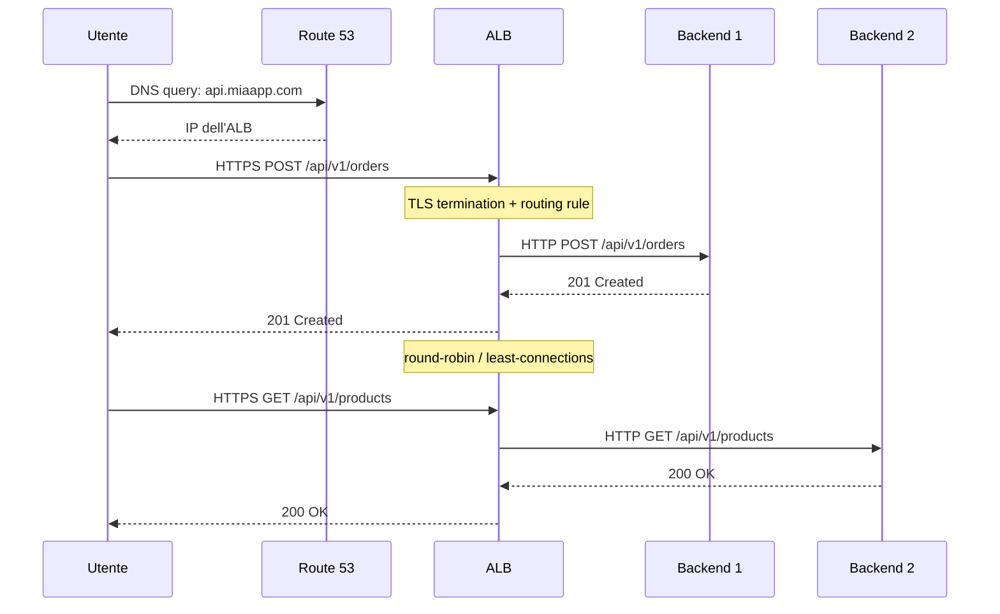

# DNS, TLS, Load Balancing, CDN

  Stabile
  Lezione 1.2
  ~13 min di lettura

Prima che un pacchetto raggiunga il tuo load balancer, deve succedere molto: un nome va risolto in un IP, una connessione cifrata va negoziata, il traffico va distribuito tra le istanze. Questi quattro meccanismi sono la porta d'ingresso di ogni sistema web.

Nella lezione 1.1 hai costruito la rete: VPC, subnet, Security Group. Il load balancer è in subnet pubblica, il backend è in subnet privata. Manca il collegamento con il mondo esterno: come fa un utente che digita `api.miaapp.com` a finire sul tuo ALB? E come fa quella connessione a essere sicura? La risposta attraversa quattro strati — DNS, TLS, load balancing, CDN — che nella pratica si configurano in sequenza ogni volta che lanci un sistema.

L'**idea in una frase**: DNS traduce i nomi in indirizzi, TLS cifra il canale, il load balancer distribuisce il carico, la CDN avvicina i contenuti all'utente — quattro problemi distinti, quattro soluzioni distinte, una pipeline unica.

## DNS: da nome a indirizzo IP

Il **DNS** (*Domain Name System*) è la rubrica di internet: trasforma `api.miaapp.com` nell'indirizzo IP a cui connettersi. Sembra semplice, ma dietro c'è una gerarchia distribuita di server che collaborano.

Quando il browser fa una query DNS, la sequenza è:
1. **Recursive resolver** (di solito il tuo ISP o 8.8.8.8 di Google): se ha la risposta in cache, la restituisce. Altrimenti va a cercare.
2. **Root nameserver**: risponde con "per `.com` parla con questo nameserver".
3. **TLD nameserver** (*Top Level Domain*, il server di `.com`): risponde con "per `miaapp.com` parla con questo nameserver".
4. **Authoritative nameserver** (il tuo): ha il record finale — `api.miaapp.com → 54.12.34.56`.

Il resolver cachca la risposta per il tempo indicato nel **TTL** (*Time to Live*) del record DNS. TTL basso (60 secondi) = flessibilità per failover rapidi ma più query DNS; TTL alto (3600 secondi) = meno query, meno costo, ma cambiamenti lenti da propagare. Per record critici in produzione, usa 60-300 secondi.

**Amazon Route 53** è il servizio DNS di AWS. Oltre alla risoluzione standard, supporta **routing policies**:
- *Simple*: un record, un IP.
- *Weighted*: manda l'80% del traffico alla versione stabile e il 20% alla nuova — utile per canary release.
- *Latency-based*: manda l'utente alla regione AWS con latenza più bassa dal suo punto di rete.
- *Failover*: primary + secondary; Route 53 fa health check e commuta automaticamente se il primary non risponde.
- *Geolocation*: utenti in Europa → regione europea, utenti in Asia → regione asiatica.

## TLS: il canale sigillato

**TLS** (*Transport Layer Security*) è il protocollo che rende HTTPS sicuro. Garantisce tre cose: **riservatezza** (i dati sono cifrati, chi intercetta non legge nulla), **integrità** (i dati non sono stati modificati in transito), **autenticità** (stai parlando davvero con il server che pensi).

L'autenticità si ottiene tramite **certificati**: il server presenta un documento digitale firmato da una **CA** (*Certificate Authority*) — un'autorità fidata come DigiCert, Let's Encrypt, o Amazon stessa. Il browser o il client verifica la firma: se è autentica, la connessione prosegue.

**AWS Certificate Manager (ACM)** semplifica questo al minimo: emette certificati SSL/TLS gratuiti per i tuoi domini, li rinnova automaticamente prima della scadenza, e li integra con ALB e CloudFront senza dover mettere mano a file `.pem`. Il certificato non è esportabile (vive solo nei servizi AWS), il che aumenta la sicurezza.

TLS handshake: cosa succede nei primi 50ms

Il **TLS handshake** avviene prima che un byte di dati applicativi viaggi:

1. **ClientHello**: il client invia le versioni TLS e le cipher suite supportate.
2. **ServerHello**: il server sceglie cipher suite e versione, invia il certificato.
3. **Verifica certificato**: il client verifica la firma della CA sulla catena di certificati.
4. **Key exchange**: con TLS 1.3 si usa ECDHE (*Elliptic-curve Diffie-Hellman Ephemeral*) — le due parti derivano una chiave di sessione condivisa senza che la chiave privata attraversi la rete.
5. **Finished**: la connessione è stabilita. Da qui in poi tutto è cifrato con la chiave di sessione.

TLS 1.3 (standard dal 2018) riduce l'handshake a **1 RTT** (*round trip*) contro i 2 RTT di TLS 1.2, tagliando ~50ms di latenza. ALB supporta TLS 1.3 di default. SSL è deprecato da anni: vulnerabile a POODLE e BEAST. Non abilitarlo.

**TLS termination**: nella maggior parte delle architetture, l'ALB decifra il traffico TLS in entrata e parla con i backend in HTTP (o HTTPS se vuoi end-to-end encryption). Questo semplifica la gestione dei certificati — i backend non devono sapere nulla di TLS — e permette all'ALB di leggere gli header HTTP per fare routing intelligente.

## Load Balancing: distribuire il carico senza downtime

Un **load balancer** riceve il traffico in entrata e lo distribuisce tra più istanze backend. L'obiettivo non è solo reggere più traffico: è **alta disponibilità** (se un'istanza muore, il traffico va alle altre), **zero-downtime deployment** (puoi sostituire le istanze gradualmente senza interrompere il servizio), e **routing intelligente** (manda `/api/*` a un servizio e `/static/*` a un altro).

AWS offre due tipi principali:

**ALB** (*Application Load Balancer*, Layer 7): lavora a livello HTTP/HTTPS. Legge path, header, query string e prende decisioni di routing basate su queste informazioni. Supporta WebSocket, HTTP/2, integrazione con AWS WAF (*Web Application Firewall*) e Cognito. È la scelta quasi universale per applicazioni web e API REST.

**NLB** (*Network Load Balancer*, Layer 4): lavora a livello TCP/UDP. Non legge il contenuto delle richieste — fa solo bilanciamento di flussi di rete. Latenza sub-millisecondo, gestisce milioni di connessioni al secondo. Usato per gaming, IoT, o quando serve un IP statico fisso (NLB ha IP statici, ALB no).

L'ALB non manda traffico direttamente alle istanze: usa i **Target Group**. Un target group è una raccolta di destinazioni (istanze EC2, ECS container, Lambda, IP) con un **health check** associato. L'ALB controlla periodicamente ogni target (es. `GET /health` ogni 30 secondi); se un target risponde con un errore, viene rimosso dalla rotazione automaticamente.

*Il flow completo: DNS risolve il nome in IP dell'ALB, il client negozia TLS con l'ALB, l'ALB distribuisce le richieste tra i backend in round-robin.*

## CDN: avvicinare i contenuti all'utente

Una **CDN** (*Content Delivery Network*) è una rete di server distribuiti globalmente — le **edge location** che hai visto nella lezione 0.4. I contenuti vengono cachati alle edge, vicino agli utenti, riducendo la latenza percepita e il carico sull'origine.

**Amazon CloudFront** è la CDN di AWS. Il flusso base: l'utente fa una richiesta → CloudFront controlla la cache all'edge più vicina → se c'è il contenuto (**cache hit**) lo restituisce direttamente → se non c'è (**cache miss**) va a chiederlo all'**origin** (S3, ALB, API Gateway, o qualsiasi HTTP server), cachca la risposta per il **TTL** configurato, e la serve all'utente.

L'**origin** può essere:
- **Amazon S3**: ideale per asset statici (immagini, CSS, JS, file di build del frontend).
- **ALB**: per contenuto dinamico — CloudFront agisce da layer di cache e protezione DDoS davanti all'ALB.
- **API Gateway**: per API con risposte cachable.
- **Custom origin**: qualsiasi server HTTP raggiungibile da internet.

La logica di caching si configura tramite **cache behavior**: per ogni path pattern (`/static/*`, `/api/*`, `/`) puoi impostare TTL diversi, scegliere quali header e cookie includere nella **cache key**, e definire se permettere la compressione.

CloudFront integra **AWS Shield Standard** (protezione DDoS automatica, gratuita) e **AWS WAF** (regole di filtraggio del traffico malevolo): gli attacchi vengono assorbiti alle edge, prima che raggiungano la tua infrastruttura.

CloudFront non è solo per file statici

Un'idea comune è che CloudFront serva solo asset statici. Non è così:

- **Risposte API**: se la tua API restituisce dati che cambiano raramente (catalogo prodotti, configurazioni), puoi cachare la risposta a CloudFront con TTL di minuti. Taglio netto di latenza e costo del backend.
- **Lambda@Edge e CloudFront Functions**: esegui codice JavaScript direttamente alle edge location — autenticazione JWT, riscrittura di header, redirect A/B test — senza round-trip all'origin.
- **WebSocket**: CloudFront supporta le connessioni WebSocket verso un ALB origin.
- **Protezione dell'origin**: puoi configurare CloudFront in modo che solo le sue richieste raggiungano il tuo ALB (tramite custom header segreto o **OAC** — *Origin Access Control* — per S3). Chi conosce solo l'IP dell'ALB non può bypassare CloudFront e il WAF.

## Cosa non è

| Il pensiero sbagliato | Come stanno le cose |
|---|---|
| "TLS e SSL sono la stessa cosa" | SSL è il predecessore deprecato, vulnerabile a POODLE, BEAST e altri attacchi. TLS 1.2 è il minimo accettabile oggi; TLS 1.3 è lo standard. Quando qualcuno dice "certificato SSL" intende di solito un certificato usato per TLS. |
| "Load balancing serve solo per reggere più traffico" | LB serve anche per zero-downtime deployment (sostituisci le istanze una alla volta), health check automatico (rimuove i target non sani dalla rotazione), e routing intelligente per path o header. |
| "CloudFront caca solo file statici" | CloudFront può cachare qualsiasi risposta HTTP, incluse API. Supporta Lambda@Edge per logica alle edge, e funge da layer di sicurezza (Shield + WAF) davanti all'origin. |
| "TTL DNS alto è sempre meglio perché riduce le query" | TTL alto rende lenti i failover: se l'IP cambia, gli utenti continuano ad andare sul vecchio indirizzo per tutto il TTL. Per record critici, TTL di 60-300 secondi bilancia performance e flessibilità. |

## Verifica di comprensione

> Rispondi a memoria. Le risposte incerte rivedile domani.

1. Quali passaggi compie il browser per risolvere `api.miaapp.com` in un IP?
2. Cosa garantisce TLS in una connessione HTTPS? (tre proprietà)
3. Qual è la differenza tra ALB e NLB? Quando sceglieresti NLB?
4. Cos'è un Target Group e come funziona il health check?
5. Come abiliti HTTPS sul tuo ALB senza gestire manualmente il certificato?
6. Quando è utile mettere CloudFront davanti a un ALB — non solo per file statici?
7. *(anticipazione)* Un utente si autentica e riceve un JWT. La prossima richiesta all'API include il JWT nell'header `Authorization`. Come fa il sistema a verificare che sia valido, e chi ne è responsabile?

## Glossario della lezione

- **DNS** (*Domain Name System*): sistema che traduce nomi di dominio in indirizzi IP.
- **TTL** (*Time to Live*): tempo (in secondi) per cui una risposta DNS può essere cachata.
- **Route 53**: servizio DNS gestito di AWS con routing policy avanzate.
- **TLS** (*Transport Layer Security*): protocollo crittografico che garantisce riservatezza, integrità e autenticità delle comunicazioni.
- **ACM** (*AWS Certificate Manager*): emette e rinnova automaticamente certificati TLS per uso con ALB e CloudFront.
- **TLS termination**: il processo di decifrare il traffico TLS a livello di load balancer.
- **ALB** (*Application Load Balancer*): load balancer Layer 7 che fa routing basato su HTTP.
- **NLB** (*Network Load Balancer*): load balancer Layer 4 per TCP/UDP ad alta performance.
- **Target Group**: raccolta di backend a cui l'ALB distribuisce il traffico, con health check.
- **CDN** (*Content Delivery Network*): rete di edge server distribuiti globalmente per ridurre la latenza.
- **CloudFront**: CDN di AWS; integra Shield e WAF per protezione all'edge.
- **Cache key**: insieme di attributi (URL, header, cookie) che identificano univocamente una risposta cachata.

## Per approfondire

- **AWS docs**: "What is an Application Load Balancer" e "What is Amazon CloudFront" su `docs.aws.amazon.com` — coprono le configurazioni con esempi step-by-step.
- **AWS re:Invent**: cerca "ALB advanced routing" per sessioni con casi d'uso di routing basato su header e canary deployment.
- **RFC 8446** (TLS 1.3): la specifica completa. Non serve leggerla tutta, ma la sezione dell'handshake è sorprendentemente leggibile.

## Prossima lezione

Ora il traffico arriva al sistema — DNS lo dirige, TLS lo protegge, ALB lo distribuisce. Ma chi decide *cosa può fare* un utente una volta dentro? E come distingue il sistema tra un utente legittimo e un processo automatico? La prossima lezione entra nel cuore del controllo accessi: identity, permessi, IAM.
