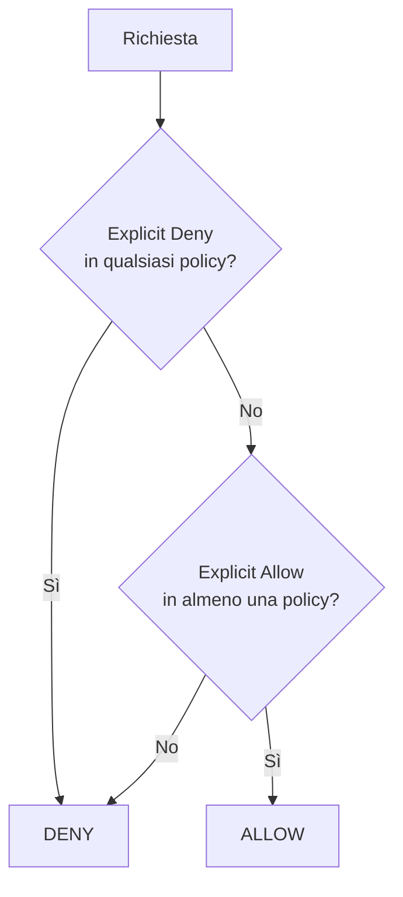

# Identity e permessi (IAM concettuale)

<div class="lesson-meta">
  <span class="badge-stato stabile">Stabile</span>
  <span>Lezione 1.3</span>
  <span>~12 min di lettura</span>
</div>

<p class="lesson-lead">Chi può fare cosa su quale risorsa. Questa è la domanda che IAM risponde — ed è la domanda di sicurezza più importante in qualsiasi sistema cloud.</p>

Puoi avere una rete perfetta e TLS ovunque, ma se i permessi sono sbagliati — troppo larghi, mal attribuiti, dati a un processo che non dovrebbe averli — il sistema è vulnerabile. La maggior parte dei breach cloud reali non passa da exploit sofisticati: passa da credenziali esposte o permessi eccessivi. **AWS IAM** (*Identity and Access Management*) è il sistema che governa ogni accesso a ogni risorsa AWS.

L'**idea in una frase**: IAM risponde sempre a tre domande — chi è il richiedente (principal), cosa vuole fare (action), su quale risorsa (resource) — e per default la risposta è no.

## I quattro elementi di una policy

Ogni decisione di accesso in AWS si riduce a una **policy**: un documento JSON che specifica cosa è permesso o negato. Ogni policy ha quattro elementi:

**Principal**: chi fa la richiesta. Può essere un IAM User (persona), un IAM Role (servizio o processo), un account AWS esterno, o un provider di identità federato (SAML, OIDC). Nel caso di policy identity-based, il principal è implicito — sei tu che attaccate la policy a un'identità specifica.

**Action**: cosa vuole fare. Ogni azione ha la forma `Servizio:Verbo`, ad esempio `s3:GetObject`, `ec2:DescribeInstances`, `lambda:InvokeFunction`, `rds:DescribeDBInstances`. La wildcard `s3:*` significa "tutto su S3". Non usarla in produzione.

**Resource**: su quale risorsa. Identificata da un **ARN** (*Amazon Resource Name*), la stringa univoca di ogni risorsa AWS. Formato: `arn:aws:s3:::mio-bucket` per un bucket, `arn:aws:s3:::mio-bucket/*` per tutti gli oggetti dentro. La wildcard `*` come resource significa "tutto" — di nuovo, non in produzione.

**Condition**: in quali circostanze (opzionale). Esempi: solo da certi IP (`aws:SourceIp`), solo con MFA attiva (`aws:MultiFactorAuthPresent`), solo su risorse con certi tag (`s3:ResourceTag`). Le condition sono la parte sottovalutata delle policy: rendono i permessi molto più precisi senza complicare la struttura.

Una policy minimale che permette a qualcuno di leggere oggetti da un bucket specifico:

```json
{
  "Effect": "Allow",
  "Action": "s3:GetObject",
  "Resource": "arn:aws:s3:::mio-bucket-dati/*"
}
```

E niente più. Niente `s3:PutObject`, niente `s3:DeleteObject`, niente accesso ad altri bucket.

## IAM User vs IAM Role: la distinzione che non si sbaglia due volte

Questa è la distinzione più importante — e quella che porta ai leak di credenziali più frequenti.

**IAM User**: un'identità con credenziali **permanenti** — username + password per la console, o access key + secret key per l'API. Pensato per persone fisiche. Il problema delle access key è che durano per sempre finché non le revochi esplicitamente, e se finiscono in un repo pubblico (succede) o in un log, sono compromesse.

**IAM Role**: un'identità **senza credenziali permanenti**. Viene "assunta" (*assumed*) da un principal via **AWS STS** (*Security Token Service*), che produce credenziali temporanee con scadenza da 15 minuti a 12 ore. Quando scadono, smettono di funzionare — anche se vengono rubate, il danno è limitato nel tempo.

I servizi AWS usano i role in tre forme:
- **EC2 Instance Profile**: ruolo associato a un'istanza EC2. Il codice che gira sull'istanza ottiene le credenziali temporanee automaticamente tramite il metadata endpoint (`169.254.169.254`).
- **Lambda Execution Role**: ruolo che Lambda assume a ogni invocazione.
- **ECS Task Role**: ruolo a livello di singolo container ECS.

**La regola che non ha eccezioni**: codice che gira su AWS → IAM Role. Mai access key hardcoded nel codice, nei file di configurazione, nelle variabili d'ambiente che entrano in un container image, in uno script di deploy. Questo è il vettore di leak numero uno.

<details>
<summary>AssumeRole tra account: la federazione di trust</summary>

IAM Role è anche il meccanismo per accesso cross-account. Se hai un account "produzione" e uno "sviluppo" separati, il developer in staging può assumere un role di sola lettura nell'account prod:

1. L'account prod crea un role con una **trust policy** che dice "l'account staging può assumere questo role".
2. Il developer in staging chiama `sts:AssumeRole` con l'ARN del role prod.
3. STS restituisce credenziali temporanee valide nell'account prod.
4. Tutto è loggato in CloudTrail con l'identità originale.

Questo pattern è la base dell'architettura multi-account: i team operano nel loro account, accedono alle risorse condivise tramite AssumeRole, con tracciabilità completa.
</details>

## Least privilege: non è una raccomandazione

**Least privilege** significa che ogni principal ha esattamente i permessi necessari per il suo lavoro — né uno di meno, né uno di più. Non è una best practice opzionale: è il principio che limita il danno quando qualcosa va storto.

Il ragionamento è semplice: se una Lambda che serve l'endpoint `/api/products` ha accesso a *tutto* DynamoDB, un bug o un attacco che sfrutta quella Lambda può leggere, scrivere o cancellare qualsiasi tabella. Se ha solo `dynamodb:Query` sulla tabella `products`, il danno possibile è limitato a quella tabella.

Nella pratica si parte larghi durante lo sviluppo (spesso `PowerUserAccess` per comodità) e si restringe in produzione. Il problema è che "restringere in produzione" rimane spesso sulla to-do list. **AWS IAM Access Analyzer** risolve questo: analizza i log di CloudTrail e ti mostra quali permessi concessi non sono stati mai usati negli ultimi X giorni — candidati alla rimozione.

**Permission boundary**: un cap massimo di permessi. Se vuoi delegare la creazione di role a un team di sviluppo senza che possano creare role con permessi più alti dei propri, attacchi una permission boundary. Anche se il team crea un role con `AdministratorAccess`, la permission boundary limita i permessi effettivi.

**Valutazione delle policy** — l'ordine che conta:



*Deny esplicito batte tutto. In assenza di Allow esplicito, la risposta è sempre Deny. Non esiste "Allow implicito".*

> **Service-to-service auth (Zero Trust, mTLS, service mesh).** IAM governa l'accesso alle *API AWS*. Quando hai microservizi che parlano tra loro nello stesso VPC, serve un livello diverso — autenticare ogni chiamata indipendentemente dalla rete. Lo vediamo in [7.6 — Zero Trust e mTLS service-to-service](../operations/zero-trust-mtls.md), perché è un tema di produzione, non di basi di sicurezza.

## Cosa non è

| Il pensiero sbagliato | Come stanno le cose |
|---|---|
| "IAM User è il modo normale per far girare codice su AWS" | IAM Role è il modo corretto per qualsiasi processo automatico. Access key permanenti nel codice sono il vettore di leak più comune e più devastante. |
| "Least privilege significa AWSReadOnlyAccess" | Least privilege significa solo i permessi necessari per quel task specifico. `ReadOnlyAccess` su tutto l'account è ancora eccessivo per una Lambda che legge da un solo bucket. |
| "Una policy con Action: * è comoda in sviluppo, poi si sistema" | Le policy permissive in sviluppo finiscono in produzione più spesso di quanto si pensi. Imposta least privilege fin dall'inizio nei contesti critici — IAM Access Analyzer aiuta a verificarlo. |

## Verifica di comprensione

> Rispondi a memoria. Le risposte incerte rivedile domani.

1. Quali sono i quattro elementi di una policy IAM? Cosa specifica ognuno?
2. Qual è la differenza fondamentale tra IAM User e IAM Role in termini di ciclo di vita delle credenziali?
3. Come fa una Lambda a ottenere le credenziali AWS senza access key nel codice?
4. Descrivi il meccanismo di valutazione delle policy: cosa batte cosa?
5. Cosa fa un Permission Boundary e quando lo usi?
6. *(anticipazione)* La tua Lambda deve leggere da S3 e scrivere su DynamoDB. Scrivi a parole (non in JSON) la policy IAM minimale che le servirebbe.

## Glossario della lezione

- **IAM** (*Identity and Access Management*): il sistema AWS che governa chi può fare cosa su quali risorse.
- **Principal**: l'identità che fa una richiesta (user, role, servizio, account).
- **Action**: l'operazione richiesta, nella forma `Servizio:Verbo` (es. `s3:GetObject`).
- **ARN** (*Amazon Resource Name*): identificatore univoco di ogni risorsa AWS.
- **IAM Role**: identità senza credenziali permanenti; si assume via STS e produce token temporanei.
- **STS** (*Security Token Service*): servizio AWS che emette credenziali temporanee.
- **Least privilege**: principio per cui ogni principal ha solo i permessi strettamente necessari.
- **IAM Access Analyzer**: tool che rileva permessi inutilizzati analizzando i log CloudTrail.
- **Permission boundary**: cap massimo ai permessi di un'identità, indipendentemente dalle policy attaccate.

## Per approfondire

- **AWS docs**: "IAM best practices" su `docs.aws.amazon.com/iam` — lista concisa e aggiornata dei principi fondamentali.
- **AWS re:Invent**: cerca "IAM deep dive" o "AWS security best practices" per sessioni con pattern avanzati (cross-account, permission boundary, ABAC — *Attribute-Based Access Control*).
- **OWASP Top 10**: A07:2021 (Identification and Authentication Failures) e A01:2021 (Broken Access Control) — le due categorie più direttamente legate a IAM mal configurato.

## Prossima lezione

IAM governa le *identità* e i *permessi*. Ma c'è una categoria di segreti che IAM non gestisce: la password del database, l'API key di Stripe, il token OAuth del webhook. Questi non sono permessi IAM — sono credenziali che il codice deve ottenere a runtime senza averle hardcoded. La prossima lezione mostra come tenerle fuori dal codice e come ruotarle senza downtime.
