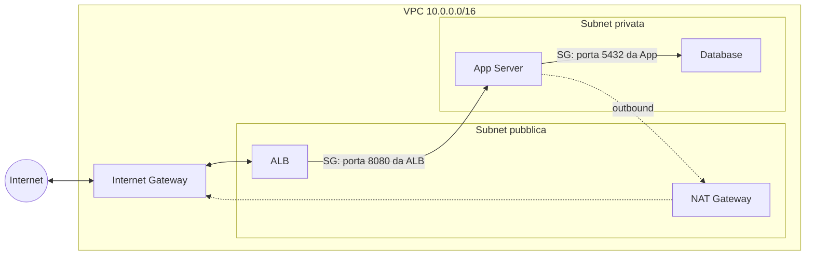

# Networking nel cloud

  Stabile
  Lezione 1.1
  ~12 min di lettura

Ogni risorsa cloud vive su una rete — e le scelte di rete determinano chi parla con chi, cosa è raggiungibile dall'esterno, e quanti soldi bruci per far uscire un pacchetto.

Nella lezione 0.3 hai incontrato il concetto di VPC — *Virtual Private Cloud* — come "rete privata su AWS". Era sufficiente per introdurre le risorse. Non è sufficiente per costruire qualcosa di reale. Un VPC non è solo un contenitore: è un sistema di routing, di isolamento, di controllo del traffico. Le scelte che fai qui — quale subnet è pubblica, dove sta il database, come configuri il firewall — determinano la sicurezza e l'architettura dell'intero sistema.

L'**idea in una frase**: nel cloud, la rete è software — la definisci con codice o con click, la cambi in minuti, ma sbagliare l'isolamento non si vede finché non ti costa.

## VPC e spazio di indirizzi

Un **VPC** è una rete logicamente isolata all'interno di AWS. "Logicamente" significa che non corrisponde a hardware dedicato: altri clienti AWS usano la stessa infrastruttura fisica, ma i loro pacchetti non vedono mai i tuoi. L'isolamento è garantito dall'hypervisor e dal software di rete di AWS.

Quando crei un VPC scegli un **CIDR block** — *Classless Inter-Domain Routing* — che definisce il tuo spazio di indirizzi IP privati. Un esempio tipico è `10.0.0.0/16`: il `/16` indica che i primi 16 bit sono fissi, lasciandoti 16 bit variabili = $2^{16} = 65.536$ indirizzi. È tanto. Per quasi tutti i carichi reali è più che sufficiente.

Dimensionare il CIDR: riferimenti pratici

| CIDR | Indirizzi totali | Uso tipico |
|---|---|---|
| `/28` | 16 | Subnet singola minima (Lambda, endpoint) |
| `/24` | 256 | Subnet di un layer applicativo |
| `/20` | 4.096 | Subnet per cluster Kubernetes mid-size |
| `/16` | 65.536 | Intero VPC — standard quasi universale |

AWS riserva 5 indirizzi per subnet (network address, router, DNS, broadcast + uno spare). Una `/24` ti dà 251 indirizzi usabili, non 256.

**Regola pratica**: prendi un `/16` per il VPC e suddividilo in subnet `/24`. Non essere avaro: cambiare il CIDR di un VPC dopo la creazione è impossibile senza ricreare tutto.

## Subnet pubbliche e private

Un VPC da solo non fa niente: le risorse vanno messe in **subnet**. Una subnet è una porzione del VPC, assegnata a una singola AZ, con una fetta dello spazio di indirizzi.

La distinzione che conta è **pubblica vs privata** — e non è una proprietà intrinseca, ma una questione di routing:

- **Subnet pubblica**: ha una route nella route table che punta a un Internet Gateway (`0.0.0.0/0 → igw-xxx`). Le risorse con IP pubblico sono raggiungibili da internet.
- **Subnet privata**: nessuna route verso internet in entrata. Le risorse sono isolate per default.

Il pattern standard per qualsiasi applicazione web è: **Load balancer nella subnet pubblica, applicazione e database nella subnet privata**. Il load balancer è l'unico punto di contatto con internet; tutto il resto non è direttamente raggiungibile.

Una cosa da non confondere: "subnet privata" non è sinonimo di "sicura". La sicurezza vera la fanno i **Security Group** (li vediamo tra poco). Una risorsa in subnet privata con Security Group mal configurato è vulnerabile quanto una in subnet pubblica.

## Internet Gateway e NAT Gateway

Per connettere il VPC a internet servono due componenti distinti, con ruoli opposti.

**Internet Gateway (IGW)**: il cancello bidirezionale. Si attacca al VPC (uno per VPC), e permette alle risorse nelle subnet pubbliche di ricevere traffico da internet *e* di inviarlo. Un'istanza EC2 in subnet pubblica con IP pubblico + route verso IGW è raggiungibile dall'esterno.

**NAT Gateway**: il cancello unidirezionale per le subnet private. Sta nella subnet *pubblica*, riceve le richieste outbound delle risorse private, le inoltra a internet usando il proprio IP pubblico, e riporta le risposte. L'effetto: le risorse private possono raggiungere internet (per scaricare dipendenze, chiamare API esterne) senza essere raggiungibili dall'esterno.

Il NAT Gateway è uno dei **costi nascosti più frequenti** del cloud. Al 2026 costa circa $0,045/ora (fissi, indipendentemente dal traffico) + $0,045/GB processato. Una sola AZ con NAT Gateway attivo 24/7 costa ~$32/mese anche senza un byte di traffico.

VPC Endpoint: evita il NAT per i servizi AWS

Se la tua Lambda o EC2 privata deve accedere solo a servizi AWS (S3, DynamoDB, Secrets Manager…), non deve passare per internet — e quindi non ha bisogno del NAT Gateway. Esiste il **VPC Endpoint**: un punto di accesso privato che connette il VPC ai servizi AWS attraverso la backbone di Amazon, senza uscire su internet.

Tipi:
- **Gateway Endpoint**: per S3 e DynamoDB. Gratuito. Si aggiunge alla route table.
- **Interface Endpoint (PrivateLink)**: per la maggior parte degli altri servizi. Costo ~$0,01/ora per AZ (al 2026).

Per un'architettura Lambda → S3 (senza necessità di accesso internet generale), un Gateway Endpoint per S3 elimina sia la necessità del NAT sia il relativo costo.

## Security Group: il firewall che conta davvero

Ogni risorsa AWS (EC2, RDS, Lambda in VPC, ECS container…) ha almeno un **Security Group** associato. Un Security Group è un firewall **stateful** a livello di network interface: definisce quale traffico è consentito in entrata e in uscita.

"Stateful" significa: se una connessione TCP è consentita in entrata, il traffico di risposta è automaticamente consentito in uscita — non serve una regola esplicita per il ritorno.

Ogni regola specifica:
- **Protocollo**: TCP, UDP, ICMP
- **Porta** (o range): 443, 5432, 0-65535
- **Source/Destination**: un CIDR (`10.0.0.0/8`) o, la cosa più potente, **un altro Security Group**

Il pattern più usato nell'architettura a layer è riferire un Security Group come source: *"consenti traffico sulla porta 5432 solo dal Security Group `sg-app`"*. Questo crea un accoppiamento logico: solo le risorse nel layer applicativo possono parlare con il database, indipendentemente dagli IP. Quando le istanze scalano e cambiano IP, non devi toccare niente.

Default di un Security Group nuovo:
- **Inbound**: tutto negato
- **Outbound**: tutto consentito

La prima cosa che si fa è restringere l'outbound a ciò che serve, e aprire l'inbound solo per le porte e le sorgenti esplicitamente necessarie.

*L'unico punto di ingresso da internet è il load balancer. App e database vivono in subnet privata, protetti da Security Group con regole che fanno riferimento ai Security Group del layer adiacente.*

## Route table: come il traffico trova la strada

Ogni subnet ha una **route table** associata: una lista ordinata di regole che dicono "per questa destinazione, vai da questa parte". La route table è ciò che distingue una subnet pubblica da una privata.

Route table di una subnet pubblica tipica:
| Destinazione | Target |
|---|---|
| `10.0.0.0/16` | local (traffico interno al VPC) |
| `0.0.0.0/0` | igw-xxxxxxxx (Internet Gateway) |

Route table di una subnet privata tipica:
| Destinazione | Target |
|---|---|
| `10.0.0.0/16` | local |
| `0.0.0.0/0` | nat-xxxxxxxx (NAT Gateway) |

La route "local" è sempre presente e non modificabile: tutto il traffico interno al VPC viene gestito direttamente, senza passare per gateway.

## Cosa non è

| Il pensiero sbagliato | Come stanno le cose |
|---|---|
| "Subnet privata = sicura per definizione" | La subnet privata isola dal traffico internet in entrata, ma non protegge dal traffico interno al VPC o da Security Group mal configurati. La sicurezza vera la fanno le regole dei Security Group. |
| "NAT Gateway è incluso nel costo base del VPC" | No: al 2026 costa ~$0,045/ora per AZ + $0,045/GB processato. Un gateway attivo in una AZ vale ~$32/mese fissi. Con più AZ per alta disponibilità, moltiplica. |
| "Posso ridimensionare il CIDR del VPC dopo la creazione" | Il CIDR primario di un VPC non si può cambiare. Si possono aggiungere CIDR secondari, ma è una soluzione di compromesso. Pianifica dall'inizio. |
| "Un Security Group è come un firewall hardware perimetrale" | È software, applicato per-NIC, stateful. Non filtra il traffico tra subnet dello stesso VPC per default — per quello serve un Network ACL o una logica di Security Group esplicita. |

## Verifica di comprensione

> Rispondi a memoria. Le risposte incerte rivedile domani.

1. Qual è la differenza tra una subnet pubblica e una privata in termini di route table?
2. Un'istanza EC2 in subnet privata deve scaricare un pacchetto da npm. Quali componenti di rete sono necessari?
3. Come configuri un Security Group per permettere solo al tier applicativo di raggiungere il database PostgreSQL sulla porta 5432?
4. Perché usare VPC Endpoint per S3 invece del NAT Gateway quando possibile?
5. Cosa succede al traffico se rimuovi la route verso l'Internet Gateway dalla route table di una subnet pubblica?
6. Un VPC con CIDR `10.0.0.0/16` quante subnet `/24` può contenere al massimo?
7. *(anticipazione)* Hai due microservizi nello stesso VPC, subnet privata. Il servizio A deve chiamare il servizio B. Basta che siano nello stesso VPC, o devi configurare altro?

## Glossario della lezione

- **VPC** (*Virtual Private Cloud*): rete logicamente isolata all'interno di AWS.
- **CIDR** (*Classless Inter-Domain Routing*): notazione per definire un range di indirizzi IP (es. `10.0.0.0/16`).
- **Subnet**: suddivisione del VPC assegnata a una singola AZ, con un sottoinsieme dello spazio di indirizzi.
- **Internet Gateway (IGW)**: componente che connette il VPC a internet in modo bidirezionale.
- **NAT Gateway** (*Network Address Translation Gateway*): permette alle risorse private di raggiungere internet in outbound senza essere raggiungibili in inbound.
- **Security Group**: firewall stateful a livello di network interface; gestisce il traffico consentito in/out per ogni risorsa.
- **Route table**: lista di regole di routing che definisce dove va il traffico uscente da una subnet.
- **VPC Endpoint**: collegamento privato verso servizi AWS senza uscire su internet pubblico.

## Per approfondire

- **AWS docs**: "What is Amazon VPC" su `docs.aws.amazon.com/vpc` — la documentazione ufficiale copre ogni componente con esempi di configurazione.
- **AWS re:Invent**: cerca "VPC deep dive" o "AWS networking fundamentals" per sessioni video con disegni architetturali dettagliati.
- **AWS Well-Architected Framework**, pilastro Security — sezione "Network protection": principi di progettazione per la difesa in profondità.
- **CIDR calculator online**: qualsiasi tool tipo `cidr.xyz` aiuta a pianificare la suddivisione prima di creare il VPC.

## Prossima lezione

Hai la rete: sai come isolare le risorse e come controllare il traffico interno. Ma un utente esterno deve ancora raggiungere il tuo sistema. Come trasforma `miaapp.com` nell'IP del load balancer? Come si stabilisce la connessione cifrata? La prossima lezione copre DNS, TLS, load balancing e CDN — i quattro strati che stanno tra l'utente e il tuo ALB.
