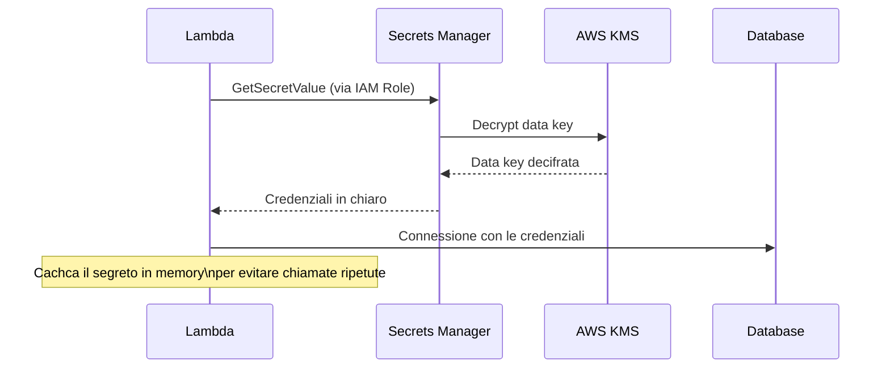

# Segreti, chiavi, dati sensibili

  Stabile
  Lezione 1.4
  ~10 min di lettura

La password del database non è un permesso IAM. L'API key di Stripe non si mette in una variabile d'ambiente del container. Questa lezione mostra dove mettere i segreti — e perché il posto non è il codice.

La lezione 1.3 ha detto: usa IAM Role, non access key nel codice. È corretto. Ma c'è una classe di segreti che IAM non gestisce: le credenziali di sistemi non-AWS. La password del database RDS che il codice deve conoscere per connettersi. La chiave API del gateway di pagamento. Il token del webhook di GitHub. Questi segreti il codice li deve avere — la questione è *come* li ottiene, e *dove* li metti.

L'**idea in una frase**: i segreti non stanno nel codice, non stanno nelle variabili d'ambiente del container image, e non stanno in file `.env` committati — stanno in un sistema dedicato che li cifra, li controlla, e li ruota, e il codice li chiede a runtime.

## Perché "non committare le credenziali" non basta

Il consiglio di non committare credenziali è giusto ma incompleto. I canali di leak sono molti:

- **Il codice nel repo** (il più ovvio, ma non il solo)
- **Le variabili d'ambiente del container image**: `docker inspect` o accesso al registry bastano per leggerle
- **I log**: se un'eccezione stampa il contesto completo, la password del DB può finire in CloudWatch Logs accessibile a tutto il team
- **I file di configurazione** (`.env`, `config.yaml`) controllati in repo anche solo "temporaneamente"
- **I CI/CD pipeline**: le variabili d'ambiente dei job sono visibili in molti sistemi di log

Il 90% dei breach di credenziali cloud non avviene via exploit sofisticati. Avviene via chiavi esposte. GitHub ha un sistema automatico che scansiona i push alla ricerca di pattern di access key AWS — e notifica AWS, che può revocarle automaticamente. Ma la notifica arriva dopo, non prima.

La soluzione non è offuscare i segreti o metterli in posti "meno ovvi". È non tenerli dove possono essere letti, usando sistemi che li gestiscono correttamente.

## AWS Secrets Manager

**AWS Secrets Manager** è il sistema di riferimento per segreti critici: password, API key, certificati. Ogni segreto è:

- **Cifrato a riposo** con una chiave KMS
- **Accessibile via IAM**: il codice deve avere il permesso `secretsmanager:GetSecretValue` sull'ARN esatto del segreto — niente permission IAM, niente accesso
- **Versionato**: ogni rotazione crea una nuova versione, le vecchie vengono tenute per il periodo di transizione
- **Rotabile automaticamente**: Secrets Manager può ruotare la password di un database RDS, aggiornare la credenziale nel database, e tutto avviene senza che il codice sappia niente — la Lambda o il container semplicemente richiede il segreto al prossimo avvio e trova già la password nuova

Il flusso runtime è semplice:

*La Lambda non ha credenziali hardcoded: le chiede a Secrets Manager a runtime, autenticandosi con il suo IAM Role.*

Costo al 2026: circa $0,40 per segreto al mese + $0,05 per 10.000 chiamate API. Per un'applicazione con 20 segreti e 1M di invocazioni al giorno, il costo è pochi euro al mese — trascurabile rispetto al rischio che evita.

**Caching**: fare una chiamata a Secrets Manager per ogni richiesta HTTP aggiunge latenza. L'**AWS Secrets Manager caching client** per Python, Java e altri linguaggi cachca il segreto in memoria per un TTL configurabile (default 1 ora). Se il segreto viene ruotato, la cache si invalida al prossimo refresh.

## SSM Parameter Store

**AWS Systems Manager Parameter Store** è l'alternativa più leggera per configurazioni e segreti di minore criticità. Un parametro di tipo **SecureString** viene cifrato con KMS — stessa protezione di Secrets Manager per la parte at-rest.

Differenze rispetto a Secrets Manager:
- **Nessuna rotazione automatica built-in**: puoi implementarla tu con una Lambda, ma non è inclusa.
- **Free tier**: fino a 10.000 parametri standard sono gratuiti; parametri advanced costano $0,05/parametro/mese (al 2026).
- **Gerarchia di path**: puoi organizzare i parametri come `/myapp/prod/db-password`, `/myapp/prod/api-key`, e leggere tutta una gerarchia con una sola chiamata.

Il caso d'uso tipico: configurazione applicativa che cambia raramente (URL dei servizi, feature flags, ARN di risorse) su Parameter Store; credenziali che ruotano su Secrets Manager.

## AWS KMS e la crittografia a buste

**AWS KMS** (*Key Management Service*) è il sistema che gestisce le chiavi crittografiche usate da Secrets Manager, S3, RDS, EBS, e quasi ogni altro servizio AWS che supporta cifratura. Capire KMS significa capire come AWS protegge i dati.

Il nucleo di KMS è la **KMS Key** (precedentemente chiamata CMK — *Customer Managed Key*): una chiave crittografica che non esce mai dall'**HSM** (*Hardware Security Module*) certificato FIPS 140-2 dove vive. Non puoi esportarla, non puoi vederla — puoi solo chiedere a KMS di fare operazioni crittografiche con essa.

Il meccanismo con cui KMS protegge dati di grandi dimensioni è la **crittografia a busta** (*envelope encryption*):

Sotto il cofano: perché la crittografia a busta

Cifrare un file da 1 GB direttamente con la KMS Key sarebbe lento (KMS è ottimizzato per chiavi, non per grandi moli di dati) e richiederebbe che i dati passino per i server KMS. Invece:

1. KMS genera una **Data Key** — una chiave AES-256 effimera.
2. La Data Key cifra i dati localmente, nel tuo sistema (veloce, nessun dato va su KMS).
3. La Data Key viene poi cifrata con la KMS Key (questa operazione avviene su KMS).
4. Il risultato: i dati cifrati + la Data Key cifrata vengono archiviati insieme.

Per decifrare:
1. Mandi la Data Key cifrata a KMS (`kms:Decrypt`).
2. KMS la decifra con la KMS Key (che non lascia mai l'HSM) e ti restituisce la Data Key in chiaro.
3. Usi la Data Key in chiaro per decifrare i dati localmente.
4. Elimini la Data Key dalla memoria.

Il risultato: la KMS Key non tocca mai i dati reali; i dati non toccano mai KMS. L'HSM protegge solo la chiave master. Questo pattern è usato da S3, EBS, RDS, Secrets Manager — tutto "cifrato con KMS" usa envelope encryption sotto.

KMS ha due tipi di chiavi:
- **AWS Managed Key**: creata e gestita da AWS per un servizio specifico (es. `aws/s3`). Automatica, gratuita, non configurabile.
- **Customer Managed Key**: creata da te, tu controlli la policy, puoi ruotarla, abilitarla/disabilitarla, vedere chi la usa in CloudTrail. Costo al 2026: $1/chiave/mese + $0,03 per 10.000 operazioni crittografiche.

Per casi standard (cifrare il database RDS, il bucket S3, i segreti) le AWS Managed Key sono sufficienti. Customer Managed Key servono quando hai requisiti di compliance che richiedono controllo diretto sulla chiave o audit granulare.

## Cosa non è

| Il pensiero sbagliato | Come stanno le cose |
|---|---|
| "Le variabili d'ambiente sono sicure per le credenziali" | Le env var si vedono nei log, in `docker inspect`, nei crash dump, nelle pipeline CI/CD. Secrets Manager è progettato per questo; le env var no. |
| "La rotazione automatica dei segreti spezza i servizi" | Secrets Manager supporta finestre di rotazione *a doppia versione*: la vecchia e la nuova password sono entrambe valide per un periodo di transizione. Il codice che usa il caching client ottiene la nuova versione al prossimo refresh. |
| "KMS cifra i file" | KMS gestisce le *chiavi*. La cifratura dei dati avviene nei client (S3, RDS, Lambda…) che usano envelope encryption con Data Key derivate da KMS. KMS non vede mai i dati in chiaro. |
| "Basta usare `.gitignore` per i file `.env`" | `.gitignore` protegge dai commit accidentali, non da leak via log, deploy script, CI/CD, o da chi ha accesso alla macchina di sviluppo. È una misura necessaria ma non sufficiente. |

## Verifica di comprensione

> Rispondi a memoria. Le risposte incerte rivedile domani.

1. Elenca tre canali di leak di credenziali che non sono "il codice committato nel repo".
2. Quale permesso IAM serve a una Lambda per leggere un segreto da Secrets Manager?
3. Cosa fa il Secrets Manager caching client e perché è necessario?
4. Qual è la differenza principale tra Secrets Manager e SSM Parameter Store?
5. Spiega envelope encryption con parole tue: perché si usa una Data Key invece di cifrare i dati direttamente con la KMS Key?
6. Quando sceglieresti una Customer Managed Key invece di una AWS Managed Key?
7. *(anticipazione)* Un'applicazione fa 10.000 richieste al secondo. Ogni richiesta richiede la password del DB. Come eviti di fare 10.000 chiamate al secondo a Secrets Manager?

## Glossario della lezione

- **AWS Secrets Manager**: sistema di gestione segreti con cifratura KMS, accesso IAM, e rotazione automatica.
- **SSM Parameter Store** (*Systems Manager Parameter Store*): store di configurazione e segreti, più leggero di Secrets Manager, con free tier.
- **SecureString**: tipo di parametro SSM cifrato con KMS.
- **AWS KMS** (*Key Management Service*): sistema di gestione chiavi crittografiche su HSM certificati.
- **HSM** (*Hardware Security Module*): hardware dedicato per operazioni crittografiche; le chiavi non ne escono mai.
- **KMS Key** (ex CMK — *Customer Master Key*): chiave master che vive in KMS; non esportabile.
- **Envelope encryption** (*crittografia a busta*): pattern in cui i dati sono cifrati con una Data Key effimera, a sua volta cifrata con la KMS Key.
- **Data Key**: chiave AES effimera generata da KMS, usata per cifrare i dati localmente.
- **Rotazione automatica**: funzione di Secrets Manager che rinnova le credenziali periodicamente senza downtime.

## Per approfondire

- **AWS docs**: "Rotate AWS Secrets Manager secrets" e "What is AWS KMS" su `docs.aws.amazon.com` — le pagine copre la rotazione step-by-step e il modello di chiavi in dettaglio.
- **AWS re:Invent**: cerca "secrets management AWS" o "AWS KMS deep dive" per sessioni con pattern avanzati di envelope encryption e multi-region secrets.
- **OWASP Top 10**: A02:2021 (Cryptographic Failures) e A07:2021 (Identification and Authentication Failures) — le categorie che coprono credential exposure e gestione errata dei segreti.

## Prossima lezione

Hai ora tutti i pezzi della Parte 1: sai costruire la rete (1.1), esporre i servizi in modo sicuro (1.2), controllare chi ha accesso (1.3), e tenere i segreti fuori dal codice (1.4). La prossima lezione mette tutto insieme in scenari reali: devi decidere, giustificare, e trovare i buchi — il formato del decision drill.
