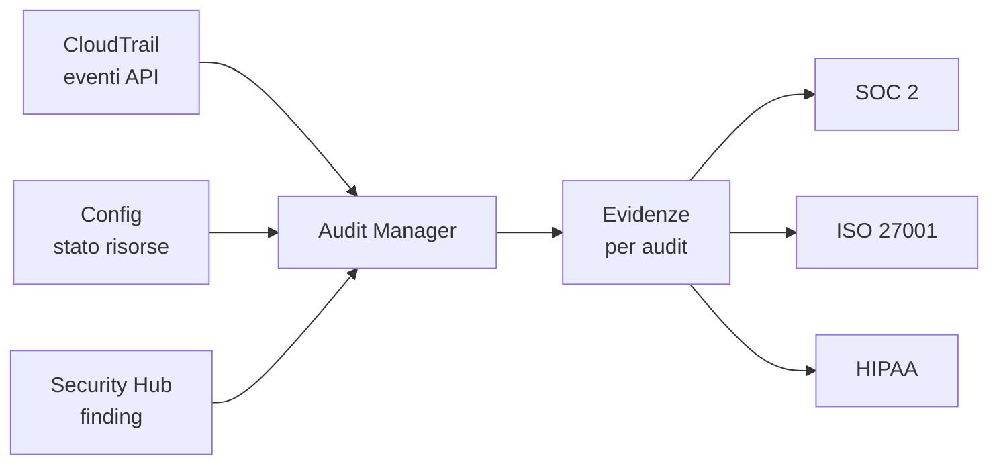

# Compliance enterprise

  In evoluzione
  Lezione 6.6
  ~11 min di lettura

La compliance non è un esame da passare una volta. È un sistema di controlli che deve essere progettato nell'infrastruttura, non aggiunto sopra dopo.

Stai costruendo un sistema per un'azienda enterprise. Ad un certo punto, prima o poi, arriva la domanda: "Sei SOC 2 compliant? Possiamo fare un audit?" Se non hai idea di cosa significhi, il meeting si ferma lì. Questa lezione ti dà il vocabolario e i concetti per non bloccarsi — senza diventare un compliance officer.

## Cos'è la compliance e perché riguarda l'engineer

**Compliance** significa conformità a un insieme di requisiti — standard tecnici, leggi, regolamenti del settore — che un'organizzazione deve dimostrare di rispettare. Gli standard che si incontrano più spesso nel cloud enterprise:

- **SOC 2** — *Service Organization Control 2*. Lo standard di sicurezza più richiesto per i vendor SaaS nel mercato nordamericano ed europeo. Non è una legge: è una certificazione volontaria che i clienti enterprise richiedono ai fornitori di servizi cloud.
- **ISO 27001** — Standard internazionale per i sistemi di gestione della sicurezza delle informazioni (ISMS). Più diffuso in Europa e in Asia. È una certificazione che un'organizzazione intera ottiene, non un singolo prodotto.
- **HIPAA** — *Health Insurance Portability and Accountability Act*. Legge americana sulla protezione dei dati sanitari. Obbligatoria per qualsiasi sistema che tratta PHI — *Protected Health Information*, dati sanitari protetti.
- **GDPR** — già trattato nella guida AI (lezione sulla privacy): è il regolamento europeo sulla protezione dei dati personali. Riguarda qualsiasi sistema che tratta dati di cittadini UE.
- **PCI DSS** — *Payment Card Industry Data Security Standard*. Obbligatorio per sistemi che trattano dati di carte di pagamento.

**Perché riguarda l'engineer:** perché la compliance non è un documento PDF che firma il legal. È una lista di controlli tecnici che devono essere implementati nell'infrastruttura. Cifratura dei dati at rest e in transit. Logging di ogni accesso. Gestione degli accessi privilegiati. Retention dei log. Backup testati. Tutto questo è roba che costruisci tu — non il compliance officer.

## SOC 2: cosa chiede all'infrastruttura

SOC 2 è organizzato attorno a cinque **Trust Service Criteria** (TSC): sicurezza, disponibilità, integrità del processamento, riservatezza, privacy. Il più richiesto è il tipo "Security" — praticamente tutti i vendor SaaS devono ottenerlo.

I controlli tecnici che SOC 2 richiede in pratica:

**Controllo degli accessi.** Chi può accedere a cosa, con quale livello di privilegi. MFA — *Multi-Factor Authentication* — obbligatoria per gli accessi umani agli account cloud. Review periodica dei permessi (access review). Gestione dei privileged user (chi ha accesso admin deve essere tracciato e limitato).

**Logging e monitoring.** Ogni accesso, ogni modifica di configurazione, ogni evento di sicurezza deve essere registrato. CloudTrail attivo in tutte le regioni, log retention adeguata (SOC 2 di solito richiede almeno un anno), alert su eventi anomali.

**Cifratura.** Dati at rest cifrati (EBS, S3, RDS con encryption abilitata). Dati in transit cifrati (TLS ovunque, niente HTTP interno non cifrato).

**Gestione delle vulnerabilità.** Patching regolare dei sistemi, scansione delle vulnerabilità (Inspector), procedure per applicare security fix critici in tempi definiti.

**Incident response.** Procedure documentate per rispondere a incidenti di sicurezza. Non basta avere i tool (GuardDuty, Security Hub): ci vuole un processo su cosa fare quando scatta un alert.

**Change management.** Le modifiche all'infrastruttura devono essere approvate, documentate e tracciate. Questo è esattamente quello che IaC con GitOps risolve: ogni cambiamento è una PR con approvazione e audit trail automatico.

## ISO 27001 e le sue differenze da SOC 2

ISO 27001 è più ampio di SOC 2: non certifica solo un prodotto SaaS ma l'intera organizzazione. Richiede la costruzione di un **ISMS** — *Information Security Management System* — con politiche, procedure, risk assessment, e audit interni periodici.

Per l'engineer, la differenza pratica con SOC 2 è limitata: molti dei controlli tecnici si sovrappongono. La differenza sta nel processo organizzativo: ISO 27001 richiede evidenza che l'organizzazione *gestisce* la sicurezza in modo sistematico, non solo che abbia i controlli tecnici. Un audit ISO 27001 valuta non solo "hai CloudTrail abilitato?" ma "hai un processo definito per analizzare i CloudTrail log e rispondere agli alert?".

## HIPAA: dati sanitari e Business Associate Agreements

HIPAA riguarda chiunque tratti PHI — dati sanitari di pazienti USA. Non è una certificazione da ottenere: è una legge con sanzioni (fino a milioni di dollari per violazione grave).

I requisiti tecnici HIPAA per l'infrastruttura cloud:

**BAA (Business Associate Agreement)**: se usi AWS per trattare PHI, devi firmare un BAA con Amazon. AWS offre BAA per i servizi che supportano HIPAA (la lista è su `aws.amazon.com/compliance/hipaa-eligible-services-reference`). Usare un servizio AWS non HIPAA-eligible per trattare PHI è una violazione, anche se il servizio è "sicuro tecnicamente".

**Audit trail completo**: ogni accesso ai dati PHI deve essere loggato. Non solo gli accessi anomali: tutti.

**Cifratura ovunque**: at rest (S3 con SSE, RDS encrypted, EBS encrypted) e in transit (TLS 1.2 minimo).

**Accesso minimo**: le persone che accedono ai dati PHI devono essere il minimo indispensabile, e gli accessi devono essere revocati prontamente quando non servono.

## Strumenti AWS per la compliance

**AWS Config** — il servizio che registra la configurazione di ogni risorsa AWS nel tempo e valuta se rispetta le regole definite. Può rilevare automaticamente che un bucket S3 è diventato pubblico, che un security group ha una regola non conforme, che un'istanza RDS non ha la cifratura abilitata. I **Config Rules** sono valutazioni automatiche che puoi legare a standard come CIS AWS o HIPAA.

**AWS CloudTrail** — già citato in 6.4: ogni chiamata API loggata. Per la compliance è obbligatorio e deve coprire tutte le regioni, con log archiviati su S3 e retention di almeno un anno nella maggior parte degli standard.

**AWS Audit Manager** — servizio che automatizza la raccolta di evidenze per audit. Mappa i controlli AWS ai framework di compliance (SOC 2, ISO 27001, HIPAA, PCI DSS) e raccoglie automaticamente prove da CloudTrail, Config, Security Hub. Riduce drasticamente il lavoro manuale di preparazione audit.

**AWS Security Hub con standard abilitati** — Security Hub include check automatici su CIS AWS Foundations Benchmark e AWS Foundational Security Best Practices. Se stai preparando un audit SOC 2, abilitare questi check ti dà un punto di partenza per capire dove sei e dove devi agire.

*Audit Manager aggrega evidenze da più fonti per costruire il dossier di audit.*

## Audit trail: la base di tutto

Un tema trasversale a tutti gli standard: l'**audit trail**. Una sequenza immutabile e completa di chi ha fatto cosa, quando, su quale risorsa. Senza audit trail non puoi dimostrare conformità a nessuno standard — né ricostruire cosa è successo durante un incidente.

I requisiti minimi per un audit trail affidabile:

- **Immutabilità**: i log non devono essere modificabili. S3 con Object Lock (WORM — *Write Once Read Many*) garantisce che i log non possano essere cancellati o modificati per un periodo definito.
- **Completezza**: tutti gli eventi rilevanti loggati, senza gap. CloudTrail con multi-region e S3 Log Bucket cifrato copre le chiamate API AWS.
- **Retention adeguata**: SOC 2 tipicamente richiede 1 anno, ISO 27001 spesso 2-3 anni, HIPAA richiede 6 anni per certi tipi di documentazione.
- **Accessibilità**: i log devono essere ricercabili per un audit. CloudWatch Logs Insights, Athena su S3, OpenSearch sono strumenti comuni.

## Cosa non è la compliance

| Il pensiero sbagliato | Come stanno le cose |
|---|---|
| "La compliance è roba da legal, non da tech" | I controlli tecnici (cifratura, logging, accesso minimo, patch management) sono il cuore della compliance. L'engineer li costruisce. Legal firma i contratti; l'engineer costruisce l'evidenza tecnica che quei contratti vengono rispettati. |
| "Una volta certificati, siamo a posto" | SOC 2 si rinnova ogni anno. ISO 27001 richiede audit di sorveglianza annuali e un audit di rinnovo ogni tre anni. La compliance è manutenzione continua, non un esame da passare una volta. |
| "AWS è SOC 2 compliant, quindi lo siamo anche noi" | AWS è responsabile della sicurezza *del* cloud (infrastruttura fisica, hypervisor, rete). Tu sei responsabile della sicurezza *nel* cloud (configurazioni, applicazioni, accessi, dati). La responsabilità condivisa si applica anche alla compliance. |
| "Abbiamo tutti gli strumenti AWS attivi, siamo compliant" | Gli strumenti generano evidenze; la compliance richiede anche processi documentati, persone formate, risk assessment, e risposta agli alert. Un Audit Manager che raccoglie prove automaticamente è utile; un team che non agisce sulle evidenze non supera l'audit. |

## Verifica di comprensione

1. Qual è la differenza tra SOC 2 e ISO 27001?
2. Cos'è un BAA e perché è necessario per trattare dati HIPAA su AWS?
3. Quali controlli tecnici specifici richiede SOC 2?
4. Cosa fa AWS Config e come supporta la compliance?
5. Cos'è l'immutabilità dei log e come si ottiene su S3?
6. Perché "AWS è SOC 2 compliant" non significa che il tuo sistema lo sia?
7. Cosa rende la compliance un processo continuo e non un'attività una tantum?

## Glossario della lezione

**SOC 2** — *Service Organization Control 2*. Standard di sicurezza per vendor SaaS, basato su Trust Service Criteria.

**ISO 27001** — Standard internazionale per la gestione della sicurezza delle informazioni (ISMS).

**HIPAA** — *Health Insurance Portability and Accountability Act*. Legge USA sulla protezione dei dati sanitari.

**PHI** — *Protected Health Information*. Dati sanitari identificabili di pazienti USA, protetti da HIPAA.

**BAA** — *Business Associate Agreement*. Contratto richiesto da HIPAA tra un'entità coperta e i suoi fornitori di servizi cloud.

**ISMS** — *Information Security Management System*. Sistema di gestione della sicurezza richiesto da ISO 27001.

**PCI DSS** — *Payment Card Industry Data Security Standard*. Standard per sistemi che trattano dati di carte di pagamento.

**AWS Config** — Servizio che registra la configurazione delle risorse AWS nel tempo e valuta la conformità a regole definite.

**AWS Audit Manager** — Servizio che automatizza la raccolta di evidenze per audit di compliance.

**WORM** — *Write Once Read Many*. Modello di storage in cui i dati scritti non possono essere modificati o cancellati. S3 Object Lock implementa WORM.

**Audit trail** — Sequenza immutabile e completa di eventi che registra chi ha fatto cosa, quando, su quale risorsa.

**MFA** — *Multi-Factor Authentication*. Autenticazione che richiede due o più fattori di verifica.

## Per approfondire

- **AWS Compliance Center** — `aws.amazon.com/compliance`. Hub di AWS per tutti i framework di compliance supportati, con whitepaper e checklist.
- **AICPA SOC 2 Trust Services Criteria** — `aicpa.org`. La fonte primaria per i criteri SOC 2.
- **AWS Audit Manager documentation** — `docs.aws.amazon.com/audit-manager`. Come configurare i framework e raccogliere evidenze.
- **AWS HIPAA documentation** — `aws.amazon.com/compliance/hipaa-compliance`. Servizi HIPAA-eligible e BAA.

## Prossima lezione

Chiusa la Parte 6. La 6.7 è il decision drill: un scenario reale in cui i costi sono raddoppiati — cosa indaghi, in che ordine, e quali voci controlli prima. È il tipo di domanda che arriva in un colloquio cloud o in una retrospettiva post-spike di spesa.
