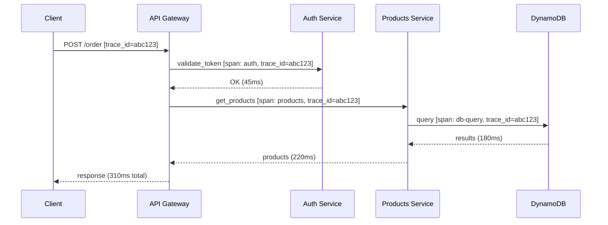

# Distributed tracing e observability avanzata

  In evoluzione
  Lezione 6.3
  ~13 min di lettura

In un sistema distribuito, una richiesta attraversa molti pezzi. Il tracing è il filo che li tiene uniti — senza di esso, una latenza anomala è un mistero senza soluzione.

Nella 6.2 hai impostato metriche e alert: sai *che* la latenza è alta. Ma in un sistema fatto di API Gateway, Lambda, SQS, un microservizio di notifiche e un database, "la latenza è alta" è l'inizio dell'indagine, non la fine. **Dove si è perso il tempo?** A quale hop? È una singola richiesta lenta o tutte?

Il distributed tracing è la risposta a questa domanda.

## Il problema: trovare il collo di bottiglia in un sistema distribuito

In un monolite è semplice: tutto gira in un processo, puoi aggiungere un `print` o un profiler e seguire l'esecuzione. In un sistema distribuito — dove ogni servizio è un processo separato, magari in container diversi, magari in AZ diverse — quella continuità si spezza.

Considera una richiesta che va da un client verso un'API REST, che chiama un servizio di autenticazione, che legge un token da Redis, poi chiama un servizio di prodotti su DynamoDB, poi passa il risultato a un servizio di prezzi che a sua volta fa tre chiamate a un'API esterna. La risposta finale arriva in 800 ms. Dove si è persa?

Senza tracing: apri sei set di log diversi, cerchi per timestamp approssimato, provi a ricostruire la sequenza a mano. Con un po' di fortuna in un'ora hai capito qualcosa.

Con il tracing: hai un singolo grafico che mostra ogni hop, i suoi tempi, gli errori, gli attributi chiave. In cinque minuti vedi che il servizio di prezzi ha impiegato 600 ms su un'API esterna che di solito risponde in 50 ms.

## Come funziona il tracing: span, trace, context propagation

Il meccanismo è semplice ma richiede che tutti i servizi cooperino.

Quando una richiesta entra nel sistema, viene generato un **trace ID** — un identificatore univoco. Ogni operazione significativa che fa parte di quella richiesta genera uno **span**: un record con un nome, il trace ID di appartenenza, un timestamp di inizio e uno di fine, e opzionalmente degli attributi (parametri, codici di risposta, errori).

*Una richiesta con trace ID condiviso tra tutti i hop: ogni span registra il proprio tempo.*

Il punto critico è la **context propagation**: il trace ID deve viaggiare con la richiesta attraverso ogni chiamata HTTP, ogni messaggio su una coda, ogni invocazione asincrona. Di solito viaggia negli header HTTP (il campo `traceparent` nello standard W3C Trace Context, o `X-Amzn-Trace-Id` per AWS X-Ray). Se un servizio non propaga il trace ID, la catena si spezza e quel pezzo è "buio".

Questo è anche il motivo per cui il tracing richiede un investimento: tutti i servizi devono essere strumentati. Non è una cosa che abiliti e funziona da sola come le metriche CloudWatch.

## AWS X-Ray

**AWS X-Ray** è il servizio di distributed tracing di AWS. Integrato nativamente con Lambda, API Gateway, ECS, EC2 e molti altri servizi AWS.

Come funziona nella pratica: abiliti il tracing su Lambda con una riga di configurazione (`TracingConfig: Active`), aggiungi il SDK X-Ray al codice dell'applicazione per strumentare le chiamate HTTP e i query DB, e X-Ray inizia a raccogliere span. La console X-Ray mostra una **service map** — una visualizzazione grafica di tutti i servizi che si parlano — e per ogni richiesta campionata il dettaglio degli span con i tempi.

Il campionamento è importante: tracciare il 100% delle richieste ha un costo e un overhead. X-Ray campiona di default l'1% delle richieste (con qualche regola per assicurarsi di catturare almeno una richiesta al secondo). Puoi configurare regole di campionamento diverse per tipo di richiesta.

I costi al 2026: $5 per milione di span registrati, con un tier gratuito di 100.000 span al mese per account. Per la maggior parte dei sistemi non è il costo principale, ma va tenuto sotto controllo su sistemi ad alto volume.

## I tre pilastri dell'observability

Il tracing è il terzo pilastro di un framework di observability che conviene avere in testa come insieme:

**Metriche** — cosa sta succedendo in aggregato, in tempo reale. Bassa latenza, basso costo di storage, alta compressibilità. Perfette per alert e trend.

**Log** — cosa è successo esattamente, evento per evento. Alta fedeltà, alto costo a volumi, difficili da correlare su sistemi distribuiti senza trace ID.

**Trace** — come una richiesta specifica ha attraversato il sistema. Altissima utilità per debugging, costo moderato se ben campionato, richiede strumentazione.

La regola pratica: **usa le metriche per rilevare**, **i log per capire il contesto**, **le trace per isolare il problema** in un sistema distribuito. Non sono alternativi, sono complementari.

## Correlazione: il superpotere dell'observability matura

Il salto qualitativo viene quando riesci a correlare i tre tipi di segnale sullo stesso problema.

Esempio: l'alert di latenza scatta (metrica). Vai sul grafico CloudWatch, vedi il picco alle 14:37. Apri X-Ray, filtri per le richieste lente in quel timeframe, vedi che il servizio di pagamenti aveva latenza alta. Dal trace ID di una richiesta lenta, vai ai log di quel container nel timeframe esatto, e trovi l'errore: "connection pool exhausted, waiting for available connection". Il problema era il pool di connessioni al database, non il database stesso.

Senza correlazione, questo percorso avrebbe richiesto molto più tempo — o non sarebbe mai arrivato alla causa radice.

Strumenti come **AWS CloudWatch Container Insights**, **Amazon OpenSearch Service** e soluzioni terze (Datadog, Grafana + Loki + Tempo) offrono questa correlazione in modo più automatico. Il principio resta: imposta i log per includere il trace ID in ogni riga, e la correlazione diventa meccanica.

## OpenTelemetry: lo standard aperto

In evoluzione

**OpenTelemetry** (spesso abbreviato OTel) è diventato lo standard de facto per strumentare applicazioni in modo vendor-neutral. È un progetto CNCF — *Cloud Native Computing Foundation* — che definisce API, SDK e protocolli per raccogliere metriche, log e trace indipendentemente dal backend.

Il vantaggio concreto: strumenti il codice una volta con l'SDK OTel, poi scegli dove mandare i dati — X-Ray, Datadog, Jaeger, Grafana Tempo — cambiando solo la configurazione del collector, senza toccare l'applicazione. Non sei legato al vendor.

AWS supporta OpenTelemetry nativamente con **AWS Distro for OpenTelemetry** (ADOT): un collector certificato che può ricevere dati OTel e inoltrarli a X-Ray o CloudWatch. Per sistemi nuovi nel 2026 è la scelta consigliata: ti dà flessibilità futura senza overhead operativo immediato.

## SLO e error budget revisitati

La 6.2 ha introdotto SLO e error budget. Il tracing aggiunge un pezzo: puoi costruire SLO più granulari, non solo sulla disponibilità globale ma su percorsi critici specifici.

"Il 99,5% delle richieste di checkout deve completarsi in meno di 1 secondo" è uno SLO su un singolo percorso. Con il tracing puoi misurarlo con precisione, identificare quali hop contribuiscono alla latenza, e prioritizzare le ottimizzazioni su ciò che conta davvero per l'utente.

Questo è l'observability matura: non solo sapere che qualcosa si è rotto, ma capire *dove* ottimizzare prima che si rompa.

## Cosa non è il distributed tracing

| Il pensiero sbagliato | Come stanno le cose |
|---|---|
| "Tracciare il 100% delle richieste è meglio" | Il campionamento al 100% ha costo e overhead proporzionali al traffico. Per la maggior parte dei casi, campionare il 1-5% — con la garanzia di catturare tutti gli errori e le richieste lente — dà insight adeguati a costo sostenibile. |
| "X-Ray risolve il problema da solo senza strumentazione" | X-Ray strumenta automaticamente le chiamate ai servizi AWS. Le chiamate HTTP verso servizi non-AWS e il codice applicativo devono essere strumentati manualmente con l'SDK. Il "gratis" è parziale. |
| "Metriche e log bastano, il tracing è un lusso" | Su un monolite è vero. Su microservizi con più di tre hop, senza tracing il debugging di latenze anomale può impiegare ore invece di minuti. Il ROI è alto abbastanza da giustificarlo. |
| "OpenTelemetry è complicato, meglio usare solo X-Ray" | Il setup iniziale di OTel richiede un po' più di configurazione. Ma il vantaggio di non essere locked-in al vendor vale l'investimento per qualsiasi sistema che punta a durare. |

## Verifica di comprensione

1. Cos'è un trace ID e perché deve viaggiare attraverso ogni hop di una richiesta?
2. Cos'è uno span? Che informazioni contiene?
3. Perché il campionamento è importante nel tracing? Quali richieste conviene sempre catturare?
4. Quali sono i tre pilastri dell'observability e cosa risponde ciascuno?
5. Cosa significa "correlare" metriche, log e trace? Fai un esempio pratico.
6. Cos'è OpenTelemetry e qual è il suo vantaggio rispetto a usare direttamente X-Ray?
7. Come puoi costruire uno SLO su un percorso critico specifico usando il tracing?

## Glossario della lezione

**Distributed tracing** — Tecnica per tracciare il percorso di una singola richiesta attraverso più servizi in un sistema distribuito.

**Trace** — L'insieme degli span che descrivono il percorso completo di una richiesta attraverso il sistema.

**Span** — Un'operazione unitaria all'interno di un trace: ha nome, trace ID, timestamp di inizio/fine, attributi.

**Trace ID** — Identificatore univoco condiviso da tutti gli span di una stessa richiesta.

**Context propagation** — Il meccanismo per cui il trace ID viaggia con la richiesta attraverso chiamate HTTP, code, eventi.

**AWS X-Ray** — Servizio di distributed tracing di AWS. Integrato con Lambda, API Gateway, ECS, EC2.

**Service map** — Visualizzazione grafica in X-Ray dei servizi che si chiamano tra loro e delle loro dipendenze.

**OpenTelemetry (OTel)** — Standard CNCF vendor-neutral per strumentare applicazioni con metriche, log e trace.

**ADOT** — *AWS Distro for OpenTelemetry*. Collector certificato AWS compatibile con OTel.

**CNCF** — *Cloud Native Computing Foundation*. Organizzazione che mantiene progetti open source per il cloud nativo (Kubernetes, OTel, Prometheus, ecc.).

## Per approfondire

- **OpenTelemetry documentation** — `opentelemetry.io/docs`. Guida ufficiale a SDK, collector e integrations.
- **AWS X-Ray documentation** — `docs.aws.amazon.com/xray`. Configurazione, campionamento, integrazione con i servizi AWS.
- **Google SRE Book, capitolo "Monitoring Distributed Systems"** — `sre.google/books`. Il framework concettuale di riferimento.
- **AWS re:Invent** — cercare "distributed tracing AWS" per talk con casi reali su scale.

## Prossima lezione

Sai rilevare i problemi e tracciarne il percorso. La 6.4 affronta la domanda che i team di sicurezza fanno sempre: il sistema è configurato in modo sicuro? Least privilege, superficie d'attacco, errori di configurazione comuni — e come scoprirli prima che lo faccia qualcun altro.
