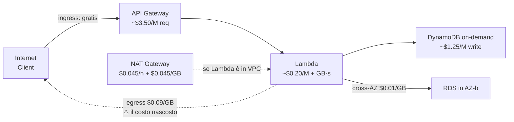

# FinOps: il cloud costa in modi sorprendenti

  In evoluzione
  Lezione 7.1
  ~14 min di lettura

Il cloud paga ciò che usi — e questo è ottimo. Il problema è che molte cose le stai usando senza saperlo.

Il prezzo di un server fisico arriva una volta sola: firmi il contratto, esce la cifra, e basta. Il cloud lavora diversamente: **ogni risorsa ha un orologio, e quell'orologio gira finché la risorsa è accesa** — anche se tu nel frattempo stai dormendo, e anche se non c'è nessun traffico sopra. Chi non interiorizza questo shift mentale trova bollette sorprendenti già al secondo mese.

**FinOps** — *Financial Operations*, gestione finanziaria dell'infrastruttura cloud — è la disciplina che colma il gap tra "quanto ho speso" e "perché ho speso così". Non è contabilità: è architettura. Le decisioni di FinOps si prendono quando disegni il sistema, non a fine mese quando la bolletta è già arrivata.

## Il cloud a consumo — il cambio di paradigma

In un datacenter tradizionale la spesa è **CapEx** — *Capital Expenditure*, immobilizzazioni. Compri i server, li ammortizzi in cinque anni. La bolletta della corrente esiste, ma è relativamente piccola. Il costo è fisso, il resto del tempo lo macchini gratis.

Nel cloud la spesa è **OpEx** — *Operational Expenditure*, costi correnti. Paghi per il tempo, per i dati trasferiti, per le richieste processate. Tre implicazioni dirette:

**Primo**: se una risorsa è accesa e non fa niente, costa comunque. Un'istanza EC2 `m5.large` ferma costa la stessa cosa di una sotto pieno carico, perché il modello di fatturazione è *per ora di esistenza*, non per percentuale di utilizzo della CPU. Questo è il motivo per cui *spegnere le cose* è una skill tecnica a tutti gli effetti.

**Secondo**: il traffico di rete ha un prezzo asimmetrico. Il traffico in **ingresso** (*ingress*) verso il cloud è quasi sempre gratuito. Il traffico in **uscita** (*egress*) — quando i dati lasciano il datacenter AWS — si paga, e si paga bene: al 2026, circa **$0.09 per GB** nei trasferimenti verso Internet per le prime centinaia di TB mensili. Su un sistema che serve molto contenuto, questo singolo voce può superare il costo del compute.

**Terzo**: alcune risorse si pagano per le unità lavorate, non per il tempo. AWS Lambda si fattura per *numero di invocazioni × durata in GB-secondi*. Amazon DynamoDB in modalità on-demand si fattura per *richiesta di lettura/scrittura*. Se non ci metti un budget alert, scopri che quella funzione chiamata in loop da un bug ha fatto $300 di danni prima che te ne accorgessi.

## I costi nascosti che sorprendono di più

Il 2026 ha consolidato un certo catalogo di trappole, documentate su ogni forum di cloud architetti. Eccole in ordine di frequenza.

### NAT Gateway

Il **NAT Gateway** — *Network Address Translation Gateway* — permette alle risorse in una subnet privata di raggiungere Internet senza avere un IP pubblico. È quasi obbligatorio in un'architettura VPC pulita. Il problema è il costo: al 2026 circa **$0.045 per ora** di esistenza (indipendente dal traffico) più **$0.045 per GB** di dati processati. Una coppia di NAT Gateway in multi-AZ su una workload con traffico Internet sostenuto può generare $200-400/mese senza che nessuno se ne accorga, perché è un costo infrastrutturale che "si vede" solo con i tag di allocazione.

La mossa: non mettere il NAT Gateway finché non ne hai davvero bisogno. Le Lambda non hanno bisogno di stare in una VPC — e quindi di un NAT Gateway — a meno che non debbano raggiungere risorse in VPC come RDS o ElastiCache. Se ci finiscono dentro *per abitudine*, il costo è tutto overhead.

### Istanze dimenticate accese

La trappola più classica. Accendi un'istanza EC2 per un test, finisci il test, chiudi il terminale. L'istanza resta lì, con le sue $0.096/ora (`m5.large`, us-east-1 al 2026), finché non vai a spegnerla esplicitamente. Su un conto con più utenti o più team, questo accade regolarmente — e le istanze dimenticate si accumulano.

La difesa: **AWS Cost Anomaly Detection** (un servizio che impara il profilo di spesa normale e segnala deviazioni significative) più **budget alert** configurati sull'account subito, prima di toccare qualsiasi risorsa. La lezione 5.1 lo ripete fin dall'inizio: è il primo gesto che fai su un account AWS, non l'ultimo.

### Snapshot e volumi EBS orfani

Quando elimini un'istanza EC2, il volume EBS — *Elastic Block Store*, il "disco" dell'istanza — non viene eliminato automaticamente per default. Resta lì, fatturato a circa **$0.10 per GB-mese** (SSD gp3 al 2026), anche senza niente sopra. Stessa cosa per gli snapshot di backup: si accumulano, e ognuno paga in base alla dimensione. Su ambienti attivi da anni, i costi di snapshot possono essere sorprendentemente alti.

### Traffico cross-AZ

Ogni dato che viaggia tra due **AZ** — *Availability Zone* — all'interno della stessa regione AWS paga un pedaggio: circa **$0.01 per GB** in ciascuna direzione. È poco, ma in un microservizio con molte chiamate interne — o un database in una AZ con i suoi client distribuiti su un'altra — si somma. La contromisura architetturale è avvicinare i servizi che si parlano di più: stessa AZ dove possibile, oppure tenere il traffico "regionale" che comunque non attraversa AZ.

### Data Transfer Out con i servizi managed

Un caso sottile: richiamare molti dati da S3, RDS o DynamoDB verso un client esterno. Il trasferimento dai servizi managed verso Internet ha le stesse tariffe di egress standard. Se hai un sistema che scarica grandi blob da S3 verso utenti web ogni giorno, quella voce di spesa scala linearmente con il traffico.

## Sotto il cofano: leggere un profilo di costo

Prima di ottimizzare, devi saper leggere. Un profilo di costo si costruisce sempre con la stessa formula mentale:

$$C_{totale} = C_{compute} + C_{storage} + C_{network} + C_{managed}$$

Dove:

- $C_{compute}$ = $\sum_i (ore_i \times prezzo\_istanza_i)$ — per ogni istanza, ogni GPU, ogni invocazione Lambda
- $C_{storage}$ = $\sum_j (GB_j \times prezzo\_storage_j)$ — S3, EBS, snapshot, RDS, ElastiCache
- $C_{network}$ = $GB_{egress} \times 0.09 + GB_{crossAZ} \times 0.02 + ore_{NAT} \times 0.045 + GB_{NAT} \times 0.045$
- $C_{managed}$ = costi per richiesta o per ora dei servizi gestiti (DynamoDB, SQS, API Gateway, ecc.)

**La parte non intuitiva**: nei sistemi cloud reali, $C_{network}$ — soprattutto egress e NAT — spesso sorpassa $C_{compute}$ su workload data-intensive. I venditori cloud tendono a mettere in risalto il prezzo del compute (competitivo, facilmente paragonabile) e a sminuire il costo di rete (voci piccole per unità, ma molte e continue).

La traduzione pratica: quando fai una stima di costo di una nuova architettura, calcola *prima* il costo di rete stimato. Se ti sorprende, è un segnale che l'architettura ha un problema.

*Profilo di costo di un endpoint serverless tipico: l'egress verso il client e il NAT Gateway (se Lambda è in VPC) sono le voci che crescono con il traffico.*

## Strumenti AWS per controllare la spesa

AWS offre un toolkit di FinOps ragionevole. Nell'ordine in cui dovresti usarli:

**AWS Budgets** — il primo strumento da configurare. Imposti una soglia di spesa mensile (es. $50) e ricevi un'email o un'alerting SNS quando arrivi al 50%, 80%, 100%. Gratis per i primi due budget, poi $0.02 al giorno per budget aggiuntivi. Non aspettare che la bolletta arrivi: questi si configurano il giorno zero.

**AWS Cost Explorer** — la visualizzazione interattiva della spesa storica, suddivisibile per servizio, regione, account, tag. Utile per capire *dove* va il denaro e fare trend analysis. La granularità oraria costa extra; quella giornaliera è inclusa.

**AWS Cost Anomaly Detection** — machine learning che apprende il profilo di spesa normale e segnala quando qualcosa devia significativamente. Cattura le istanze dimenticate, i bug che chiamano in loop, i picchi inattesi. Costa circa $0.10 per $1000 di spesa analizzata — per la maggior parte degli account è sostanzialmente gratis.

**Cost Allocation Tags** — tag applicati alle risorse AWS (es. `Project: api-v2`, `Team: backend`, `Env: prod`) che permettono di segmentare la spesa per dimensione di business. Senza tag, Cost Explorer ti dice "hai speso $200 su EC2" ma non *quale* progetto o team li ha generati. Attivali subito: il tagging retroattivo non funziona per i costi passati.

**AWS Compute Optimizer** — analizza i pattern di utilizzo delle istanze EC2 e dei container ECS e suggerisce il tipo di istanza più efficiente per il tuo carico reale. Non sostituisce il ragionamento architetturale, ma trova i casi in cui stai pagando per il doppio della CPU che usi davvero.

**Savings Plans e Reserved Instances** — impegni pluriennali (1 o 3 anni) in cambio di sconti fino al 60-70% rispetto al prezzo on-demand. Hanno senso solo su workload stabili e prevedibili. Su workload spiky o in fase di discovery, il prezzo on-demand con buona architettura batte l'impegno pluriennale: non bloccare il cash per flessibilità che non hai ancora capito di non volere.

## Carbon-aware FinOps

Dal 2025-26 è entrata nelle slide enterprise una dimensione che prima viveva solo nelle policy di sostenibilità: **le emissioni di CO₂ come asse di costo dell'infrastruttura**.

Il meccanismo è semplice: l'intensità di carbonio dell'elettricità varia per regione (una regione alimentata da fonti rinnovabili emette meno di una a carbone) e per ora del giorno (nelle ore di picco la rete usa più fonti fossili per la punta). Questo significa che la stessa Lambda in `us-east-1` ha un'impronta diversa a seconda di quando gira.

**AWS Customer Carbon Footprint Tool** — disponibile nella console AWS Billing, mostra le emissioni stimate in tCO₂e per servizio e regione, con confronto anno su anno. Non è perfetto (i dati AWS sui PUE e sul mix energetico sono aggregati, non per singola AZ), ma permette di rendicontare alle compliance enterprise che lo chiedono.

**Carbon-aware scheduling**: la pratica di spostare workload *non time-sensitive* — training batch, export notturni, ricalcoli storici, test di carico — nelle regioni o nelle finestre orarie a minore intensità di carbonio. AWS ha regioni con quasi-zero emissioni (es. `eu-north-1` in Svezia, quasi interamente idroelettrica); `us-east-1` è mediamente più "sporca" per il mix energetico della costa est USA.

Un'implementazione concreta: EventBridge Scheduler che lancia i batch job di notte in una regione a basse emissioni invece che in quella di default. Il costo compute è lo stesso; l'impronta è diversa. E con l'arrivo dei "carbon surcharge" enterprise, l'impronta ha un prezzo.

Questa non è ecologia da brochure. I contratti enterprise del 2026 iniziano a includere requisiti di Scope 3 (emissioni indirette della supply chain), e l'infrastruttura cloud dei fornitori rientra in quella categoria. Ignorarla è una scelta tecnica con conseguenze commerciali.

## Cosa non è FinOps

| Il pensiero sbagliato | Come stanno le cose |
|---|---|
| "Il cloud è sempre più costoso di un server fisico" | Dipende dal pattern d'uso. Per workload spiky e variabili, il cloud vince nettamente. Per workload stabili e prevedibili a lungo termine, il capex fisico può battere l'opex cloud — ma il confronto va fatto includendo i costi operativi (team ops, hardware refresh, cooling). Non c'è una risposta universale. |
| "FinOps è roba da CFO, non da engineer" | Le decisioni architetturali *sono* decisioni di costo. Mettere Lambda in VPC, scegliere quante AZ, usare S3 diretto o passare da un proxy: ogni scelta impatta la bolletta. L'engineer che non fa FinOps scarica il problema sulla finanza, che non ha gli strumenti per risolverlo. |
| "Bastano i Savings Plans per ridurre la spesa" | I Savings Plans riducono il costo dell'esistente, non eliminano lo spreco. Un'istanza che non serve — scontata del 60% — costa ancora il 40%. Prima elimini lo spreco architetturale, poi ottimizzi il residuo con gli impegni. |
| "Il costo di rete è trascurabile" | È la voce più sottovalutata in assoluto. Sistemi data-intensive, molte AZ, NAT Gateway attivo: il networking supera spesso il compute. Va stimato prima, non scoperto dopo. |

## Verifica di comprensione

1. Un'istanza EC2 è accesa ma non riceve traffico. Sta costando denaro? Perché?
2. Che cos'è il traffico egress e perché ha un prezzo diverso dall'ingress?
3. Perché un NAT Gateway ha un costo fisso *e* un costo variabile? Quando conviene evitarlo?
4. Nomina tre servizi AWS utili per il controllo della spesa e spiega la funzione principale di ognuno.
5. Cos'è il "cross-AZ traffic cost" e quando diventa rilevante?
6. Cosa sono i Cost Allocation Tags e perché configurarli subito ha più valore che configurarli dopo?
7. In cosa consiste il carbon-aware scheduling e in quale tipo di workload ha più senso applicarlo?

## Glossario della lezione

**CapEx** — *Capital Expenditure*. Spesa in immobilizzazioni (server fisici, hardware). Si ammortizza nel tempo.

**OpEx** — *Operational Expenditure*. Costi correnti (abbonamenti, utilizzo cloud). Si paga nel periodo in cui viene sostenuto.

**FinOps** — *Financial Operations*. Disciplina di gestione finanziaria dell'infrastruttura cloud. Unisce ingegneria, finanza e business.

**Egress** — Traffico di dati *in uscita* dal cloud verso Internet o altri provider. A pagamento.

**Ingress** — Traffico di dati *in ingresso* nel cloud. Generalmente gratuito.

**NAT Gateway** — *Network Address Translation Gateway*. Permette alle risorse in subnet privata di raggiungere Internet senza IP pubblico. A pagamento per ora e per GB.

**AZ** — *Availability Zone*. Datacenter fisicamente separato all'interno di una regione AWS. Il traffico tra AZ si paga.

**EBS** — *Elastic Block Store*. Storage a blocchi persistente per istanze EC2. Si paga per GB-mese anche senza utilizzo attivo.

**Cost Allocation Tag** — Tag applicato alle risorse AWS per segmentare la spesa per progetto, team o ambiente nei report di costo.

**Savings Plans** — Impegno di spesa pluriennale su AWS in cambio di sconti fino al 60-70% rispetto ai prezzi on-demand.

**tCO₂e** — *Tonnellate di CO₂ equivalente*. Unità di misura delle emissioni di gas serra.

## Per approfondire

- **AWS Well-Architected Framework, pilastro Cost Optimization** — la lettura di riferimento ufficiale. Disponibile su `docs.aws.amazon.com/wellarchitected`.
- **AWS Pricing Calculator** — strumento per stimare i costi prima di deployare. Disponibile su `calculator.aws`.
- **FinOps Foundation — FinOps Framework** — il framework di settore per la disciplina FinOps, con maturity model e best practice. Disponibile su `finops.org/framework`.
- **AWS re:Invent** — le sessioni "Cost Optimization" degli ultimi anni (cercabili su YouTube per "AWS re:Invent cost optimization") coprono pattern reali con numeri reali.

## Prossima lezione

Hai visto come la spesa si accumula e come tenerla sotto controllo. La prossima lezione affronta l'altra faccia del giorno-2: capire che cosa sta succedendo *dentro* il sistema quando qualcosa non va — monitoring, alert, e cosa fare alle tre di notte quando suona un allarme.
