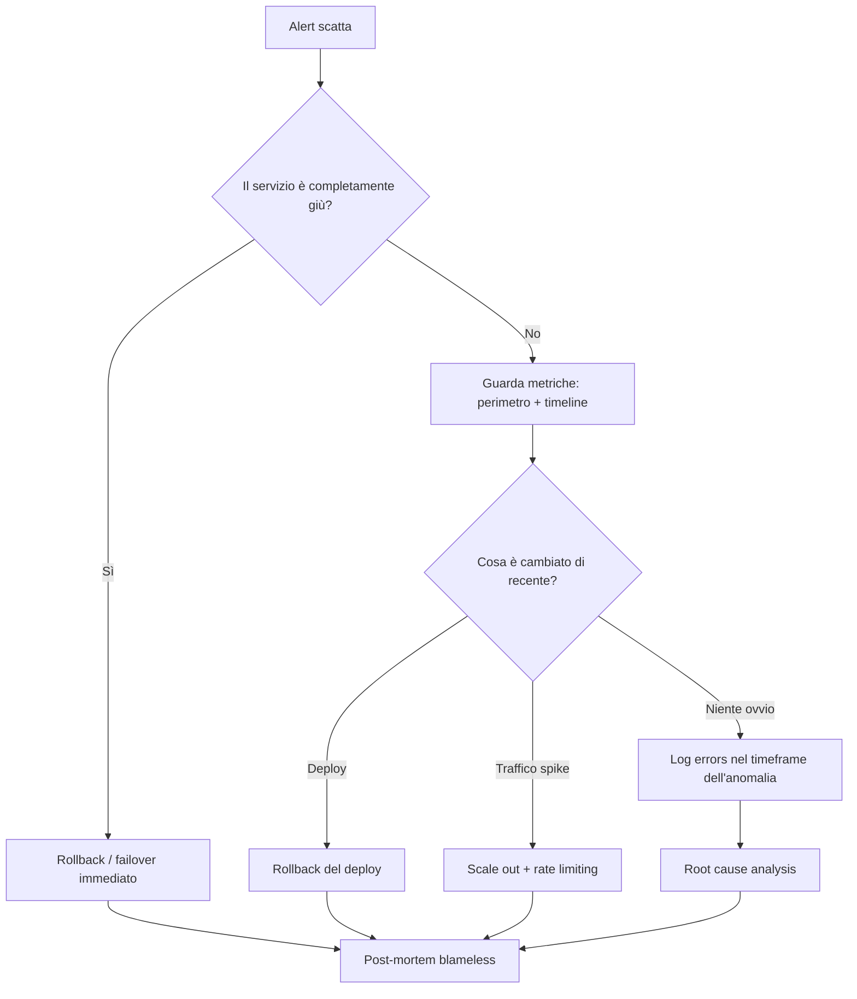

# Monitoring e incident response

  In evoluzione
  Lezione 7.2
  ~12 min di lettura

Un sistema in produzione senza monitoring è una macchina che guidi bendato: funziona finché la strada è dritta, ma non sai quando sta per curvarsi.

Nella lezione precedente hai visto che il cloud ti fa pagare per ogni risorsa accesa. Il monitoring risponde a una domanda diversa: quelle risorse stanno *funzionando* come dovrebbero? E quando smettono — o prima che smettano — come lo sai?

## Le tre categorie: metriche, log, trace

L'observability — la capacità di capire lo stato interno di un sistema dai suoi output — si appoggia su tre tipi di segnale. Vale la pena distinguerli subito, perché ognuno risponde a una domanda diversa.

**Le metriche** sono numeri nel tempo. CPU al 78%, latenza media 240 ms, numero di richieste al secondo: valori aggregati, campionati periodicamente, conservati efficientemente perché sono piccoli. Le metriche ti dicono *che qualcosa sta cambiando* — ma non perché. Sono il quadro strumenti della macchina.

**I log** sono eventi testuali con un timestamp. "Utente 42 ha fatto login", "query fallita su DB con errore X", "Lambda ha esaurito la memoria": sono i fatti grezzi di quello che è successo, nel momento in cui è successo. I log ti dicono *cosa è successo* — ma recuperarli e filtrarli su volumi grandi ha un costo. Sono il nastro del giornale di bordo.

**Le trace** — che vedremo in dettaglio nella lezione 7.3 — sono la mappa di come una singola richiesta ha attraversato i vari pezzi del sistema. Per ora: le trace rispondono alla domanda "dove ha impiegato il tempo questa richiesta?". Ne parliamo nella 7.3 perché richiedono il concetto di sistema distribuito.

In AWS il servizio che unifica metriche e log è **Amazon CloudWatch**. È il punto di partenza pratico di ogni monitoring su AWS.

## CloudWatch: la strumentazione di AWS

CloudWatch non è un singolo prodotto ma una famiglia di servizi connessi.

**CloudWatch Metrics** — ogni servizio AWS pubblica automaticamente le proprie metriche su CloudWatch. EC2 manda CPU, rete, disco. Lambda manda durata delle invocazioni, errori, throttling. RDS manda connessioni attive, latenza delle query, spazio libero. Non devi fare niente per avere queste metriche di base: arrivano da sole. Puoi anche pubblicare metriche personalizzate dall'applicazione (es. "numero di ordini processati al minuto") tramite l'SDK AWS.

**CloudWatch Logs** — il servizio di raccolta e ricerca di log. Le applicazioni e i servizi AWS scrivono i propri log in **Log Group**: una Lambda ha il suo Log Group, un container ECS ha il suo. I log si conservano per un periodo configurabile (da 1 giorno a indefinito). La ricerca con **CloudWatch Logs Insights** usa un linguaggio di query per filtrare e aggregare log su grandi volumi. Attenzione: conservare log a lungo con retention indefinita ha un costo — $0.03 per GB-mese (al 2026) si somma su volumi alti.

**CloudWatch Alarms** — regole che monitorano una metrica e cambiano stato (OK, ALARM, INSUFFICIENT_DATA) quando supera una soglia. Un Alarm può mandare una notifica SNS, scalare un gruppo di EC2, o eseguire un'azione di auto-recovery. È il meccanismo di alerting di base.

**CloudWatch Dashboards** — cruscotti con grafici configurabili. Utili per avere una vista aggregata della salute del sistema, ma sono uno strumento di visualizzazione, non di risposta.

## Alert sensati: la differenza tra rumore e segnale

Il problema del monitoring non è avere dati — CloudWatch li genera in quantità industriale. Il problema è avere **alert sensati**: allarmi che suonano quando c'è qualcosa che richiede attenzione umana, e non suonano altrimenti.

Un alert che scatta troppo spesso diventa rumore. Le persone iniziano a ignorarlo — un fenomeno che in operations si chiama **alert fatigue**, stanchezza da allarmi. Quando tutto è sempre rosso, il rosso smette di voler dire qualcosa. Il risultato è che l'incidente reale si perde nel rumore e arriva tardi.

Le regole base per un alert sensato:

**Allarma su sintomi, non su cause.** "La latenza p99 supera 2 secondi" è un sintomo: l'utente sta soffrendo. "La CPU è al 90%" è una causa potenziale: ma la CPU al 90% con latenza normale non è un problema per l'utente. Allarma su ciò che l'utente percepisce, poi usa le metriche di causa per *diagnosticare*.

**Ogni alert deve avere un runbook.** Un runbook è una procedura: "quando questo alert scatta, controlla X, poi Y, poi fai Z". Se non sai cosa fare quando l'alert scatta, l'alert non è pronto per la produzione.

**Distingui urgente da non urgente.** Un'interruzione totale del servizio alle 3 di notte richiede un page immediato — svegliare qualcuno. Un tasso di errore leggermente elevato che si risolve da solo può attendere un ticket al mattino. Trattare tutto come urgente è come non avere priorità.

**Usa la soglia giusta, non quella comoda.** "CPU > 80%" è una soglia che sembra ragionevole ma spesso è sbagliata: molti servizi girano felicemente al 90% di CPU senza impatto sugli utenti. La soglia corretta dipende dal contesto — definiscila testando, non tirandola a caso.

## Cosa guardare quando si rompe tutto

È notte, suona un allarme, il servizio è degradato. Hai cinque minuti per capire dove guardare prima di coinvolgere altri. Questo è il percorso mentale:

**1. Stabilisci il perimetro.** È tutto giù o solo una parte? Tutta la regione AWS o solo alcune AZ? Solo certi utenti o tutti? La risposta restringe immediatamente lo spazio di ricerca.

**2. Guarda la timeline degli eventi recenti.** Qualcosa è cambiato nelle ultime ore? Un deploy? Una modifica di configurazione? Un aumento del traffico? La maggior parte degli incidenti ha un "what changed" risposta.

**3. Metriche di sistema, dall'esterno verso l'interno.** Prima controlla cosa vede il cliente (tassi di errore HTTP, latenza p95/p99 a livello di load balancer), poi scendi verso i servizi interni (latenza del database, code SQS in crescita, Lambda throttling). Segui la catena dal punto di dolore verso la causa.

**4. Log degli errori nel momento del problema.** Non tutti i log: filtra per il periodo dell'anomalia e per il livello `ERROR` o `FATAL`. Spesso basta la prima riga di uno stack trace.

**5. Decidi: mitigate o debug.** Se hai trovato la causa e ci vuole tempo per fixarla, la priorità è fermare l'emorragia — rollback del deploy, scalare orizzontalmente, disabilitare una feature via feature flag — e poi fare root cause analysis a freddo. Non stare a debuggare mentre il sistema brucia.

*Flusso decisionale durante un incidente: prima mitigare, poi capire.*

## SLO e SLA: il contratto con gli utenti

Fin qui hai visto strumenti e reazioni. Ma monitoring davvero maturo inizia prima dell'incidente: definendo **cosa significa che il sistema funziona**.

Un **SLO** — *Service Level Objective*, obiettivo di livello di servizio — è un target interno. "Il 99,9% delle richieste ha latenza < 500 ms nel mese corrente." Nessuno ti penalizza se lo manchi, ma ti dà un metro per decidere quanto è grave un incidente.

Un **SLA** — *Service Level Agreement*, accordo di livello di servizio — è un impegno contrattuale verso un cliente. Se lo manchi, ci sono penali o crediti. Lo SLA è sempre *più allentato* dello SLO interno: uno SLO al 99,9% di solito copre uno SLA al 99,5%, lasciando margine di manovra.

Un **SLI** — *Service Level Indicator*, indicatore — è la metrica concreta che misuri: la percentuale di richieste riuscite, la latenza al percentile 99, il tasso di errore. Lo SLI è il numero; lo SLO è il target su quel numero.

L'**error budget** è la conseguenza pratica: se il tuo SLO è 99,9% di disponibilità mensile, hai un budget di ~43 minuti di downtime al mese. Quando l'error budget è esaurito, smetti di fare deploy rischiosi e stabilizzi. Quando hai budget abbondante, puoi muoverti veloci. SLO e error budget sostituiscono la discussione infinita tra "il team prodotto vuole velocità" e "il team ops vuole stabilità": il numero media il conflitto.

## Cosa non è il monitoring

| Il pensiero sbagliato | Come stanno le cose |
|---|---|
| "Più log conservo, meglio sto" | I log costano e vanno filtrati. Log inutili seppelliscono quelli utili. Il valore è nei log strutturati e indicizzati, non nel volume grezzo. Imposta retention adeguata per tipo di log. |
| "Un alert per ogni metrica è un sistema robusto" | Alert fatigue è il vero nemico. Pochi alert precisi, ognuno con un runbook, valgono più di cento soglie generiche che suonano di continuo. |
| "Il monitoring risolve i problemi" | Il monitoring li *rileva*. Risolvere richiede runbook, architettura resiliente (lezione 7.5), e post-mortem blameless che imparano dagli incidenti. |
| "CloudWatch basta per tutto" | CloudWatch basta per la maggior parte dei casi AWS. Per sistemi distribuiti complessi o multi-cloud, strumenti come Datadog, Grafana o OpenTelemetry offrono correlazione e tracing più avanzati — li vediamo nella 7.3. |

## Verifica di comprensione

1. Qual è la differenza tra una metrica e un log? Quale domanda risponde ciascuno?
2. Perché "allarmare sulla CPU al 90%" è spesso l'approccio sbagliato? Quale alternativa è migliore?
3. Cosa è un runbook e perché ogni alert ne dovrebbe avere uno?
4. Descrivi i primi tre passi che fai quando suona un allarme di notte e il servizio è degradato.
5. Cosa è un SLO e come si differenzia da uno SLA?
6. Cos'è l'error budget e come cambia le decisioni di deploy?
7. Perché conservare log con retention indefinita può essere un problema, non solo un vantaggio?

## Glossario della lezione

**Metrica** — Valore numerico campionato nel tempo (CPU %, latenza ms, richieste/sec). Aggregato ed efficiente da conservare.

**Log** — Evento testuale con timestamp. Fornisce contesto e dettaglio ma costoso a volumi alti.

**CloudWatch** — Servizio AWS di monitoring. Include Metrics, Logs, Alarms e Dashboards.

**Log Group** — Contenitore logico di log in CloudWatch. Ogni servizio ha il suo Log Group.

**Alert fatigue** — Stanchezza da allarmi: quando gli alert sono troppi e troppo rumorosi, le persone iniziano a ignorarli.

**Runbook** — Procedura documentata da eseguire quando scatta un alert specifico.

**SLO** — *Service Level Objective*. Target interno di qualità del servizio (es. 99,9% di richieste riuscite).

**SLA** — *Service Level Agreement*. Impegno contrattuale verso clienti. Sempre più allentato dello SLO interno.

**SLI** — *Service Level Indicator*. La metrica concreta misurata (es. percentuale di richieste con status 2xx).

**Error budget** — Il margine di "guasto permesso" che deriva dallo SLO. Se esaurito, si ferma l'innovazione e si stabilizza.

**Post-mortem blameless** — Analisi dell'incidente focalizzata sui processi e i sistemi, non sulle persone. Obiettivo: imparare, non punire.

## Per approfondire

- **Google SRE Book, capitoli su SLO e Error Budget** — disponibile gratuitamente su `sre.google/books`. Il testo che ha definito la disciplina SRE.
- **AWS Well-Architected Framework, pilastro Reliability** — `docs.aws.amazon.com/wellarchitected`. Copre monitoring, backup, e DR in un unico framework.
- **CloudWatch documentation** — `docs.aws.amazon.com/cloudwatch`. La source of truth per limiti, prezzi e configurazioni.
- **AWS re:Invent** — cercare "AWS re:Invent operational excellence" per casi reali di monitoring su scala.

## Prossima lezione

Hai gli strumenti per monitorare un sistema singolo. La 7.3 affronta la sfida successiva: quando il sistema è fatto di decine di microservizi che si chiamano tra loro — e una richiesta attraversa sei hop prima di rispondere — come tracci il percorso e capisci dove si è perso il tempo?
