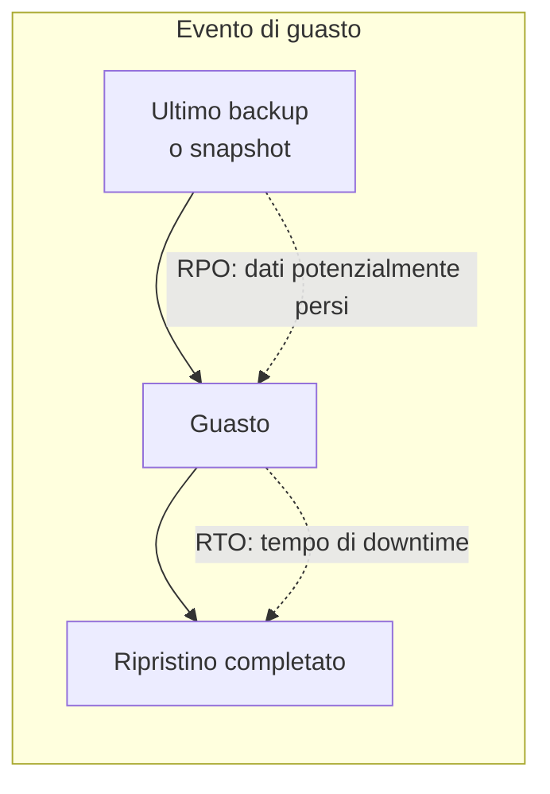

# Resilienza e disaster recovery

  Stabile
  Lezione 7.5
  ~12 min di lettura

Un sistema affidabile non è quello che non si rompe mai. È quello che, quando si rompe, si riprende in tempi accettabili senza perdere dati critici.

La sicurezza (7.4) difende dall'esterno. La resilienza difende dall'interno: hardware che cede, bug che corrompono dati, regione AWS che ha un'interruzione, deploy che va storto. Questi eventi capitano — su scala abbastanza grande, è quasi certo che capiteranno. La domanda non è "se" ma "quanto tempo per tornare operativi" e "quanti dati perdiamo".

## RPO e RTO: il vocabolario del business

Quando il management o il cliente chiede "quanto siete resilienti?", stanno chiedendo due numeri che hanno nomi precisi.

**RPO** — *Recovery Point Objective*, obiettivo del punto di recupero — è la quantità massima di dati che puoi permetterti di perdere, misurata in tempo. Se il tuo RPO è 4 ore, significa che un sistema di backup che salva ogni 4 ore è sufficiente: nel peggiore dei casi perdi 4 ore di dati. Se il tuo RPO è 0 (nessuna perdita di dati accettabile), hai bisogno di replica sincrona in tempo reale.

**RTO** — *Recovery Time Objective*, obiettivo del tempo di recupero — è il tempo massimo che puoi stare giù prima che l'impatto sul business diventi inaccettabile. Un e-commerce potrebbe avere un RTO di 30 minuti; un sistema bancario critico, secondi; un sistema interno di reportistica, ore o giorni.

RPO e RTO costano in proporzione inversa: più li vuoi bassi (più protezione), più paghi — in infrastruttura, in complessità operativa, in latenza aggiuntiva (la replica sincrona introduce latenza). La conversazione con il business è: "per abbassare l'RPO da 1 ora a 5 minuti costa X in più al mese — è il giusto trade-off?"

*RPO è la finestra di dati a rischio; RTO è la finestra di downtime.*

## Livelli di disponibilità: da single-AZ a multi-region

Non esiste un'unica architettura "resiliente". Esistono livelli, ognuno con un costo diverso.

**Single-AZ** — tutte le risorse in una singola Availability Zone. Il guasto di quella AZ porta giù tutto. È il default se non fai scelte esplicite, ed è accettabile solo per ambienti non produttivi o sistemi con RTO alto.

**Multi-AZ** — le risorse critiche replicano su due o più AZ nella stessa regione. Un guasto su un'AZ (che succede alcune volte l'anno su ogni regione AWS) non porta giù il sistema: il traffico si sposta sull'altra. RDS con Multi-AZ ha un replica sincrona su un'altra AZ con failover automatico in ~30 secondi. ALB — *Application Load Balancer* — distribuisce il traffico su istanze in AZ diverse. Multi-AZ è il minimo per qualsiasi sistema in produzione con requisiti di continuità.

**Multi-region** — le risorse replicano su due o più regioni AWS geograficamente separate. Protegge da eventi catastrofici che impattano un'intera regione (rari ma non impossibili). Il costo è alto: replica cross-region ha latenza, i dati si moltiplicano, il failover regionale è complesso. Ha senso per sistemi mission-critical con SLA altissimi o requisiti di data residency che richiedono replica geografica.

**Global** — pattern come AWS Route 53 con failover policy, CloudFront con failover di origine, DynamoDB Global Tables (replica attiva in più regioni). È la soglia del "carrier grade": ti arriva sopra un costo mensile considerevole.

La regola pratica: per la maggior parte dei sistemi produttivi, **multi-AZ** è il livello giusto. Multi-region è giustificabile solo con un business case preciso.

## Backup e restore: non basta avere i backup

Tutti sanno che i backup sono importanti. Meno persone li testano regolarmente. **Un backup che non hai mai ripristinato è un backup di cui non sai se funziona.**

**AWS Backup** è il servizio centralizzato di backup per la maggior parte dei servizi AWS: RDS, DynamoDB, EBS, EFS, S3. Permette di definire policy di backup (frequenza, retention, regione di destinazione) e di monitorare lo stato. Il costo è quello dello storage dei backup: solitamente qualche centesimo per GB-mese.

Il ciclo che funziona:
1. Definisci RPO → tradotto in frequenza di backup (backup ogni X ore)
2. Definisci retention → quanto a lungo conservi ogni backup
3. Testa il restore periodicamente (almeno mensile per i sistemi critici) su un ambiente di staging separato
4. Documenta il restore procedure — non per te, che sai farlo; ma per chi deve farlo alle 3 di notte sotto stress

Il punto 4 è spesso saltato. Un runbook di restore dettagliato — "apri AWS Backup, seleziona questo vault, scegli il punto di ripristino, testa con questi query" — vale oro in un incidente reale.

## Chaos engineering: rompere per imparare

Il **chaos engineering** è la pratica deliberata di iniettare guasti in un sistema per verificare che risponda correttamente. L'idea, nata in Netflix con il celebre "Chaos Monkey", è semplice: se il sistema deve sopravvivere a un guasto, devi sapere che lo fa — non solo credere che lo faccia.

In pratica: termina istanze random in produzione e verifica che il sistema continui a funzionare. Blocca il traffico verso un'AZ e verifica che il failover avvenga nei tempi previsti. Introduci latenza artificiale tra due servizi e verifica che il timeout handling funzioni.

**AWS Fault Injection Service** (FIS) — il servizio gestito AWS per chaos engineering. Permette di definire esperimenti (es. "termina il 30% delle istanze EC2 in questo target group per 5 minuti") e di eseguirli in modo controllato, con rollback automatico se il sistema supera certe soglie.

Il chaos engineering non è anarchia: segue il principio di iniettare guasti in ambienti sotto carico reale ma con ipotesi precise ("ci aspettiamo che il sistema rimanga sotto 500 ms di latenza anche con un'AZ giù") e rollback immediato se l'ipotesi è falsa.

Su sistemi nuovi: inizia in staging, poi in produzione in orari a basso traffico, con experiment scope limitato. Il punto non è causare incidenti ma prevenirli — trovando le debolezze prima che un guasto reale le trovi.

## Strategie di disaster recovery

Il settore ha standardizzato quattro strategie DR, ordinate per costo crescente e RTO/RPO decrescenti:

**Backup & Restore** — solo backup. Nessuna infrastruttura attiva nella seconda regione. RPO: ore. RTO: ore. Costo: basso (solo storage). Per sistemi non critici.

**Pilot Light** — infrastruttura minima attiva nella seconda regione (es. solo il database in replica). In caso di disaster, scale up rapido degli altri componenti. RPO: minuti. RTO: decine di minuti. Costo: moderato.

**Warm Standby** — versione ridotta del sistema completo sempre attiva. In caso di disaster, scale up per gestire il carico pieno. RPO: secondi. RTO: minuti. Costo: alto.

**Multi-Site Active/Active** — sistema completo e a piena capacità in due regioni contemporaneamente. Il traffico è bilanciato tra le due. In caso di failure su una regione, l'altra assorbe tutto senza intervention manuale. RPO: quasi zero. RTO: quasi zero. Costo: molto alto.

La scelta dipende dal business case. Non esiste la strategia "giusta" in assoluto: esiste quella che fa senso per il tuo RPO/RTO e il tuo budget.

## Cosa non è la resilienza

| Il pensiero sbagliato | Come stanno le cose |
|---|---|
| "Multi-AZ significa zero downtime" | Multi-AZ riduce drasticamente il rischio di downtime su guasti hardware e di rete locali. Non elimina downtime da bug dell'applicazione, deploy errati o errori operativi — che sono la causa più frequente di incidenti nei sistemi maturi. |
| "Ho i backup, sono coperto" | I backup coprono la perdita di dati (RPO). Non coprono il tempo di inattività (RTO): se per ripristinare i backup ci vogliono 4 ore, il tuo RTO è 4 ore. Le due dimensioni sono indipendenti. |
| "Il chaos engineering è pericoloso, non lo facciamo" | Non fare chaos engineering è pericoloso: ti garantisce di scoprire le debolezze solo durante un incidente reale, sotto pressione, davanti agli utenti. L'engineering controllato è meno rischioso dell'ignoranza. |
| "Multi-region è sempre la scelta giusta per la produzione" | Multi-region è complesso, costoso e introduce latenza di replica. Per la maggior parte dei sistemi produttivi, multi-AZ con buoni backup è sufficiente. Multi-region ha senso solo con un business case preciso. |

## Verifica di comprensione

1. Cos'è l'RPO e come si traduce in frequenza di backup?
2. Cos'è l'RTO e da cosa dipende il suo valore accettabile?
3. Qual è la differenza tra multi-AZ e multi-region? Quando si giustifica il secondo?
4. Perché "avere i backup" non è sufficiente per dire di essere coperti?
5. Cos'è il chaos engineering e qual è la differenza rispetto a causare incidenti?
6. Descrivi le quattro strategie DR e il loro trade-off costo/RPO-RTO.
7. Perché testare il restore è importante quanto avere il backup?

## Glossario della lezione

**RPO** — *Recovery Point Objective*. Massima perdita di dati accettabile, misurata in tempo dall'ultimo backup o snapshot.

**RTO** — *Recovery Time Objective*. Massimo tempo di downtime accettabile prima di impatto inaccettabile sul business.

**Multi-AZ** — Distribuzione delle risorse su più Availability Zone nella stessa regione. Standard minimo per sistemi produttivi.

**Multi-region** — Replica delle risorse su più regioni geograficamente separate. Per requisiti molto alti di continuità.

**AWS Backup** — Servizio centralizzato di backup per i principali servizi AWS (RDS, DynamoDB, EBS, EFS, S3).

**Chaos engineering** — Pratica di iniettare guasti controllati in un sistema per verificarne la resilienza.

**AWS Fault Injection Service (FIS)** — Servizio AWS per chaos engineering: define ed esegui esperimenti di guasto in modo controllato.

**Pilot Light** — Strategia DR con infrastruttura minima attiva nella regione di backup (solo database replicato).

**Warm Standby** — Strategia DR con versione ridotta del sistema completo attiva nella regione di backup.

**Active/Active** — Strategia DR con sistema a piena capacità in due regioni contemporaneamente.

## Per approfondire

- **AWS Disaster Recovery whitepaper** — disponibile su `docs.aws.amazon.com/whitepapers`. Copre le quattro strategie con architetture dettagliate.
- **AWS Fault Injection Service documentation** — `docs.aws.amazon.com/fis`. Setup, tipi di fault, safety guardrails.
- **Principi del chaos engineering** — `principlesofchaos.org`. Il manifesto originale della disciplina.
- **AWS Well-Architected Framework, pilastro Reliability** — `docs.aws.amazon.com/wellarchitected`.

## Prossima lezione

Hai coperto resilienza e continuità operativa. La **7.6** affronta il principio di sicurezza che cambia tutto in produzione moderna: **Zero Trust e mTLS service-to-service**. Non fidarti della rete interna, autentica ogni chiamata, anche tra microservizi nello stesso VPC.
