# Sicurezza in produzione

  Stabile
  Lezione 6.4
  ~13 min di lettura

La maggior parte delle violazioni cloud non viene da attacchi sofisticati: viene da configurazioni sbagliate che nessuno ha controllato.

La lezione 1.3 ha spiegato IAM — *Identity and Access Management* — come concetto: chi può fare cosa su quale risorsa. La lezione 1.4 ha parlato di gestione dei segreti. Questa lezione è il livello successivo: applicare quei concetti in produzione, dove "funziona" non basta e devi anche chiederti "è sicuro?".

Il tema è ampio. Il taglio qui è pragmatico: gli errori che capitano davvero, gli strumenti che li trovano, e l'attitudine mentale che serve.

## La superficie d'attacco nel cloud

**Superficie d'attacco** è l'insieme di tutti i punti attraverso cui un attaccante potrebbe entrare o estrarre dati. Nel cloud questa superficie è grande per definizione: stai costruendo su un'infrastruttura condivisa, accessibile da Internet, gestita con API programmatiche.

Le tre componenti principali della superficie d'attacco cloud:

**Identità e permessi.** Ogni IAM role, ogni access key, ogni policy è un potenziale vettore. Un role con permessi troppo ampi esposto a una Lambda raggiungibile dall'esterno è una porta aperta. Le credenziali AWS hardcodate in un repository pubblico (succede più spesso di quanto si pensi — GitHub scansiona attivamente per trovarle) vengono abusate in minuti.

**Risorse esposte.** Un bucket S3 con accesso pubblico per errore. Un security group con `0.0.0.0/0` sulla porta 22. Un'istanza RDS con accesso dall'esterno della VPC. Sono configurazioni che "funzionano" per il caso d'uso, ma espongono dati o servizi a chiunque.

**Dipendenze e supply chain.** Le immagini container da cui parte il tuo deployment, le librerie di terze parti, i pacchetti npm o pip: ognuno è un vettore. Una dipendenza con una CVE — *Common Vulnerabilities and Exposures*, vulnerabilità nota — non patchata è una superficie d'attacco che non hai creato tu ma che devi gestire.

## Least privilege applicato

Il principio del **least privilege** — ogni entità ha i permessi minimi indispensabili per fare il suo lavoro — è facile da enunciare e difficile da applicare bene. I problemi pratici:

**I policy permissivi nascono dalla fretta.** "Per ora metti `*` su S3 così funziona, poi ristringo." Quel "poi" non arriva mai. La politica di sicurezza deve essere invertita: parti da zero permessi, aggiungi solo ciò che serve, verifica che funzioni.

**I role devono essere scoped per risorsa.** Non un unico role con accesso a tutti i bucket S3: un role per funzione, con accesso solo ai bucket che quella funzione usa. Se la Lambda di upload dei profili utente viene compromessa, non deve poter leggere i dati finanziari.

**Le access key statiche sono un rischio.** Chiavi `AWS_ACCESS_KEY_ID` e `AWS_SECRET_ACCESS_KEY` nel codice o in variabili d'ambiente sono credenziali che non scadono da sole. Preferire sempre i **IAM role** — credenziali temporanee ruotate automaticamente — ai programmatic access con chiavi statiche. I role si usano per Lambda, EC2, ECS, e qualsiasi workload che gira su risorse AWS.

**Usa IAM Access Analyzer.** È un servizio AWS che analizza le policy IAM e identifica quelle che concedono accesso a risorse esterne all'account — un segnale di over-permissioning. Non sostituisce il ragionamento, ma trova i casi ovvi.

## Errori di configurazione comuni

Questi sono i pattern che compaiono nei report di sicurezza cloud anno dopo anno.

### Bucket S3 pubblici per sbaglio

Il caso più frequente. Un bucket viene creato con `Block Public Access` disabilitato — magari perché serve per un sito statico — e poi usato anche per dati non pubblici. Oppure una policy viene scritta male e concede `s3:GetObject` a `*`.

AWS ha introdotto **S3 Block Public Access** a livello di account: con questa impostazione attiva, nessun bucket può diventare pubblico accidentalmente, indipendentemente dalle policy individuali. Abilitarla a livello di account è il primo gesto su qualsiasi account AWS.

### Security group troppo permissivi

Un security group con `0.0.0.0/0` (tutto Internet) su porte sensibili — 22 (SSH), 3306 (MySQL), 5432 (PostgreSQL), 6379 (Redis) — è una configurazione che espone servizi critici direttamente a Internet.

La regola: le risorse nel tier dati (database, cache) non devono mai avere accesso diretto dall'esterno della VPC. SSH sulle istanze EC2 deve passare da **AWS Systems Manager Session Manager** — che non richiede apertura di porte — invece che da un security group con porta 22 aperta.

### Credenziali hardcoded

Credenziali AWS, password di database, API key di terze parti nel codice sorgente — soprattutto in repo che a volte diventano pubblici. GitHub ha un meccanismo di secret scanning che notifica AWS direttamente quando trova access key esposte; AWS revoca automaticamente le chiavi rilevate. Ma è una rete di sicurezza, non un piano.

La gestione corretta: **AWS Secrets Manager** o **AWS Systems Manager Parameter Store** per tutti i segreti. Le applicazioni li leggono a runtime tramite API, mai li bakeano in variabili d'ambiente o file di configurazione versionati.

### Logging e audit trail disabilitati

**AWS CloudTrail** registra ogni chiamata API sull'account: chi ha fatto cosa, quando, da dove. È la base di qualsiasi investigazione di sicurezza. Abilitarlo in tutte le regioni (non solo quella principale) è obbligatorio — e per default è attivo, ma la conservazione dei log va configurata.

Senza CloudTrail, se qualcuno accede a delle risorse non autorizzate, non hai modo di ricostruire cosa è successo.

## Strumenti di sicurezza AWS

**AWS Security Hub** — aggrega i finding di sicurezza da GuardDuty, Inspector, Macie e da check automatici sulle best practice (benchmark CIS AWS Foundations, AWS Foundational Security Best Practices). È il cruscotto unico di sicurezza: invece di aprire cinque console diverse, hai un posto solo.

**Amazon GuardDuty** — sistema di threat detection basato su machine learning. Analizza CloudTrail, VPC Flow Logs e DNS logs alla ricerca di pattern anomali: accessi da indirizzi IP sospetti, chiamate API insolite, mining di criptovalute, credential exfiltration. Non richiede agenti da installare; lo abiliti e funziona. Costo proporzionale al volume di log analizzati.

**Amazon Inspector** — vulnerability scanner per workload. Analizza le istanze EC2 e le immagini container ECR alla ricerca di CVE note nei pacchetti installati. Integrato con ECR: ogni immagine pushata viene scansionata automaticamente.

**Amazon Macie** — scoperta e classificazione di dati sensibili in S3. Usa machine learning per identificare PII — *Personally Identifiable Information*, dati personali identificabili — credenziali, dati finanziari nei bucket. Utile per sapere dove sono i dati sensibili prima di doverlo scoprire da un audit.

```mermaid
architecture-beta
  group account(cloud)[AWS Account]

  service trail(logos:aws-cloudwatch)[CloudTrail] in account
  service guard(logos:aws-cloudwatch)[GuardDuty] in account
  service hub(logos:aws-cloudwatch)[Security Hub] in account
  service insp(logos:aws-cloudwatch)[Inspector] in account
  service macie(logos:aws-cloudwatch)[Macie] in account

  trail:R --> L:hub
  guard:R --> L:hub
  insp:B --> T:hub
  macie:B --> T:hub
```

*Security Hub aggrega i finding da tutti gli altri strumenti di sicurezza AWS.*

## Sicurezza dei container e della supply chain

Se usi container (ECS, EKS, Lambda container images), la superficie d'attacco include le immagini.

**Immagini base minime.** Partire da `alpine` o dalle immagini `distroless` invece che da `ubuntu` o `debian` full riduce drasticamente il numero di pacchetti — e quindi di CVE potenziali. Meno roba nell'immagine, meno superficie.

**Non girare come root.** I container che girano come utente `root` dentro il container hanno privilegi eccessivi se c'è un escape. Usa direttiva `USER` nel Dockerfile per impostare un utente non privilegiato.

**Scansione delle immagini.** Amazon ECR — *Elastic Container Registry* — con la funzione Inspector integrata scansiona automaticamente ogni immagine pushata e segnala le CVE. Per immagini base critiche, aggiungi la scansione nel CI/CD (Trivy, Snyk) prima che l'immagine arrivi in produzione.

**Software Bill of Materials (SBOM).** Uno SBOM è la lista di tutti i componenti di un'applicazione (pacchetti, librerie, versioni). È diventato un requisito enterprise nel 2025-26, dopo Executive Order sulla sicurezza software negli USA. Strumenti come Syft generano SBOM da immagini container.

## Cosa non è la sicurezza in produzione

| Il pensiero sbagliato | Come stanno le cose |
|---|---|
| "Siamo in una VPC, siamo al sicuro" | La VPC isola il traffico di rete, ma non protegge da IAM mal configurato, credenziali esposte, o vulnerabilità nelle applicazioni. La sicurezza è a strati — una VPC è uno strato, non l'intero sistema. |
| "Non siamo un bersaglio abbastanza grande" | I bot che scansionano S3 bucket pubblici o cercano access key su GitHub non scelgono i bersagli: automatizzano la ricerca su tutti gli account. La dimensione del target è irrilevante per gli attacchi automatizzati. |
| "Il security team si occupa di sicurezza, l'engineer fa feature" | Nel cloud, l'engineer crea le risorse, scrive le policy IAM, sceglie le immagini base, decide se aprire una porta. La sicurezza è embedded nelle decisioni tecniche quotidiane, non è un layer separato che arriva dopo. |
| "Abilitare tutti i servizi di sicurezza AWS è sufficiente" | GuardDuty e Inspector generano finding; qualcuno deve leggerli e agire. Uno strumento abilitato ma non monitorato è inutile. Security Hub senza processi di triage e risposta è un cruscotto vuoto. |

## Verifica di comprensione

1. Cos'è la "superficie d'attacco" e quali sono le sue tre componenti principali nel cloud?
2. Perché le IAM access key statiche sono un rischio maggiore rispetto ai IAM role? Come si mitigano?
3. Cos'è S3 Block Public Access a livello di account e perché è il primo gesto su un account AWS?
4. Perché la porta SSH (22) su un security group aperta a `0.0.0.0/0` è un problema e qual è l'alternativa?
5. Cosa fa AWS GuardDuty e come differisce da Inspector?
6. Cos'è un SBOM e perché è diventato rilevante nel 2025-26?
7. "Siamo in una VPC, siamo al sicuro" — perché questo ragionamento è sbagliato?

## Glossario della lezione

**Superficie d'attacco** — L'insieme dei punti attraverso cui un attaccante potrebbe accedere o estrarre dati da un sistema.

**CVE** — *Common Vulnerabilities and Exposures*. Sistema di identificazione standardizzato delle vulnerabilità note nei software.

**IAM Access Analyzer** — Servizio AWS che analizza le policy IAM e identifica accessi a risorse esterne all'account.

**S3 Block Public Access** — Impostazione a livello di account che impedisce che bucket S3 diventino pubblici, indipendentemente dalle policy individuali.

**AWS CloudTrail** — Servizio che registra ogni chiamata API sull'account AWS. Base dell'audit trail di sicurezza.

**AWS Security Hub** — Cruscotto di sicurezza che aggrega finding da GuardDuty, Inspector, Macie e da check automatici sulle best practice.

**Amazon GuardDuty** — Threat detection basato su ML. Analizza CloudTrail, VPC Flow Logs e DNS logs per pattern anomali.

**Amazon Inspector** — Vulnerability scanner per EC2 e immagini container ECR. Identifica CVE nei pacchetti installati.

**Amazon Macie** — Classificazione di dati sensibili in S3. Identifica PII, credenziali e dati finanziari.

**ECR** — *Elastic Container Registry*. Registro di immagini container gestito da AWS.

**PII** — *Personally Identifiable Information*. Dati che identificano direttamente o indirettamente una persona fisica.

**SBOM** — *Software Bill of Materials*. Lista di tutti i componenti software (pacchetti, librerie, versioni) di un'applicazione.

**Session Manager** — Feature di AWS Systems Manager che permette accesso shell a istanze EC2 senza aprire la porta SSH.

## Per approfondire

- **AWS Security Best Practices** — whitepaper disponibile su `docs.aws.amazon.com/whitepapers`. Include IAM, networking, data protection.
- **CIS AWS Foundations Benchmark** — framework di configurazione sicura per AWS. Disponibile su `cisecurity.org`. Security Hub include check automatici su di esso.
- **OWASP Cloud Security** — `owasp.org`. Lista dei rischi di sicurezza più comuni nel cloud.
- **AWS re:Invent** — cercare "AWS re:Invent security best practices" per casi reali con numeri.

## Prossima lezione

Hai chiuso il tema sicurezza. La 6.5 affronta la resilienza: non solo "il sistema è sicuro" ma "il sistema sopravvive a un guasto" — RPO, RTO, failover multi-AZ, chaos engineering, e i concetti che il business chiede e l'engineer deve saper ragionare prima che succeda il guasto vero.
