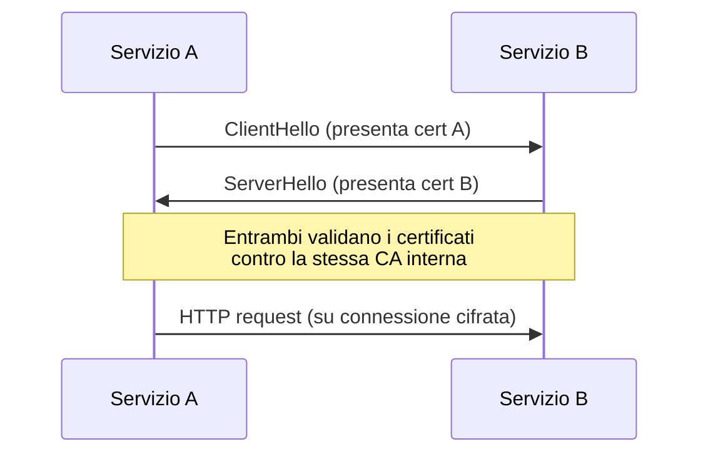
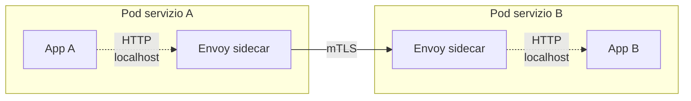

# Zero Trust e mTLS service-to-service

  In evoluzione
  Lezione 7.6
  ~11 min di lettura

Il VPC e i security group non bastano. Nei sistemi distribuiti moderni — microservizi, multi-cluster, multi-account — ogni chiamata service-to-service deve essere autenticata indipendentemente dalla rete. È un cambio di modello, non un add-on.

La lezione [1.3 — Identity e permessi](../networking-security/identity-iam.md) ha mostrato come IAM governa l'accesso alle API AWS. Ma nel tuo sistema hai anche servizi che parlano tra loro — microservizio A chiama microservizio B nello stesso VPC. Qui entra in gioco un principio diverso, che vale per qualsiasi sistema con più di un servizio in produzione.

L'**idea in una frase**: in Zero Trust, la rete è ostile per definizione — anche quella interna — e ogni chiamata deve dimostrare la propria identità prima di essere accettata.

## Il modello tradizionale e perché non basta più

L'architettura di rete classica è "castello e fossato": un perimetro forte (firewall, VPN, VPC isolato) protegge una rete interna *implicitamente fidata*. Tutto ciò che è dentro il perimetro può parlare con tutto ciò che è dentro il perimetro. Funziona finché:

- I servizi sono pochi e tutti dentro lo stesso data center.
- Non hai dipendenze esterne raggiungibili dall'interno.
- Nessun attaccante riesce mai a entrare nel perimetro (assunzione ottimista).

Nei sistemi cloud moderni questi assunti cadono uno dopo l'altro. Hai decine di microservizi, multi-VPC, multi-account, multi-region. Un service mesh, un CI/CD compromesso, una libreria con vulnerabilità — sono tutte porte sul perimetro. Se "dentro = fidato" è l'unico controllo, una sola breccia espone tutto.

**Zero Trust** ribalta il principio: *never trust, always verify*. Non importa da dove arriva la richiesta — interna, esterna, dallo stesso pod K8s. Ogni chiamata si autentica esplicitamente.

## I tre pilastri di Zero Trust

1. **Identità verificata per ogni chiamata.** Il chiamante dimostra chi è (un cert, un token firmato, una credenziale STS), e il chiamato lo verifica indipendentemente dalla rete da cui viene.
2. **Least privilege applicato a livello di servizio.** Servizio A può chiamare solo gli endpoint di servizio B che gli servono, non "tutto il VPC di servizio B".
3. **Cifratura in transito ovunque.** Niente HTTP interno in chiaro, nemmeno tra servizi nello stesso subnet privata.

I tre principi sono indipendenti — puoi adottarne uno e non gli altri — ma il valore reale arriva solo quando si combinano.

## mTLS: la realizzazione tecnica più comune

**mTLS** (*mutual TLS*) è il pattern di autenticazione service-to-service più adottato nel cloud moderno. Nel TLS classico solo il server presenta un certificato — il client verifica l'identità del server, ma il server non sa chi sia il client (lo scopre con un token applicativo, una API key, ecc.). In mTLS **entrambi i lati presentano un certificato**: il server verifica il client, il client verifica il server, e la connessione si stabilisce solo se entrambi sono validi.

*Anche se un attaccante intercetta il traffico nella rete interna, non può falsificare un certificato firmato dalla CA interna.*

I vantaggi rispetto a soluzioni applicative (token + API key):

- **Funziona allo strato 7 senza modificare l'applicazione.** Il TLS handshake è gestito a livello di socket — il codice del servizio fa HTTP normale.
- **Autenticazione e cifratura in un solo meccanismo.** Niente token in chiaro che vanno cifrati separatamente.
- **Rotazione automatica.** I certificati hanno una scadenza breve (ore o giorni), rotti automaticamente — niente segreti permanenti.

Lo svantaggio: gestire una CA (Certificate Authority) interna, emettere e ruotare certificati per ogni servizio, distribuirli al deploy. Non è banale a mano — ed è esattamente il problema che un service mesh risolve.

## Service mesh: la "fase 2" di Zero Trust

Un **service mesh** (Istio, Linkerd, AWS App Mesh, Consul Connect) è l'infrastruttura che gestisce mTLS, traffic policy, retry e telemetria in modo *trasparente* per il codice applicativo. Il pattern standard è il **sidecar proxy**: accanto a ogni container del servizio gira un secondo container — un proxy (tipicamente Envoy) — che intercetta tutto il traffico in entrata e in uscita.

*Il codice applicativo continua a fare HTTP normale verso `localhost`. Il proxy si occupa di mTLS, retry, circuit breaking, observability.*

Il valore di un service mesh va oltre Zero Trust:

- **mTLS automatico** tra tutti i servizi nel mesh, senza modificare il codice.
- **Policy di autorizzazione dichiarative**: "servizio A può chiamare `POST /orders` su servizio B, ma non `DELETE`".
- **Traffic management**: canary deployment, weighted routing, A/B testing senza toccare il load balancer.
- **Observability uniforme**: latenza, error rate, tracing — generati dal proxy, non dipendenti dal linguaggio dell'applicazione.

Quando NON serve un service mesh: pochi servizi (sotto i 5-10), team piccolo, latenza critica (il sidecar aggiunge 1-3ms per hop), oppure quando l'opzione AWS-native è sufficiente.

## L'alternativa AWS-native: IAM Auth + SigV4

Se i tuoi servizi sono interamente su AWS e si chiamano via API Gateway, ALB con autenticazione, o invocazioni Lambda dirette, hai un'opzione più semplice di un service mesh: **autenticazione IAM con firma SigV4**.

Ogni richiesta service-to-service viene firmata con le credenziali temporanee del role IAM del chiamante (vedi [1.3](../networking-security/identity-iam.md) — IAM Role su EC2 / Lambda / ECS Task). Il chiamato — API Gateway, ALB, Lambda — verifica la firma e applica la policy IAM. Niente certificati da gestire, niente sidecar, ma:

- Funziona solo per chiamate verso servizi AWS che supportano IAM Auth.
- Non hai mTLS — la cifratura è TLS normale (server only), e l'identità del client è nel header firmato.
- Non hai traffic management o telemetria avanzata.

È la scelta giusta per architetture serverless/API Gateway pure. Diventa insufficiente quando hai servizi non-AWS, deploy su EKS con tante chiamate sincrone, o requisiti di compliance che richiedono mTLS esplicito.

## Decision drill in miniatura

| Scenario | Opzione consigliata | Perché |
|---|---|---|
| 3 Lambda dietro API Gateway che chiamano DynamoDB | IAM Auth + SigV4 | Niente da installare, AWS-native, costo zero. |
| 15 microservizi su EKS, team che cresce | Service mesh (Istio o App Mesh) | mTLS automatico, policy dichiarative, observability uniforme. |
| ECS Fargate + RDS, monolite + 2 servizi ausiliari | mTLS manuale (cert da ACM Private CA) | Service mesh è overkill; mTLS senza sidecar è gestibile. |
| Multi-cloud (AWS + on-prem) con compliance SOC 2 | Service mesh (Istio o Consul Connect) | È l'unica opzione che spanna i confini di rete in modo uniforme. |

## Cosa non è

| Il pensiero sbagliato | Come stanno le cose |
|---|---|
| "Zero Trust significa eliminare il VPC" | Zero Trust è un principio di autenticazione, non una topologia di rete. Hai ancora il VPC e le sue protezioni; in più, ogni chiamata è autenticata indipendentemente da dove viene. |
| "Service mesh = Kubernetes" | I service mesh nascono spesso su K8s, ma esistono anche per VM (Consul Connect, AWS App Mesh con ECS). Il pattern sidecar non è esclusivo di K8s. |
| "mTLS rallenta troppo per la produzione" | L'handshake costa una volta per connessione (e con keep-alive raramente si ripete). Il throughput a regime è praticamente identico a TLS server-only. La latenza aggiuntiva del sidecar (1-3ms) è il vero costo, non mTLS in sé. |
| "Adottiamo Zero Trust spegnendo i security group" | Zero Trust si **aggiunge** alle difese di rete, non le sostituisce. Security group e NACL restano: limitano la superficie d'attacco; mTLS autentica chi si presenta a quella superficie. |

## Verifica di comprensione

> Rispondi a memoria. Le risposte incerte rivedile domani.

1. Qual è il principio fondamentale di Zero Trust e in cosa differisce dal modello "castello e fossato"?
2. Cosa significa "mutual" in mTLS, e in cosa differisce da TLS classico?
3. Cosa fa un sidecar proxy in un service mesh? Perché si chiama "trasparente al codice"?
4. Quando IAM Auth + SigV4 è preferibile a un service mesh? Quando smette di bastare?
5. Quali sono i tre vantaggi di mTLS rispetto a un token applicativo (es. JWT in header)?
6. Cosa rende un service mesh inadatto a un sistema con pochi servizi e bassa latenza target?

## Glossario della lezione

- **Zero Trust**: modello di sicurezza per cui ogni richiesta va autenticata indipendentemente dalla provenienza di rete.
- **mTLS** (*Mutual TLS*): estensione di TLS in cui entrambi i lati presentano un certificato.
- **Service mesh**: infrastruttura di proxy sidecar che gestisce mTLS, retry, traffic policy e telemetria.
- **Sidecar proxy**: container ausiliario che gira accanto al servizio e ne intercetta il traffico (Envoy è lo standard).
- **CA** (*Certificate Authority*): autorità che emette e firma i certificati. In Zero Trust è quasi sempre una CA interna (es. ACM Private CA su AWS).
- **SigV4**: protocollo AWS di firma delle richieste con credenziali IAM.

## Per approfondire

- **NIST SP 800-207** — Zero Trust Architecture. Il documento di riferimento sui principi.
- **Istio docs** su `istio.io`: introduzione al service mesh più diffuso, con esempi di mTLS e authorization policy.
- **AWS App Mesh** — `docs.aws.amazon.com/app-mesh`. L'opzione managed di AWS, integrata con ECS/EKS.
- **ACM Private CA** — `aws.amazon.com/private-ca`. La CA managed di AWS per emettere certificati interni.

## Prossima lezione

Hai chiuso il blocco di operations: cost, monitoring, tracing, sicurezza in produzione, resilienza e service-to-service auth. La **7.7** è il decision drill della Parte 7: i costi raddoppiano da un giorno all'altro — cosa indaghi, in che ordine, quali leve hai per intervenire prima che la prossima fattura faccia lo stesso.
