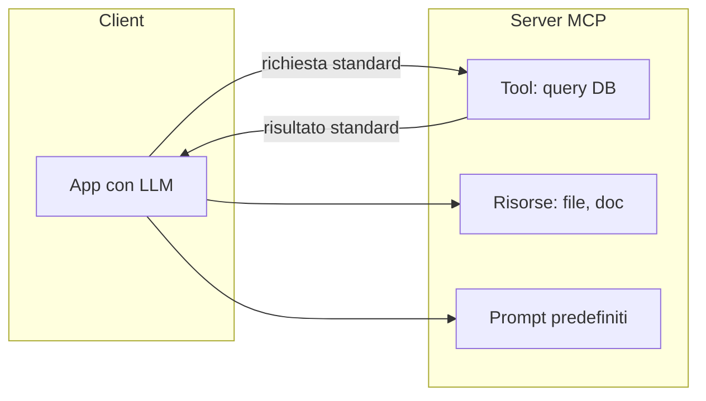

# MCP — Model Context Protocol

<span class="badge-stato stabile">Stabile</span> Promosso da "emergente" a standard de facto. Esempio di voce uscita dal Radar ed entrata in guida.

## Il problema

Un LLM da solo è una scatola che produce testo. Per essere utile deve **agire**: leggere i tuoi file, interrogare un database, chiamare un'API, cercare sul web. Storicamente ogni framework inventava il suo modo di collegare questi "strumenti" al modello — risultato: integrazioni fragili, non riusabili, da riscrivere ad ogni cambio di tecnologia.

MCP risolve questo come fece USB per le periferiche: **un protocollo standard** con cui qualsiasi modello può parlare con qualsiasi strumento o fonte dati, senza integrazioni su misura. Scrivi un "server MCP" per la tua fonte una volta, e lo usano tutti i client compatibili.

## I concetti



I tre concetti chiave:

- **Server MCP** — espone capacità: *tool* (azioni eseguibili), *risorse* (dati leggibili), *prompt* (template riusabili).
- **Client MCP** — l'app con l'LLM che consuma quei server.
- **Trasporto standard** — il formato dei messaggi è fisso, quindi client e server scritti da persone diverse funzionano insieme senza accordi preventivi.

Il valore non è tecnico, è di **ecosistema**: una volta che esiste lo standard, nasce un mercato di server pronti (per GitHub, database, file system…) che colleghi senza scrivere codice di integrazione.

## In pratica

Concettualmente, esporre un tool via MCP è dichiarare cosa fa e quali parametri vuole:

```python
# pseudo-struttura di un tool in un server MCP
@server.tool()
def cerca_ordini(cliente_id: str, dal: str) -> list:
    """Restituisce gli ordini di un cliente da una certa data."""
    return db.query(cliente_id, dal)
```

Il client (l'app col modello) scopre automaticamente che questo tool esiste, e l'LLM può decidere di chiamarlo quando serve. Tu non scrivi la "colla": la fornisce il protocollo.

## Trade-off — quando usare cosa

| Situazione | Scelta |
|---|---|
| Integri 1 sola API, progetto piccolo | Una chiamata diretta basta, MCP è sovrastruttura |
| Più tool, più progetti, vuoi riuso | MCP ripaga: scrivi il server una volta |
| Vuoi sfruttare server già pronti | MCP, è il motivo per cui esiste |
| Serve controllo fine su sicurezza/permessi | Attenzione: dare a un modello accesso a tool reali è potente e rischioso |

La cautela vera: un modello che può *eseguire azioni* è molto più pericoloso di uno che produce solo testo. Ogni tool esposto è una superficie d'attacco (vedi [prompt injection](/security/prompt-injection)).

## Stato dell'arte / cosa evitare

- <span class="badge-stato stabile">Stabile</span> MCP è ormai adottato ampiamente come standard per il tool-calling. Conoscerlo è atteso.
- <span class="badge-stato evoluzione">In evoluzione</span> L'ecosistema di server pronti cresce in fretta: la mappa di "cosa esiste" cambia di mese in mese.
- **Da evitare**: costruire integrazioni custom non standard per cose che un server MCP già copre; esporre tool con permessi ampi senza guardrail.

## Per approfondire

La specifica ufficiale del protocollo è la fonte primaria; cercala aggiornata, perché l'ecosistema evolve.

---

## Self-check

1. Con quale analogia spiegheresti MCP a un collega non tecnico? Perché lo standard conta più della singola integrazione?
2. Quali sono i tre tipi di capacità che un server MCP può esporre?
3. Perché un LLM che può *eseguire tool* è più rischioso di uno che genera solo testo?
4. In quale situazione MCP è una complicazione inutile?
