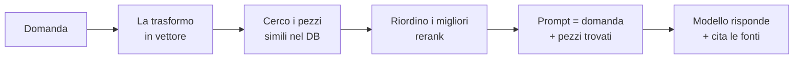

# RAG — Retrieval-Augmented Generation

> **~8 min** — Alla fine saprai: *spiegare cos'è RAG a un collega, e dire dov'è il punto che si rompe più spesso.*
> Stabile — il pattern resta, cambiano i pezzi dentro.

---

## Prima di leggere — prova a rispondere

Non saltare questo. Rispondere *prima* di sapere è ciò che fa attaccare la memoria. Bastano 20 secondi, anche se sbagli (anzi: sbagliare aiuta).

1. Un modello AI non conosce i documenti della **tua** azienda. Come fai a fargli rispondere su quelli, *senza* riaddestrarlo?
2. Se gli incolli 500 pagine nel prompt, secondo te che problemi nascono?

Tieni a mente le tue risposte. Le ricontrolli tra poco.

---

## L'idea in una frase

**Trova i pezzi di testo rilevanti → mettili nel prompt → fai rispondere il modello solo su quelli.**

Tutto RAG è qui. Il resto sono dettagli su *come* fai bene ciascun passo.

:::tip Ancora mentale
RAG = **dare al modello un libro aperto alla pagina giusta**, invece di pretendere che ricordi tutto a memoria.
:::

---

## Perché serve (torna alla domanda 1)

Un LLM sa solo ciò che ha visto in addestramento. Non conosce i tuoi documenti, non sa cosa è successo dopo il suo cut-off, e quando non sa **inventa** — è l'allucinazione.

Potresti riaddestrarlo sui tuoi dati (fine-tuning), ma è **costoso, lento, e da rifare a ogni aggiornamento**. RAG evita tutto questo: non *insegni* i dati al modello, glieli **passi al momento giusto**.

> **Dillo a voce ora** (sì, davvero, ad alta voce): *"RAG serve perché un modello non conosce i miei dati e riaddestrarlo costa troppo."* Detto? Vai avanti.

---

## Come funziona, passo per passo

Leggi il diagramma, poi **copri lo schermo con una mano e prova a ridire i 5 passaggi.** Quanti ne ricordi? Se meno di 3, rileggi una volta sola e riprova. Questo è l'unico modo in cui si fissa.

---

## I 4 mattoni che devi saper nominare

Te li do uno per volta. Dopo ognuno, una micro-domanda.

**1. Chunking** — spezzi i documenti in pezzi (chunk). Troppo grandi = rumore e costo. Troppo piccoli = perdi il senso.
→ *È la decisione che pesa di più sulla qualità, e la più sottovalutata.*
- Perché un chunk troppo piccolo è un problema?

**2. Embedding** — ogni chunk diventa un vettore di numeri che ne cattura il **significato**. Testi simili → vettori vicini.
- Due frasi che dicono la stessa cosa con parole diverse: vettori vicini o lontani?

**3. Retrieval + Rerank** — recuperi *tanti* candidati (veloce ma grezzo), poi un secondo modello li **riordina** tenendo solo i migliori (preciso ma costoso).
- Perché non recuperare direttamente solo i 5 migliori e basta?

**4. Generation** — il modello scrive la risposta usando **solo** i pezzi forniti, con citazioni.
- Cosa dovrebbe fare il modello se nei pezzi non c'è la risposta?

*(Risposte in fondo, ma prova prima tu.)*

---

## Quando usare cosa

| Se... | Allora... |
|---|---|
| Pochi documenti, domande semplici | RAG base. Non complicare. |
| Contano termini esatti (codici, nomi) | **Hybrid**: semantica + keyword insieme |
| La qualità non basta | Aggiungi **rerank** prima di ogni altra cosa |
| I dati cambiano spesso | RAG batte il fine-tuning facile |
| Devi insegnare uno **stile/comportamento** | Lì RAG non basta → fine-tuning |

:::warning La trappola n.1
Quando RAG dà risposte scadenti, **9 volte su 10 il colpevole è il retrieval** (recuperi i pezzi sbagliati), non il modello. Si aggiusta il retrieval, non si cambia subito modello.
:::

---

## Cosa dura e cosa no

- Stabile Il ciclo recupera → aumenta → genera. Non se ne va.
- In evoluzione Hybrid search e rerank: ormai default, non più "roba avanzata".
- A rischio Le chain rigide "carico un PDF in 5 righe": ok per demo, male in produzione.
- **Evita:** chunk a taglia fissa cieca — saltare la valutazione del retrieval — pensare che context window enormi rendano RAG inutile (costano e perdono precisione: "lost in the middle").

---

## Richiamo finale (chiudi tutto e rispondi a voce)

Non rileggere. Recupera a memoria — è qui che impari davvero.

1. RAG in una frase: ___
2. I 5 passaggi del flusso: ___
3. Dove guardi per primo se le risposte fanno schifo, e perché: ___
4. Quando RAG **non** basta e serve fine-tuning: ___

Se ti blocchi su una, segnala quella pagina per rivederla **domani** (non oggi: lo stacco è ciò che la fissa).

## Ripasso a sorpresa (interleaving — non saltare)

Domande su roba di **altre** pagine. Mischiare argomenti è ciò che ti fa ricordare a lungo, non a blocchi.

- *(da MCP)* Perché un modello che può **eseguire azioni** è più pericoloso di uno che produce solo testo?
- *(da LLM-as-judge)* Cos'è un "golden dataset" e perché senza è inutile valutare?

*(Se non le ricordi, è normale: vuol dire che quelle pagine vanno ripassate. È un test, non un fallimento.)*

---

Risposte alle micro-domande

1. **Chunk troppo piccolo**: perde il contesto attorno, e da solo non basta a rispondere.
2. **Frasi sinonime**: vettori **vicini** — l'embedding cattura il significato, non le parole esatte.
3. **Perché non solo i 5 migliori**: il retrieval iniziale è veloce ma grezzo e può sbagliare; recuperarne tanti e poi rerankare riduce il rischio di scartare il pezzo giusto.
4. **Se non c'è la risposta**: dirlo ("non è nel contesto"), **non** inventare.

