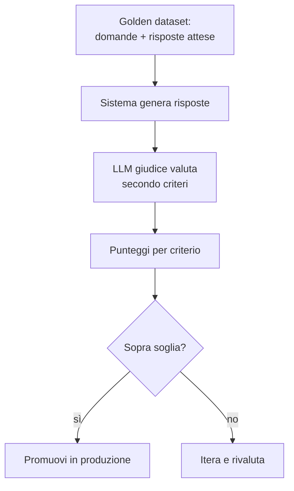

# LLM-as-judge — misurare la qualità

<span class="badge-stato evoluzione">In evoluzione</span> Il metodo si sta affinando, ma il principio regge.

## Il problema

Hai costruito un sistema che risponde. Ma **è buono?** Con il testo non esiste una metrica unica come l'accuracy: due risposte diverse possono essere entrambe corrette. Eppure senza misura sei cieco — non sai se una modifica migliora o peggiora, non sai quando sei pronto per la produzione, non puoi difendere il sistema davanti a nessuno.

Questo è il punto che separa chi fa demo da chi fa sistemi seri: tutti sanno far funzionare un caso, pochi sanno dire *quanto bene* funziona su mille casi.

## I concetti

L'idea: **usare un LLM (potente) per giudicare le risposte di un altro LLM**, secondo criteri che definisci tu. Non è perfetto, ma è scalabile e sorprendentemente allineato al giudizio umano quando fatto bene.



I mattoni:

- **Golden dataset** — un insieme curato di casi di test (domanda + cosa consideri una buona risposta). È il fondamento: senza questo, ogni valutazione è aria.
- **Criteri espliciti** — non "è buona?" ma: è fedele al contesto fornito? risponde alla domanda? è completa? cita le fonti?
- **Giudice** — un modello forte a cui dai la risposta, il contesto e i criteri, e che assegna punteggi motivati.
- **Eval offline vs online** — offline = sul golden dataset prima di rilasciare; online = monitorando le risposte reali in produzione.

## In pratica

```python
giudizio = llm_giudice(f"""Valuta la risposta da 1 a 5 su ogni criterio.
Motiva ogni punteggio in una frase.

Domanda: {domanda}
Contesto fornito: {contesto}
Risposta da valutare: {risposta}

Criteri:
- Fedeltà: usa solo il contesto, senza inventare?
- Pertinenza: risponde davvero alla domanda?
- Completezza: copre i punti importanti?

Rispondi in JSON: {{"fedelta": n, "pertinenza": n, "completezza": n, "note": "..."}}
""")
```

La regola d'oro: **chiedi al giudice di motivare prima di dare il voto.** Un modello che spiega ragiona meglio di uno che spara un numero secco.

## Trade-off — quando usare cosa

| Situazione | Scelta |
|---|---|
| Prototipo iniziale | Valutazione umana a campione, veloce |
| Devi iterare spesso e in fretta | LLM-as-judge sul golden dataset |
| Decisione critica / regolata | Giudice LLM **+** revisione umana sui casi limite |
| Hai una risposta esatta attesa | Match diretto, non serve un giudice |

I limiti da conoscere: il giudice ha **bias** (tende a preferire risposte lunghe, o quelle che somigliano al suo stile); va calibrato confrontandolo ogni tanto con giudizi umani. E non delegargli decisioni dove un errore costa caro senza un umano nel loop.

## Stato dell'arte / cosa evitare

- <span class="badge-stato stabile">Stabile</span> L'idea di un golden dataset + criteri espliciti.
- <span class="badge-stato evoluzione">In evoluzione</span> Le tecniche per ridurre il bias del giudice e renderlo riproducibile.
- **Da evitare**: rilasciare senza nessuna valutazione ("sembra funzionare"); fidarsi del giudice senza mai confrontarlo con l'umano; un golden dataset di 3 esempi (troppo piccolo per dire qualcosa).

## Per approfondire

Strumenti di observability/eval come Langfuse, Arize Phoenix, LangSmith. Cerca la documentazione aggiornata di quello che adotti.

---

## Self-check

1. Perché per il testo non esiste una metrica unica come l'accuracy della classificazione?
2. Cos'è un golden dataset e perché senza è inutile valutare?
3. Perché conviene chiedere al giudice di *motivare* prima di assegnare il voto?
4. Cita due bias noti di un giudice LLM e come li terresti sotto controllo.
