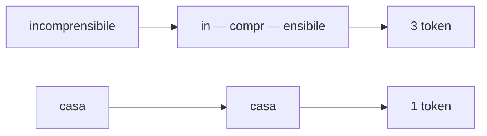
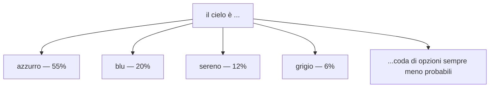

# Come funziona un LLM

  Stabile
  Lezione 0.1
  ~12 min di lettura

Questi fondamenti non cambiano da anni. È la base su cui poggia tutto il resto della guida — se questa è solida, il resto fila.

Un **LLM** — *Large Language Model*, modello linguistico di grandi dimensioni — in fondo fa una cosa sola: **dato un testo, indovina la parola più probabile che viene dopo.** Poi la aggiunge e indovina di nuovo, una parola alla volta, finché non ha composto la risposta. Rispondere a una domanda, riassumere, tradurre, scrivere codice: sotto il cofano è sempre lo stesso gesto, ripetuto centinaia di volte.

Sembra troppo semplice per reggere tutto quello che vediamo fare a questi modelli. Eppure è letteralmente così — e capirlo a fondo è ciò che separa chi usa un LLM a caso da chi sa cosa sta facendo. Partiamo da una parola che useremo ovunque: **modello**.

## Cos'è un modello

Un modello impara dagli esempi invece di seguire regole scritte a mano, e la differenza è più grossa di quanto sembri. Nel software normale è lo sviluppatore a scrivere la logica pezzo per pezzo: *se l'email contiene "hai vinto", è spam*. **Un modello fa l'opposto: non gli dai regole, gli dai dati.** Gli passi migliaia di email già divise tra spam e legittime, e capisce da solo cosa le distingue — anche le cose che noi non sapremmo nemmeno spiegare. Col linguaggio è identico: un LLM non studia la grammatica italiana, **la tira fuori da solo** dalla mole di testo su cui si è allenato.

Cosa c'è davvero dentro un modello

Dentro c'è una funzione matematica con miliardi di numeri interni, i **parametri** (li sentirai chiamare anche "pesi"). All'inizio sono casuali e il modello non sa fare niente. Durante l'**addestramento** (*training*) gli si mostra una montagna di testo, e ogni volta che sbaglia a prevedere la parola dopo, i parametri vengono corretti di pochissimo nella direzione giusta. Moltiplica per qualche miliardo di volte e quei numeri, da casuali, diventano una mappa sorprendentemente ricca di come funziona il linguaggio. La struttura che li organizza si chiama **rete neurale**, e l'architettura specifica degli LLM moderni è il **transformer** — roba che merita la sua trattazione, e che la guida riprende più avanti.

## Il modello non vede parole, vede token

"Indovina la parola dopo" è una semplificazione comoda, ma imprecisa. Un LLM non lavora con le parole intere, lavora con i **token**: pezzetti di testo. Un token può essere una parola corta ("casa"), un frammento di una più lunga ("inter", poi "essante"), uno spazio o un segno di punteggiatura.

Perché complicarsi la vita così? Per non doversi portare dietro un vocabolario infinito. Se il modello dovesse conoscere ogni parola esistente — in tutte le lingue, più nomi, sigle, refusi e parole inventate ieri — non finirebbe più. Con i token invece gli bastano poche decine di migliaia di pezzi per comporre **qualsiasi** testo, incluse parole che non ha mai visto. È lo stesso trucco dell'alfabeto: 21 lettere ricombinabili battono un simbolo diverso per ogni parola.

Sembra un dettaglio da nerd, e invece ti tocca il portafoglio: il costo delle API si misura in token, non in parole, e così i limiti di lunghezza. Pure certe figuracce dei modelli — tipo sbagliare a contare le lettere di una parola — vengono da qui: il modello non vede le lettere, vede token.

> **Curiosità** — Una parola rara e lunga si spezza in più token di una comune e corta. Ecco perché, a parità di lettere, certe parole "costano" più di altre.

## La finestra di contesto

Per indovinare il token dopo, il modello guarda tutto quello che ha davanti: la tua domanda più ciò che ha già scritto. Ma c'è un tetto a quanto testo riesce a tenere d'occhio in una volta, e si chiama **finestra di contesto** (*context window*). Quello che sfora il tetto, sparisce dai radar.

Pensala come una **scrivania**: ci stanno un tot di fogli, e se ne aggiungi troppi i primi cadono dal bordo. Il modello non li vede più, punto. È il motivo per cui in una chat molto lunga a volte sembra "dimenticare" come avevi iniziato — quel pezzo è semplicemente caduto dalla scrivania.

A questo si aggiunge un secondo limite, diverso. Un modello conosce solo ciò che ha visto fino al suo **cut-off**: la data in cui è finito l'addestramento. Tutto quello che è successo dopo, per lui non esiste — a meno che non glielo passi tu nel contesto.

Metti insieme i due limiti e hai già capito, in anticipo, perché esiste metà di questa guida. **Documento troppo lungo per la scrivania? Informazione successiva al cut-off?** In tutti e due i casi la mossa è la stessa: dare al modello, al momento giusto, solo i pezzi che gli servono. Quella tecnica si chiama **RAG**, ed è la lezione 1.1.

## Probabilità e temperature

Resta la domanda più ghiotta: come fa, di preciso, a "scegliere" la parola dopo? "Scegliere" è una parola che inganna, perché fa pensare a una decisione netta. In realtà il modello calcola **una probabilità per ogni token possibile**. Dopo "il cielo è", nella sua testa c'è qualcosa del genere:

Attenzione però: il modello non *sa* che il cielo è azzurro. Ha solo visto, in una marea di frasi scritte da esseri umani, che dopo "il cielo è" la parola "azzurro" spunta di continuo — e quella frequenza è diventata un numero alto. È statistica che si è messa il vestito buono dell'intuizione.

Il bello è *come* pesca da questo ventaglio. Se prendesse sempre il più probabile sarebbe prevedibile da morire, e pure peggiore: si incepperebbe a ripetere le stesse cose. Se pescasse a caso, sfornerebbe accozzaglie senza senso. La verità utile sta nel mezzo, e a deciderla è un parametro: la **temperature**.

La temperature è un numero, di solito tra 0 e 2, che regola **quanto il modello dà retta alle differenze di probabilità.** Non cambia le probabilità: cambia quanto se le prende sul serio. Bassa (vicino a 0), il modello punta quasi sempre sul favorito → risposte coerenti, prevedibili, a volte noiose: il **notaio**. Alta, anche le opzioni improbabili si giocano le loro chance → risposte varie, creative, ma più a rischio di sparare castronerie: il **poeta dopo il secondo bicchiere**.

Morale: **non esiste la temperature "giusta", esiste quella giusta per il compito.** Una risposta legale, dove inventarsi le cose è un disastro? Bassa. Un brainstorming di nomi, dove la noia è il vero nemico? Alta. Quasi tutto vive nel mezzo, e il punto giusto si trova provando, non copiando un default da un tutorial.

> **Nota** — La temperature non è l'unica manopola. Un'altra molto usata, *top-p*, fa una cosa simile ma tagliando la coda delle opzioni improbabili. Per ora tieni il concetto: ci sono parametri che regolano quanto il modello osa.

### Sotto il cofano: la softmax

Vale la pena vedere il meccanismo vero, perché chiarisce cosa fa davvero la temperature.

Quando il modello finisce di elaborare non produce probabilità belle pronte, ma un punteggio grezzo per ogni token, chiamato **logit**. I logit sono numeri qualsiasi (anche negativi) che non sommano a niente di sensato. Per trasformarli in probabilità vere — positive e con somma 1 — si usa la funzione **softmax**:

$$P(\text{token}_i) = \frac{e^{z_i / T}}{\sum_j e^{z_j / T}}$$

dove $z_i$ è il logit del token *i* e $T$ è la temperature. La temperature è esattamente quel $T$ che divide i logit **prima** che la softmax faccia il suo lavoro.

Senza formule: la softmax prende i punteggi grezzi e li trasforma nelle fette di una torta che fa 100%. Dividere per $T$ decide quanto saranno diverse le fette. $T$ piccolo (sotto 1) **gonfia** le differenze, la fetta del favorito diventa enorme → notaio. $T$ grande **appiattisce** le differenze, anche gli outsider hanno una chance vera → poeta. La cosa da portarsi a casa: **la temperature non aggiunge creatività dal nulla.** Il modello aveva già calcolato tutto; il parametro decide solo quanto seguire la classifica che si era già fatto in testa. Alzarla non lo rende più intelligente, gli dà solo il permesso di pescare più in basso.

## Cosa un LLM non è

Capire come funziona una cosa vuol dire anche sapere come **non** funziona. Quattro equivoci tornano più spesso degli altri:

| Il pensiero sbagliato | Come stanno le cose |
|---|---|
| "Cerca la risposta in un database" | No, non cerca niente: **genera** testo un token alla volta, a probabilità. Niente archivio, solo una previsione che si srotola. |
| "Se dice il falso, sta mentendo" | No, non ha intenzioni. Ha prodotto una sequenza che gli pareva probabile. Il falso è un effetto collaterale, non una bugia. |
| "Sa tutto quello che c'è in rete" | No, sa fino al suo **cut-off**, e non come pagine da consultare ma come intuizioni statistiche. Non ha la fonte in tasca. |
| "Più temperature = più intelligente" | No, più temperature = più **vario**, non più giusto. Spesso è pure il contrario. |

> **Il punto da tenere stretto per tutta la guida** — Un LLM **non recupera fatti, predice testo plausibile.** Ecco perché può dire con assoluta sicurezza cose completamente false — le chiamiamo **allucinazioni** (lezione 3.3). Una frase falsa, per lui, può essere una sequenza di parole perfettamente probabile. Non sta sbagliando un test di memoria: sta facendo benissimo il suo unico lavoro, prevedere parole plausibili. **Plausibile non vuol dire vero**, e tenere separate le due cose è metà del mestiere di chi costruisce con gli LLM.

---

## Verifica di comprensione

> Rispondi a memoria, senza rileggere — è lo sforzo di recuperare che fissa le cose, non la rilettura. Le risposte incerte rivedile **domani**, non subito: lo stacco di un giorno le consolida. Le ultime due domande anticipano lezioni future, è normale non saperle ancora.

1. Cosa fa un LLM, ridotto all'osso?
2. Cos'è un token, e perché il modello non usa parole intere?
3. Cos'è la finestra di contesto, e che fine fa ciò che la sfora?
4. Cosa regola davvero la temperature?
5. Perché un LLM può dire con sicurezza una cosa falsa senza "mentire"?
6. *(anticipazione)* Visti i limiti di cut-off e finestra di contesto, a che problema serve RAG?
7. *(anticipazione)* Se predice testo plausibile invece di recuperare fatti, quanto ti fidi di una sua risposta in ambito medico o legale?

---

## Glossario

- **LLM (Large Language Model)** — modello linguistico di grandi dimensioni; il tipo di modello di cui parla tutta la guida.
- **Modello** — una funzione matematica con tanti parametri, regolati da soli durante l'addestramento a partire da grandi quantità di dati.
- **Parametri (pesi)** — i numeri interni del modello, regolati in addestramento; sono ciò che il modello "ha imparato".
- **Addestramento (training)** — la fase in cui i parametri si regolano mostrando al modello molti esempi.
- **Token** — l'unità minima di testo (spesso un pezzo di parola) che il modello legge e produce.
- **Tokenizzazione** — il processo che spezza il testo in token.
- **Finestra di contesto (context window)** — quanti token il modello tiene d'occhio in una volta sola.
- **Cut-off** — la data oltre cui il modello non ha più visto dati in addestramento.
- **Logit** — il punteggio grezzo che il modello dà a ogni token prima di trasformarlo in probabilità.
- **Softmax** — la funzione che trasforma i logit in probabilità con somma 100%.
- **Temperature** — il parametro che regola quanto il modello segue fedelmente la classifica di probabilità.
- **Top-p** — parametro complementare che limita la scelta ai token più probabili entro una soglia.
- **Allucinazione** — quando il modello produce con sicurezza un'informazione falsa ma plausibile.

---

## Per approfondire

- **3Blue1Brown**, serie su reti neurali e transformer (YouTube) — il modo più chiaro per *vedere* questi concetti, non solo leggerli.
- **Tokenizer online di OpenAI** — incolli del testo e guardi in tempo reale come viene spezzato in token. Due minuti e i token non sono più un mistero.
- **Wikipedia**, voce *Large language model* (l'inglese è più completa) — buona panoramica con riferimenti nelle note.

*Risorse indicate per la ricerca; per i link esatti conviene cercarli al momento, perché cambiano nel tempo.*

---

## Prossima lezione

**0.2 Embedding e spazi vettoriali.** Ora sai che il modello ragiona in token e va a probabilità. Prossima domanda: come fa a sapere che "cane" e "cagnolino" sono parenti, mentre "cane" e "frigorifero" no? La risposta — i numeri che catturano il significato — è il mattone su cui si regge RAG.
