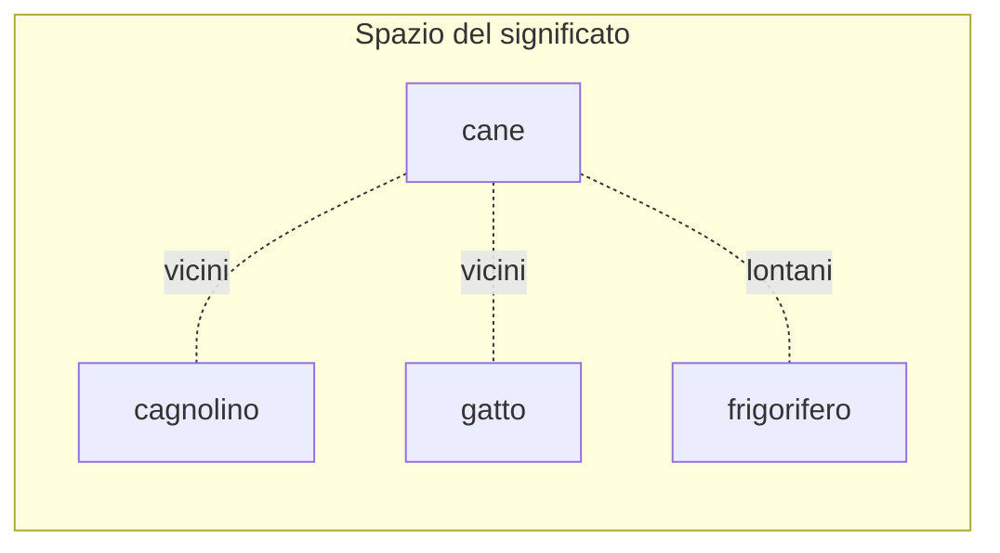
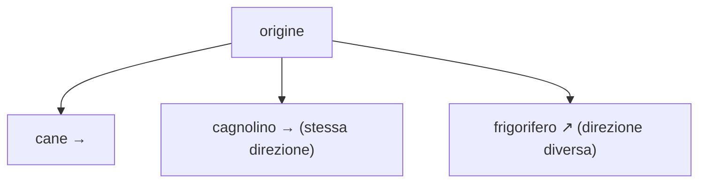

# Embedding e spazi vettoriali

  Stabile
  Lezione 0.2
  ~12 min di lettura

Il mattone che rende possibile la ricerca per significato — e quindi RAG, gli agenti, mezza guida. Se lo capisci qui, dopo è tutta discesa.

Nella lezione 0.1 abbiamo lasciato in sospeso una domanda: come fa un modello a sapere che **"cane" e "cagnolino" sono parenti**, mentre "cane" e "frigorifero" non c'entrano niente? Non lo sa perché qualcuno gliel'ha detto. Lo sa perché ha trasformato ogni parola in **numeri** — e quei numeri, per le parole che significano cose simili, finiscono vicini. Questi numeri si chiamano **embedding**, e sono una delle idee più eleganti di tutta l'AI moderna.

## L'idea: trasformare il significato in posizione

Immagina una mappa. Su una cartina geografica, città vicine sono vicine sulla carta e città lontane sono lontane — la **posizione** racconta una relazione. Un embedding fa la stessa cosa, ma con il significato: prende una parola (o una frase, o un documento) e le assegna un punto in uno spazio, in modo che **cose con significato simile finiscano in punti vicini.**

"Cane" e "cagnolino" cadono uno accanto all'altro. "Gatto" è lì vicino — non identico, ma nella stessa zona, perché condivide un sacco di contesti con "cane" (animali, casa, pelo, guinzaglio). "Frigorifero" sta dall'altra parte della mappa. **La distanza tra i punti è la differenza di significato.** Tutto qui — ed è una cosa enorme.

*Definizione:* un **embedding** è la rappresentazione di un testo come una lista di numeri (un **vettore**) che ne cattura il significato. Testi simili → vettori vicini.

## Perché "vettore" e cosa significa "spazio a tante dimensioni"

Quella lista di numeri ha un nome: **vettore**. E la parola "spazio" qui è letterale, solo con un piccolo trucco mentale da fare.

Sulla mappa di prima ogni punto ha 2 coordinate: latitudine e longitudine, due numeri. Un embedding fa lo stesso, ma invece di 2 numeri ne usa **centinaia o migliaia**. Ogni numero è una specie di "coordinata" lungo una dimensione diversa del significato. Non riusciamo a *immaginare* uno spazio a 1.000 dimensioni — il cervello si ferma a 3 — ma la matematica se ne frega di cosa riusciamo a immaginare: calcolare la distanza tra due punti funziona identico, che le dimensioni siano 2 o 2.000.

> **Curiosità** — Le dimensioni non hanno un'etichetta del tipo "questa misura quanto è un animale". Emergono da sole durante l'addestramento, e di solito sono illeggibili per noi. Però funzionano: l'esempio classico è che, prendendo i vettori, *re − uomo + donna* dà un punto vicinissimo a *regina*. Il modello ha "imparato" il concetto di regalità e di genere senza che nessuno glieli definisse.

## Come si misura la "vicinanza"

Abbiamo detto "vettori vicini", ma vicini *come*? Qui entra la misura che sentirai nominare in continuazione quando si parla di ricerca: la **similarità del coseno** (*cosine similarity*).

L'idea, senza matematica: invece di guardare *quanto sono distanti* due punti, guardi **in che direzione puntano** dal centro. Due vettori che puntano nella stessa direzione sono simili, anche se uno è più "lungo" dell'altro. È una scelta furba, perché nel significato conta la direzione (di cosa parla un testo), non l'intensità (quanto è lungo).

Il risultato è un numero tra -1 e 1: vicino a **1** = stesso significato, vicino a **0** = scollegati, verso **-1** = opposti. Quando un sistema "cerca i testi più simili a questa domanda", nel 90% dei casi sta calcolando la similarità del coseno tra l'embedding della domanda e quelli dei documenti, e tiene i punteggi più alti.

Sotto il cofano: la formula del coseno

La similarità del coseno tra due vettori $A$ e $B$ è:

$$\text{sim}(A, B) = \frac{A \cdot B}{\|A\| \, \|B\|}$$

Sopra c'è il **prodotto scalare** (moltiplichi le coordinate una a una e sommi). Sotto, le **lunghezze** dei due vettori, che servono a normalizzare — è quel "dividere per la lunghezza" che rende la misura indifferente a quanto è lungo un vettore e sensibile solo alla direzione. Il risultato è il coseno dell'angolo tra i due: angolo 0° (stessa direzione) → coseno 1; angolo 90° (perpendicolari) → coseno 0.

Il prodotto scalare funziona come una **votazione coordinata per coordinata**: se in una certa dimensione entrambi i vettori hanno valore alto e dello stesso segno, quella coordinata "vota a favore" della somiglianza (il prodotto è grande e positivo); se uno è positivo e l'altro negativo, vota contro (prodotto negativo); se uno dei due è vicino a zero, quella dimensione non vota proprio. Sommi tutti i voti, normalizzi per la lunghezza, e hai la direzione comune. Non devi calcolarla a mano mai, ma ora sai *perché* si chiama "del coseno" e *perché* normalizza.

## Chi produce gli embedding

Non li calcoli a mano: lo fa un **modello di embedding**, un parente stretto degli LLM ma con un altro mestiere. Un LLM genera testo; un modello di embedding prende un testo e **sputa fuori il suo vettore**. Gli dai "il gatto dorme sul divano", ti restituisce una lista di, diciamo, 1.536 numeri. Gli dai un intero documento, stessa cosa: un vettore solo che ne riassume il significato.

La cosa pratica da sapere: esistono tanti modelli di embedding diversi, producono vettori di lunghezze diverse, e **non sono intercambiabili.** Vettori fatti da modelli diversi non si possono confrontare tra loro — è come misurare due cose con righelli tarati in modo diverso. Quando costruisci un sistema, scegli un modello di embedding e tieni quello per tutto.

> **Nota** — "Embedding" si usa sia per il concetto (rappresentare significato come numeri) sia per il risultato concreto (il vettore di una frase specifica). Lo sentirai in entrambi i sensi, te ne accorgi dal contesto.

## Perché tutto questo ti serve

Gli embedding sono il motore silenzioso sotto un sacco di cose che vedrai. **Cercare per significato invece che per parole esatte**: cerchi "come resettare la password" e trovi un documento che dice "ripristinare le credenziali di accesso", anche se non c'è una parola in comune — perché i due testi hanno embedding vicini. È il cuore di **RAG** (lezione 1.1): per trovare i pezzi di documento giusti da dare al modello, prima li trasformi tutti in embedding, poi cerchi quelli più vicini alla domanda. Senza embedding, niente ricerca semantica, e senza quella, niente RAG.

## Cosa un embedding non è

Quattro equivoci che girano e che vale la pena tagliare alla radice:

| Il pensiero sbagliato | Come stanno le cose |
|---|---|
| "È un dizionario di sinonimi" | No. È una **posizione** in uno spazio, non una lista. Due testi vicini non sono sinonimi: hanno significato *affine*. "Cane" e "gatto" sono vicini ma non vogliono dire la stessa cosa. |
| "Da un embedding posso tornare al testo originale" | No. Il vettore conserva il **significato**, non le parole esatte. È un viaggio di sola andata: testo → numeri, non il contrario. |
| "Vettori prodotti da modelli diversi sono confrontabili" | No. Ogni modello costruisce il suo spazio del significato a modo suo — due righelli tarati in modo diverso. Si sceglie un modello e si tiene quello per tutto il sistema. |
| "Più dimensioni = sempre meglio" | No. Dimensioni in più = più sfumature *potenziali*, ma anche più costo (storage, calcolo) e a volte rumore. Quello che conta è il modello, non il numero. |

---

## Verifica di comprensione

> Rispondi a memoria, senza rileggere. Le incerte rivedile domani. Le ultime anticipano lezioni future.

1. Cos'è un embedding, in una frase?
2. Perché "cane" e "cagnolino" finiscono vicini, mentre "cane" e "frigorifero" no?
3. Cosa misura la similarità del coseno, e perché guarda la direzione e non la distanza?
4. Perché non puoi confrontare embedding prodotti da due modelli diversi?
5. *(anticipazione)* Cerchi "come resettare la password" e un documento parla di "ripristinare le credenziali". Come fa un sistema a trovarlo anche senza parole in comune?
6. *(anticipazione)* Per dare a un LLM i pezzi giusti di mille documenti, gli embedding in che punto entrano in gioco?

---

## Glossario

- **Embedding** — la rappresentazione di un testo come vettore di numeri che ne cattura il significato; testi simili producono vettori vicini.
- **Vettore** — una lista ordinata di numeri; qui, le "coordinate" di un testo nello spazio del significato.
- **Spazio (vettoriale)** — lo "spazio a tante dimensioni" in cui vivono gli embedding; ogni numero del vettore è una coordinata.
- **Dimensioni** — il numero di valori in un embedding (es. 768, 1.536); più dimensioni = più sfumature di significato catturabili.
- **Similarità del coseno (cosine similarity)** — misura di vicinanza tra due vettori basata sulla loro direzione; va da -1 (opposti) a 1 (identici).
- **Prodotto scalare** — l'operazione (moltiplica e somma le coordinate) alla base della similarità del coseno.
- **Modello di embedding** — il modello che trasforma un testo nel suo vettore.
- **Ricerca semantica** — cercare per significato invece che per parole esatte, usando gli embedding.

---

## Per approfondire

- **Tokenizer ed embedding a confronto:** cerca visualizzazioni di *word embeddings* (la classica "TensorFlow Embedding Projector") per vedere i vettori delle parole disposti nello spazio.
- **3Blue1Brown**, il video sugli embedding nei transformer — ottimo per vedere come le parole diventano vettori.
- **Documentazione dei modelli di embedding** (OpenAI, Cohere, modelli open come quelli su Sentence Transformers): utile quando dovrai sceglierne uno per un progetto.

*Risorse indicate per la ricerca; per i link esatti conviene cercarli al momento.*

---

## Prossima lezione

**0.3 Concetti ML che servono a chiunque.** Sai come ragiona un modello (0.1) e come rappresenta il significato (0.2). Prima di costruire qualunque cosa, serve un'intuizione meccanica di cosa cambia *dentro* il modello quando lo si modifica — e, soprattutto, di cosa il fine-tuning *sposta* davvero (i pesi) e cosa **non** sposta (i fatti recuperabili: quelli sono lavoro per RAG). Senza questa intuizione, la griglia di decisione fine-tuning vs RAG (1.7) si recita a memoria invece di capirla.
