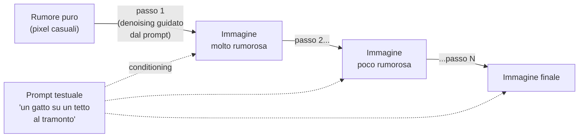

# Generazione di immagini (diffusion models)

  In evoluzione
  Lezione 2.4
  ~10 min di lettura

I diffusion model partono da rumore puro e lo raffinano progressivamente guidati dal prompt testuale — un processo opposto a quello che immagina la maggior parte delle persone. Capire il meccanismo chiarisce sia le capacità che i limiti, e ti fa smettere di meravigliarti che le mani vengano strane.

La generazione di immagini è il caso AI più visibile al grande pubblico — Midjourney, DALL-E, Stable Diffusion sono entrati nel mainstream. Ma il meccanismo che li alimenta è spesso frainteso, e fraintenderlo porta a aspettative sbagliate. Questa lezione ti da il quadro corretto senza la matematica completa.

## L'idea di base: dal rumore all'immagine

La maggior parte delle persone immagina che un modello di generazione immagini "disegni" da sinistra a destra come farebbe un umano. Non funziona così.

Un **diffusion model** parte dall'opposto: **partenza da rumore puro**. In addestramento, il modello impara a rimuovere progressivamente il rumore da immagini reali — una versione molto rumorosa di un gatto verso una meno rumorosa, verso quella quasi integra, verso il gatto perfetto. Impara il processo di **denoising**.

Al momento della generazione, si inverte il processo: si parte da un'immagine di rumore puro — pixel casuali — e si applica il denoising passo dopo passo, guidato dal testo del prompt. Dopo decine o centinaia di passi, il rumore si risolve in un'immagine.

Il prompt non "disegna" l'immagine: **guida il denoising**. Ad ogni passo, il modello chiede implicitamente "questa versione meno rumorosa è più coerente col prompt?" e si muove in quella direzione.

## I parametri che controllano la generazione

Sotto il cofano: latent diffusion e perché è più efficiente

Il denoising su immagini a piena risoluzione pixel per pixel sarebbe proibitivamente lento. I modelli moderni (Stable Diffusion e derivati) usano il **latent diffusion**: invece di lavorare nello spazio dei pixel, lavorano in uno spazio latente compresso — un autoencoder converte prima l'immagine in una rappresentazione molto più piccola, il diffusion process avviene lì, e un decoder riporta all'immagine finale. Questo riduce il costo computazionale di ordini di grandezza senza perdere qualità percepita.

Ecco perché Stable Diffusion gira su GPU consumer: il diffusion avviene su un tensore 64×64 (o simile), non su 512×512 pixel.

**Denoising steps** — il numero di passi di raffinamento. Più passi = immagine più rifinita ma più lenta da generare. Dai 20-30 passi (veloce, qualità buona) ai 100+ (lento, qualità massima). La maggior parte dei casi d'uso pratici sta tra 20 e 50.

**CFG — Classifier-Free Guidance** — quanto strettamente il modello segue il prompt. Un valore basso (1-3) lascia molta libertà creativa; un valore alto (10-15+) forza un'aderenza molto letterale. Il punto dolce per la maggior parte dei prompt è 7-9. CFG troppo alto produce immagini "over-saturate" con artefatti visivi.

**Seed** — il punto di partenza del rumore. Stesso seed + stesso prompt + stessi parametri = stessa immagine. Fondamentale per la riproducibilità.

**Negative prompt** — cosa non vuole nel risultato. "Senza dita distorte, senza watermark, senza sfocatura" guidano il denoising lontano da quei difetti. Una buona pratica nella generazione professionale.

## I casi d'uso principali

**Text-to-image** — il caso base: un prompt testuale produce un'immagine. Pubblicità, concept art, prototipazione rapida di visual, illustrazioni per contenuti.

**Image-to-image** — si fornisce un'immagine di partenza (non rumore puro) e si guida la trasformazione con un prompt. Cambio di stile ("trasforma questo schizzo in una foto realistica"), variazioni su un tema, editing guidato.

**Inpainting** — si maschera una parte dell'immagine e il modello la riempie in modo coerente col contesto e col prompt. Rimuovere oggetti, aggiungere elementi, correggere difetti.

**Outpainting** — estende l'immagine oltre i bordi originali, generando il contesto mancante. Utile per adattare proporzioni o allargare composizioni.

## I limiti che devi conoscere

Alcuni limiti sono strutturali — emergono dal meccanismo stesso — non bug in via di risoluzione.

**Testo nelle immagini.** I diffusion model generano testo come pattern visivo, non come caratteri semantici. Il risultato è spesso un testo deformato, con lettere inventate, quasi-leggibile ma sbagliato. Modelli come DALL-E 3 hanno migliorato molto (usando CLIP conditioning più forte), ma il problema non è completamente risolto.

**Mani e anatomia complessa.** Le mani umane hanno una struttura geometrica precisa — 5 dita, articolazioni specifiche — e i modelli faticano a mantenerla. Le mani con 6 dita o geometrie strane sono un artefatto noto. Lo stesso vale per geometrie complesse, gioielli articolati, meccanismi.

**Relazioni spaziali precise.** "Metti la palla rossa a sinistra del cubo blu" è difficile. Il modello capisce concettualmente ma può invertire sinistra e destra, o fare variazioni. Le relazioni spaziali esatte richiedono iterazione o approcci alternativi.

**Conteggio.** "Tre cani" può diventare due o quattro. Il conteggio preciso non è garantito.

**Copyright e deepfake.** I modelli sono addestrati su immagini del web, molte protette da copyright. Generare "nello stile di [artista specifico]" è un'area legalmente controversa. La generazione di immagini realistiche di persone reali in contesti falsi è un problema etico e legale grave — molti provider hanno guardrail, nessuno li ha perfetti.

In evoluzione La generazione video (Sora, Runway, Kling) applica gli stessi principi del diffusion alle sequenze temporali. La qualità è già notevole su clip brevi; le limitazioni di coerenza temporale e costo rimangono significative. Il campo si muove velocemente.

## Quando usare la generazione di immagini

| Use case | Adatto? | Note |
|---|---|---|
| Concept art e prototipazione rapida | Ottimo | Velocità, varietà, basso costo |
| Asset finali per produzione | Con cura | Verifica copyright, possibili artefatti |
| Immagini con testo integrato | Limitato | Il testo è spesso impreciso; post-processing necessario |
| Fotografie di persone reali | Rischio alto | Deepfake, consenso, questioni legali |
| Editing di immagini esistenti | Buono | Image-to-image e inpainting |
| Logo e branding precisi | Scarso | Difficile mantenere esattezza geometrica |

## Cosa NON è la generazione di immagini

| Il pensiero sbagliato | Come stanno le cose |
|---|---|
| "Il modello disegna come un umano" | Parte dal rumore e lo rimuove progressivamente. Il processo è opposto. |
| "Le mani vengono storte per un bug" | È un limite strutturale del meccanismo. Migliora con scale e conditioning migliori, ma non è "risolto". |
| "CFG alto = sempre meglio" | Troppo alto produce artefatti e over-saturation. Il punto dolce è 7-9. |
| "Stable Diffusion e DALL-E fanno la stessa cosa" | Stesso principio, architetture e training diversi, capacità e limiti differenti. |

---

## Verifica di comprensione

> Rispondi a memoria. Le incerte rivedile domani.

1. Descrivi il processo di un diffusion model in tre frasi — senza guardare la lezione.
2. Cosa controlla il CFG (Classifier-Free Guidance)?
3. Perché i modelli di generazione faticano con il testo nelle immagini e con le mani?
4. Qual è la differenza tra text-to-image e image-to-image?
5. Un cliente vuole generare automaticamente le immagini di copertina per 500 articoli blog con testo del titolo integrato nell'immagine. Quali limiti gli segnali?

---

## Glossario

- **Diffusion model** — architettura generativa che impara a rimuovere progressivamente il rumore da immagini, e al momento della generazione inverte il processo partendo da rumore puro.
- **Denoising** — processo di rimozione progressiva del rumore dall'immagine, guidato dal prompt testuale.
- **Denoising steps** — il numero di passi di raffinamento; più passi = più qualità, più lento.
- **CFG (Classifier-Free Guidance)** — parametro che controlla quanto strettamente il modello segue il prompt testuale.
- **Latent diffusion** — variante del diffusion che opera in uno spazio latente compresso invece che nello spazio dei pixel, riducendo drasticamente il costo computazionale.
- **Seed** — il punto di partenza casuale del rumore; stesso seed + stessi parametri = stessa immagine.
- **Negative prompt** — testo che specifica cosa il modello deve evitare nell'immagine generata.
- **Inpainting** — generazione di contenuto per riempire una maschera (area selezionata) in un'immagine esistente.
- **Outpainting** — estensione di un'immagine oltre i suoi bordi originali.

---

## Per approfondire

- **"Denoising Diffusion Probabilistic Models"** di Ho et al. — il paper fondante dei diffusion model moderni; cerca il titolo su arXiv.
- **"High-Resolution Image Synthesis with Latent Diffusion Models"** — il paper di Stable Diffusion; cerca su arXiv.
- **Documentazione di DALL-E 3, Midjourney, Stability AI** — i provider principali documentano capabilities e limiti nelle guide ufficiali.

*Risorse indicate per la ricerca; per i link aggiornati conviene cercarli al momento.*

---

## Prossima lezione

**2.5 Quando multimodale, quando pipeline separate.** Hai le basi di ogni modalità. Ora la domanda architecturale: nativo o pipeline? La griglia dei trade-off — costo, latenza, qualità, controllo, manutenzione — per non indovinare ma decidere.
