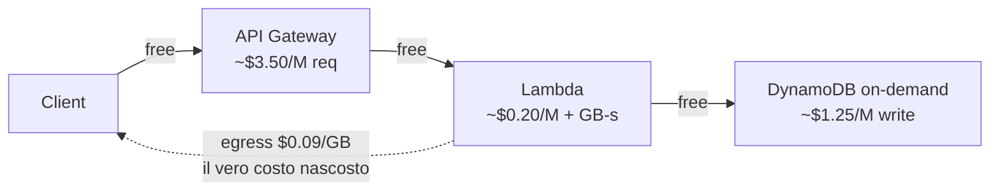

# Prompt per scrivere una lezione del Cloud Playbook

> **Come si usa**
>
> 1. Apri `cloud/SYLLABUS.md` e individua la lezione da scrivere (numero, titolo, scope, dipendenze, posizione).
> 2. Compila i campi del **blocco VARIABILE** qui sotto (i `{{PLACEHOLDER}}`). Non toccare il blocco FISSO.
> 3. Copia l'intero prompt (variabile + fisso) e incollalo a Sonnet (o altro modello strong) in una conversazione che abbia accesso al filesystem del repo.
> 4. Quando consegna, valutala con la stessa rubric di 0.1/0.2 della AI Playbook (densità, voce, tabella anti-pattern, sotto-il-cofano, bridge) + **rubric Mermaid** (vedi checklist in fondo).
>
> **Quando NON usare questo prompt:** per **decision drill** (formato diverso, vedi AGENTS.md §7). Per quelle scrivi un prompt dedicato.

---

## BLOCCO VARIABILE — da compilare per ogni lezione

```
LEZIONE: {{numero}} — {{titolo}}
FILE: cloud/{{cartella}}/{{slug}}.md

SCOPE (incollato letterale da cloud/SYLLABUS.md, riga ~{{N}}):
{{blocco SYLLABUS verbatim}}

CONFINE NETTO (cosa NON entra in questa lezione, e dove vive invece):
- {{cosa1}} — vive in {{lezione X}}
- {{cosa2}} — vive in {{lezione Y}}

AGGANCIO IN APERTURA (filo lasciato dalla lezione {{precedente}}):
{{una-due frasi: la domanda/osservazione in sospeso da cui partire}}

BRIDGE IN CHIUSURA (verso la lezione {{successiva}}):
{{una-due frasi: come questa lezione apre la prossima}}

CROSS-REFERENCE VERIFICATI (solo lezioni che esistono nel SYLLABUS, AI o Cloud):
- {{lezione A}} — quando parli di {{argomento}}
- {{lezione B}} — quando parli di {{argomento}}
- {{...}}

CANDIDATI PER I MATTONI H2 (l'agente è libero di adattarli, ma è il punto di partenza):
1. {{mattone 1}}
2. {{mattone 2}}
3. {{mattone 3}}
4. {{mattone 4}}

SOTTO IL COFANO (formula, algoritmo, modello di costo, protocollo — se rilevante):
- {{es. "modello di costo per richiesta serverless: C = req × ($/req) + GB-s × ($/GB-s) + GB-out × ($/GB egress)"}}
- Posizionamento suggerito: {{H3 in linea / <details> collassato}}

DIAGRAMMI MERMAID (vedi sezione dedicata sotto — quasi obbligatori per lezioni architetturali):
- Tipo: {{architecture-beta / sequenceDiagram / flowchart / cost-diagram}}
- Caption: {{una riga che dice cosa mostra}}
- Cosa aggiunge che la prosa non dice: {{...}}

TABELLA "COSA NON È" — 4 misconception candidate (l'agente può sostituire se ne trova di migliori):
| Il pensiero sbagliato | Come stanno le cose |
|---|---|
| "{{misc1}}" | {{realtà1}} |
| "{{misc2}}" | {{realtà2}} |
| "{{misc3}}" | {{realtà3}} |
| "{{misc4}}" | {{realtà4}} |

BADGE DI STATO (uno tra: stabile / evoluzione / rischio / legacy):
{{stato}}

DURATA STIMATA: ~{{N}} min di lettura
```

---

## BLOCCO FISSO — vale per ogni lezione, non modificare

Sei un agente che scrive una lezione del "Cloud Playbook", in italiano. Il repo è una guida di studio su cloud applicativo e AWS basata su Docusaurus, gemella della AI Playbook. Il file da scrivere è quello indicato in `FILE` sopra: lo **scaffold esiste già** (frontmatter, `<div class="lesson-meta">`, eventuale `<p class="lesson-lead">` e segnaposto). Preserva frontmatter e lesson-meta (aggiornando il badge da `bozza` allo stato indicato sopra), riscrivi la lesson-lead se necessario, e **sostituisci tutto il corpo** dopo la lead.

### Passo 0 — LEGGI PRIMA DI SCRIVERE (non saltare)

In ordine, leggi questi file per intero:

1. `AGENTS.md` — è il contratto di scrittura. Voce, profondità, struttura, regole sui termini, badge, anti-pattern. Quello che dice è vincolante per entrambi i playbook.
2. `ai/foundations/come-funziona-un-llm.md` (lezione 0.1 AI) — **gold standard di densità e voce**. Cloud non ha ancora una lezione di riferimento propria: la voce è la stessa, prendila da qui. La tabella "Cosa un LLM non è" e la sezione "Sotto il cofano: la softmax" sono i riferimenti di stile. La prima lezione cloud scritta a questo livello diventerà il gold standard cloud.
3. `ai/foundations/embedding.md` (lezione 0.2 AI) — **pavimento accettabile**. Stesso registro, uso di `<details>` per sotto-il-cofano.
4. `cloud/SYLLABUS.md`, lettura mirata: il blocco della lezione corrente e i blocchi delle lezioni nominate nei `CROSS-REFERENCE` e nei bridge.

Quando hai finito, hai in testa: il timbro di voce, la densità attesa, la tabella anti-pattern obbligatoria, l'uso di `<details>` per il sotto-cofano matematico/tecnico, il limite di non introdurre concetti che appartengono a lezioni successive.

### Template della pagina (da AGENTS.md §3, in ordine)

Usa i 13 blocchi del template di AGENTS.md §3. Promemoria critici per il Cloud:

1. **NESSUN emoji nei titoli di sezione.** Prosa pulita.
2. **Idea in una frase + ancora mentale**: il cuore della lezione in una riga, integrata nel discorso, non in un box separato.
3. **Una sezione H2 per ogni mattone.** Vedi i `CANDIDATI PER I MATTONI` sopra (punto di partenza, non vincolo).
4. **Sotto il cofano**: nel cloud spesso è un **modello di costo**, un **modello di latenza** o uno **scenario di failure**. Trattalo come 0.1 tratta la softmax: prima la formula/modello vero, poi la traduzione intuitiva.
5. **Tabella "Cosa NON è" — OBBLIGATORIA**: 4 righe, misconception comuni demolite.
6. **Diagrammi Mermaid** (vedi sezione dedicata sotto): per lezioni architetturali almeno uno, di regola.
7. **Verifica di comprensione**: 6-7 domande a memoria, spacing.
8. **Glossario** in fondo, solo i termini di questa pagina.
9. **Per approfondire**: 3-4 risorse. **MAI inventare URL precisi, titoli, numeri di pagina, nomi di whitepaper specifici.** AWS whitepaper sono ricercabili: rimanda alla docs ufficiale (`docs.aws.amazon.com`) o al re:Invent con titolo descrittivo, non con codice di sessione inventato.
10. **Prossima lezione**: gancio in prosa breve.

### Regole di voce (distillate da AGENTS.md §5 — vincolanti)

- **Italiano**. Diretto, va al sodo. Frasi brevi che si guadagnano il punto.
- **Tecnico vero**: usa i nomi corretti dei servizi (es. "AWS Lambda" alla prima occorrenza, poi "Lambda"; "Amazon DynamoDB" → "DynamoDB"; "Amazon S3" → "S3"). Non annacquare ("storage gestito" al posto di "S3" è vago — usalo solo quando il discorso è generico, non quando intendi S3).
- **Acronimi**: sciogli alla prima occorrenza, sempre. IAM = Identity and Access Management, VPC = Virtual Private Cloud, ALB = Application Load Balancer, ecc.
- **Grassetti funzionali**: sul perno del concetto. Dosati.
- **Battute dosate**: solo dove il concetto le regge.
- **Analogie integrate nel discorso**, non in box. Affiancano la precisione, non la sostituiscono.
- **Profondità ALTA**. Chiarezza > lunghezza > brevità.
- **Niente meta-istruzioni nel corpo.**
- **Concreto, sempre**: numeri reali, prezzi reali, configurazioni reali (ma a prova di obsolescenza — vedi sotto).
- **Si fida del lettore**.

### Termini con prerequisiti

Per concetti che presuppongono altre lezioni (es. "container", "VPC", "IAM role", "event-driven"): nomina con il termine corretto + una riga inline autosufficiente, e se serve un `<details>` di approfondimento minimo. Rimanda alla lezione che lo copre. Non spiegarli da zero qui se appartengono altrove.

### Numeri e prezzi — regola anti-obsolescenza

Il cloud cambia prezzi e limiti più spesso dell'AI cambia modelli. Quando citi un numero:

- Datalo: "al 2026, Lambda costa ~$0.20 per 1M invocazioni".
- Marcalo con badge `evoluzione` se è cruciale per il senso della lezione.
- Preferisci **ordini di grandezza** e **rapporti** ("DynamoDB on-demand costa ~10× la versione provisioned a parità di throughput stabile") rispetto a cifre esatte: gli ordini di grandezza durano anni, i decimali no.
- Per i limiti hard (es. "Lambda timeout massimo 15 min", "S3 oggetto massimo 5 TB"): vanno bene come sono, sono stabili da anni.

### Diagrammi Mermaid — non opzionali per Cloud

Nel Cloud il disegno chiude un ragionamento che la prosa apre. Le **lezioni architetturali** (Parti 1, 2, 4, 5, 7) devono avere **almeno un diagramma**. Le concettuali pure (0.x) possono saltarlo se non c'è struttura visiva.

**Tipi disponibili (Mermaid v11.1+, già abilitato in `docusaurus.config.mjs`)**:

- **`architecture-beta`** — il preferito per architetture AWS. Usa icon pack `logos:` di iconify per i servizi AWS (out-of-the-box, niente da registrare). Vocabolario d'icona standard del Cloud Playbook:

  | Servizio | Icona |
  |---|---|
  | API Gateway | `logos:aws-api-gateway` |
  | Lambda | `logos:aws-lambda` |
  | EC2 | `logos:aws-ec2` |
  | ECS / Fargate | `logos:aws-ecs` (fallback `server`) |
  | S3 | `logos:aws-s3` |
  | DynamoDB | `logos:aws-dynamodb` |
  | RDS / Aurora | `logos:aws-rds` |
  | CloudFront | `logos:aws-cloudfront` |
  | IAM | `logos:aws-iam` |
  | VPC | `logos:aws-vpc` (o fallback `cloud` per group) |
  | SQS | `logos:aws-sqs` |
  | SNS | `logos:aws-sns` |
  | EventBridge | `logos:aws-eventbridge` |
  | CloudWatch | `logos:aws-cloudwatch` |
  | Step Functions | `logos:aws-step-functions` (fallback `flowchart`) |
  | Bedrock | `logos:aws-bedrock` (fallback `cloud`) |

  Fallback ai 5 built-in di Mermaid (`cloud`, `database`, `disk`, `internet`, `server`) per servizi senza logo nativo.

  Raggruppa per **confine logico** (VPC, account, region) con `group ... in ...`. Etichetta gli edge dove il least-privilege rileva (es. "IAM: lambda:Invoke").

- **`sequenceDiagram`** — flussi richiesta/risposta sincroni (client → ALB → Lambda → DynamoDB → response) e interazioni async (producer → SQS → consumer, con DLQ in caso di fallimento).

- **`flowchart`** — alberi decisionali (decision drill), pipeline CI/CD/IaC.

- **`flowchart` "cost-diagram"** — pattern Cloud-specifico per FinOps/inferenza/serverless: mostra **dove si accumula il denaro** in una richiesta, con annotazioni `$` sugli edge. Usalo nelle lezioni di costo (6.1 FinOps, 5.3 inference cloud, ecc.).

- **`C4Context`** (sperimentale) — solo Parte 7 reference architecture, con commento "sperimentale".

**Regole vincolanti**:

- **Caption di una riga sopra** il diagramma che dice cosa mostra ("Flusso di una richiesta serverless con autorizzazione IAM e persistenza DynamoDB").
- Il diagramma deve **aggiungere informazione**, non duplicare la prosa. Se la prosa già dice tutto: è rumore, toglilo.
- **Vocabolario d'icona coerente** con la tabella sopra. Stesso servizio = stessa icona attraverso tutte le lezioni.
- **Mai >10 nodi** per diagramma. Spezza in due più piccoli.
- Itera sulla sintassi con il live editor: <https://mermaid.live>.

**Esempio scheletro `architecture-beta`** (architettura serverless minima, da adattare):

```mermaid
architecture-beta
  group vpc(logos:aws-vpc)[VPC]
  service apigw(logos:aws-api-gateway)[API Gateway] in vpc
  service lambda(logos:aws-lambda)[Lambda] in vpc
  service ddb(logos:aws-dynamodb)[DynamoDB] in vpc
  apigw:R --> L:lambda
  lambda:R --> L:ddb
```



**Esempio scheletro "cost-diagram"** (FinOps su un endpoint serverless):



L'annotazione importante è dove si nasconde il costo (egress, NAT Gateway, cross-AZ): mostrala con edge tratteggiati o un colore diverso quando il pattern serve.

### Cross-reference

Usa **solo** i riferimenti elencati nel blocco `CROSS-REFERENCE VERIFICATI` sopra. Percorsi Docusaurus:

- Cloud → Cloud: `/cloud/{categoria}/{slug}` (es. `/cloud/networking-security/identity-iam`).
- Cloud → AI: `/ai/{categoria}/{slug}` (es. `/ai/building/rag` quando una lezione cloud cita RAG).

Niente link a pagine inesistenti, niente numeri di lezione inventati.

### Output

Sovrascrivi il corpo del file indicato in `FILE`. Mantieni frontmatter e `<div class="lesson-meta">` (aggiornando il badge da `bozza` allo stato indicato in `BADGE DI STATO`, e la durata stimata). **Non creare altri file.** **Non aggiungere commenti meta** tipo "ecco la lezione, ho seguito X regole". Consegna solo il file scritto.

### Checklist di auto-valutazione (eseguila prima di consegnare)

Prima di dichiarare finito, verifica TU stesso:

- [ ] Lette per intero `AGENTS.md`, 0.1 AI, 0.2 AI, e i blocchi SYLLABUS rilevanti.
- [ ] Apertura aggancia un filo della lezione precedente, non parte fredda.
- [ ] L'**idea in una frase** è presente e cristallina.
- [ ] C'è la tabella "Cosa NON è" con 4 righe non banali.
- [ ] C'è un `<details>` o un H3 "sotto il cofano" se la lezione ha una formula/modello di costo/algoritmo.
- [ ] **Per lezioni architetturali: almeno 1 diagramma Mermaid presente.**
- [ ] **Sintassi Mermaid valida** (testata in mermaid.live).
- [ ] **Caption di una riga sopra ogni diagramma.**
- [ ] **Vocabolario di icone coerente** con la tabella di questo prompt.
- [ ] Nessun emoji nei titoli H2/H3.
- [ ] Nessun URL inventato, nessun whitepaper/sessione re:Invent di cui non sei certo.
- [ ] Numeri e prezzi datati (al 2026) o espressi come ordini di grandezza.
- [ ] Acronimi sciolti alla prima occorrenza (IAM, VPC, ALB, KMS, ecc.).
- [ ] Bridge in chiusura punta alla lezione indicata, con nome e numero esatti dal SYLLABUS.
- [ ] Nessun concetto introdotto che appartiene a una lezione successiva.
- [ ] Densità confrontabile con la 0.1 AI. Se ogni paragrafo si guadagna il posto, sei a posto.
- [ ] La pagina compila in Docusaurus: frontmatter valido (titoli con `:` quotati), MDX corretto, blocchi mermaid in ```` ```mermaid ````, KaTeX wrappato in `$...$` o `$$...$$`.
- [ ] Glossario in fondo, non a inizio pagina.
- [ ] Stato badge aggiornato.

Quando hai dubbi su un dettaglio non coperto qui, scegli come avrebbero scelto 0.1 e 0.2 AI.
